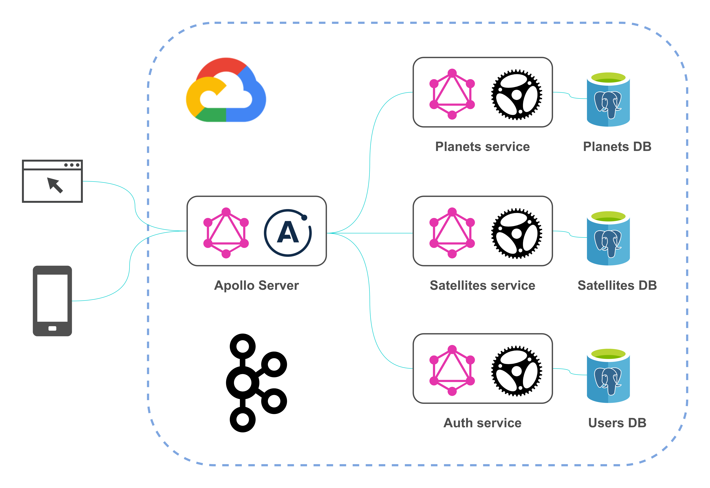
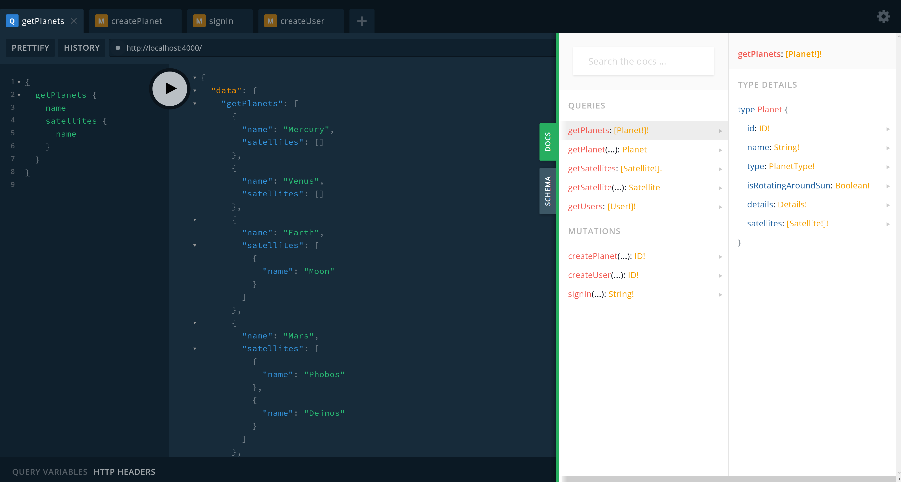
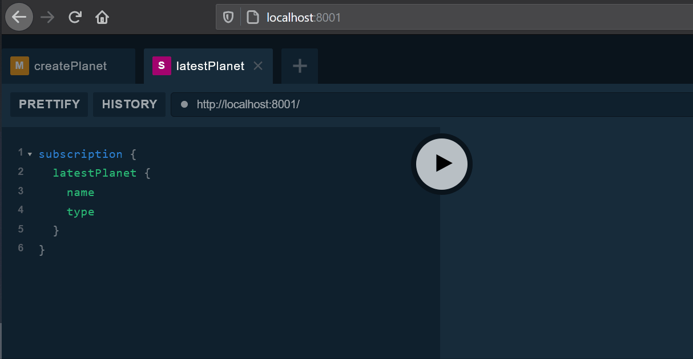

# 学习园地 | 「译」 GraphQL in Rust

## 译者序

Roman Kudryashov([博客](https://romankudryashov.com))是一名来自莫斯科的资深后端开发人员，在日常工作中用Rust/Java/Kotlin来完成服务的持久层，微服务之间的集成等工作。在`Async-graphql`的开发过程中给予了非常多的[帮助](https://github.com/async-graphql/async-graphql/issues?q=is%3Aissue+author%3Arkudryashov)，然后根据这些经验总结出来这篇入门教程（[英文原版](https://romankudryashov.com/blog/2020/12/graphql-rust/)）。

译者老油条（[孙黎](https://github.com/sunli829)），`Async-graphql`库作者，连续创业者，处女座码农，之前日常工作由C++和Golang完成，两年前一个偶然的机会邂逅Rust语言，并不由自主的爱上了它，之后再也没有碰过其它编程语言，工作中用Rust语言完成所有的事情，是不折不扣的Rust语言狂热粉丝。Rust是我这么多年编程生涯中真正遇到的完美编程语言，无GC，并发安全以及类似Python等脚本语言才提供的高级语法，让我产生给它做一些力所能及的贡献的想法，[nvg](https://github.com/sunli829/nvg)和[Xactor](https://github.com/sunli829/xactor)是刚学Rust不久之后的小试牛刀，而[Async-graphql](https://github.com/async-graphql/async-graphql)是Rust 1.39异步稳定之后的产物。

_学习Rust的过程很艰辛，需要保持一颗修行的心，当你能够越过那一座座阻碍在面前的高山，也许才能够发现它真正的美好。_


## 目录

- [学习园地 | 「译」 GraphQL in Rust](#学习园地--译-graphql-in-rust)
  - [译者序](#译者序)
  - [目录](#目录)
  - [介绍](#介绍)
    - [概览](#概览)
    - [技术栈](#技术栈)
    - [开发工具](#开发工具)
    - [实现](#实现)
    - [依赖库](#依赖库)
    - [核心功能](#核心功能)
    - [查询和类型定义](#查询和类型定义)
    - [解决N+1问题](#解决n1问题)
- [接口定义](#接口定义)
    - [自定义标量](#自定义标量)
    - [定义变更(Mutation)](#定义变更mutation)
    - [定义订阅(Subscription)](#定义订阅subscription)
    - [集成测试](#集成测试)
    - [GraphQL客户端](#graphql客户端)
    - [API安全](#api安全)
      - [限制查询的深度和复杂度](#限制查询的深度和复杂度)
      - [认证](#认证)
      - [鉴权](#鉴权)
    - [定义枚举](#定义枚举)
      - [日期处理](#日期处理)
    - [支持ApolloFederation](#支持apollofederation)
    - [ApolloServer](#apolloserver)
    - [数据库交互](#数据库交互)
    - [运行和API测试](#运行和api测试)
    - [订阅测试](#订阅测试)
    - [CI/CD](#cicd)
    - [结论](#结论)
    - [有用的链接](#有用的链接)

在今天的文章中，我将描述如何使用Rust及其生态系统创建GraphQL后端服务。 本文提供了创建GraphQL API时最常见任务的实现示例。最后，将使用Apollo Server和Apollo Federation将三个微服务组合为一个端点。 这使客户端可以同时从任意数量的源中获取数据，而无需知道哪些数据来自哪个源。

## 介绍

### 概览

在功能方面，所描述的项目与我上一篇文章中所描述的非常相似，但是现在它是使用Rust编写的。 该项目的架构如下所示：



架构的每个组件都回答了在实现GraphQL API时可能出现的几个问题。整个模型包括有关太阳系中的行星及其卫星的数据。该项目具有多模块结构，并包含以下模块：

- [planets-service](https://github.com/rkudryashov/graphql-rust-demo/tree/master/planets-service) (Rust)

- [satellites-service](https://github.com/rkudryashov/graphql-rust-demo/tree/master/satellites-service) (Rust)

- [auth-service](https://github.com/rkudryashov/graphql-rust-demo/tree/master/auth-service) (Rust)

- [apollo-server](https://github.com/rkudryashov/graphql-rust-demo/tree/master/apollo-server) (JS)

在Rust中有两个库来创建GraphQL后端：[Juniper](https://github.com/graphql-rust/juniper)和[Async-graphql](https://github.com/async-graphql/async-graphql)，但是只有后者支持Apollo Federation，因此我在项目中选择了它（Juniper中的Federation支持存在未解决的[问题](https://github.com/graphql-rust/juniper/issues/376)）。 这两个库都遵循[代码优先](https://blog.logrocket.com/code-first-vs-schema-first-development-graphql/)方法。

同样，PostgreSQL用于持久层实现，[JWT](https://jwt.io/)用于认证，而Kafka用于消息传递。

### 技术栈

下表总结了该项目中使用的主要技术栈：

| 类型            | 名字           | 网站                                                                   | 代码仓库                                             |
|---------------|----------------|------------------------------------------------------------------------|--------------------------------------------------------|
| 语言            | Rust           | [link](https://www.rust-lang.org/)                                     | [link](https://github.com/rust-lang/rust)              |
| GraphQL服务端库 | Async-graphql  | [link](https://async-graphql.github.io/async-graphql/zh-CN/index.html) | [link](https://github.com/async-graphql/async-graphql) |
| GraphQL网关     | Apollo Server  | [link](https://www.apollographql.com/docs/apollo-server/)              | [link](https://github.com/apollographql/apollo-server) |
| Web框架         | Actix-web      | [link](https://actix.rs/)                                              | [link](https://github.com/actix/actix-web)             |
| 数据库          | PostgreSQL     | [link](https://www.postgresql.org/)                                    | [link](https://github.com/postgres/postgres)           |
| 消息队列        | Apache Kafka   | [link](https://kafka.apache.org/)                                      | [link](https://github.com/apache/kafka)                |
| 容器编排        | Docker Compose | [link](https://docs.docker.com/compose/)                               | [link](https://github.com/docker/compose)              |

另外还有一些需要依赖的Rust库:

| 类型        | 名字              | 网站                                            | 代码仓库                                                  |
|-------------|-------------------|-------------------------------------------------|-------------------------------------------------------------|
| ORM         | Diesel            | [link](https://diesel.rs/)                      | [link](https://github.com/diesel-rs/diesel)                 |
| Kafka客户端 | rust-rdkafka      | [link](https://crates.io/crates/rdkafka)        | [link](https://github.com/fede1024/rust-rdkafka)            |
| 密码哈希库  | argonautica       | [link](https://crates.io/crates/argonautica)    | [link](https://github.com/bcmyers/argonautica)              |
| JWT         | jsonwebtoken      | [link](https://crates.io/crates/jsonwebtoken)   | [link](https://github.com/Keats/jsonwebtoken)               |
| 测试        | Testcontainers-rs | [link](https://crates.io/crates/testcontainers) | [link](https://github.com/testcontainers/testcontainers-rs) |

### 开发工具

要在本地启动项目，你只需要`Docker Compose`。 如果没有`Docker`，可能需要安装以下内容：

- [Rust](https://www.rust-lang.org/tools/install)
- [Diesel CLI](https://diesel.rs/guides/getting-started/) (运行 `cargo install diesel_cli --no-default-features --features postgres`)
- [LLVM](https://releases.llvm.org/download.html)(`argonautica`依赖)
- [CMake](https://cmake.org/install/) (`rust-rdkafka`依赖)
- [PostgreSQL](https://www.postgresql.org/download/)
- [Apache Kafka](https://kafka.apache.org/quickstart)
- [npm](https://www.npmjs.com/get-npm)

### 实现

_清单1. 根`Cargo.toml`指定三个应用和一个库:_

根[Cargo.toml](https://github.com/rkudryashov/graphql-rust-demo/blob/master/Cargo.toml)

```toml
[workspace]
members = [
    "auth-service",
    "planets-service",
    "satellites-service",
    "common-utils",
]
```

让我们从[planets-service](https://github.com/rkudryashov/graphql-rust-demo/tree/master/planets-service)开始。

### 依赖库

这是Cargo.toml：

_清单2. [Cargo.toml](https://github.com/rkudryashov/graphql-rust-demo/blob/master/planets-service/Cargo.toml)_

```toml
[package]
name = "planets-service"
version = "0.1.0"
edition = "2018"

[dependencies]
common-utils = { path = "../common-utils" }
async-graphql = "2.4.3"
async-graphql-actix-web = "2.4.3"
actix-web = "3.3.2"
actix-rt = "1.1.1"
actix-web-actors = "3.0.0"
futures = "0.3.8"
async-trait = "0.1.42"
bigdecimal = { version = "0.1.2", features = ["serde"] }
serde = { version = "1.0.118", features = ["derive"] }
serde_json = "1.0.60"
diesel = { version = "1.4.5", features = ["postgres", "r2d2", "numeric"] }
diesel_migrations = "1.4.0"
dotenv = "0.15.0"
strum = "0.20.0"
strum_macros = "0.20.1"
rdkafka = { version = "0.24.0", features = ["cmake-build"] }
async-stream = "0.3.0"
lazy_static = "1.4.0"

[dev-dependencies]
jsonpath_lib = "0.2.6"
testcontainers = "0.9.1"
```

`Async-graphql`是GraphQL服务端库，`Actix-web`是Web服务框架，而`Async-graphql-actix-web`提供它们之间的集成。

### 核心功能

我们转到`main.rs`：

_清单3. [main.rs](https://github.com/rkudryashov/graphql-rust-demo/blob/master/planets-service/src/main.rs)_

```rust
#[actix_rt::main]
async fn main() -> std::io::Result<()> {
    dotenv().ok();
    let pool = create_connection_pool();
    run_migrations(&pool);

    let schema = create_schema_with_context(pool);

    HttpServer::new(move || App::new()
        .configure(configure_service)
        .data(schema.clone())
    )
        .bind("0.0.0.0:8001")?
        .run()
        .await
}
```

这里，使用`lib.rs`中定义的功能配置环境和HTTP服务器：

_清单4. [lib.rs](https://github.com/rkudryashov/graphql-rust-demo/blob/master/planets-service/src/lib.rs)_

```rust
pub fn configure_service(cfg: &mut web::ServiceConfig) {
    cfg
        .service(web::resource("/")
            .route(web::post().to(index))
            .route(web::get().guard(guard::Header("upgrade", "websocket")).to(index_ws))
            .route(web::get().to(index_playground))
        );
}

async fn index(schema: web::Data<AppSchema>, http_req: HttpRequest, req: Request) -> Response {
    let mut query = req.into_inner();

    let maybe_role = common_utils::get_role(http_req);
    if let Some(role) = maybe_role {
        query = query.data(role);
    }

    schema.execute(query).await.into()
}

async fn index_ws(schema: web::Data<AppSchema>, req: HttpRequest, payload: web::Payload) -> Result<HttpResponse> {
    WSSubscription::start(Schema::clone(&*schema), &req, payload)
}

async fn index_playground() -> HttpResponse {
    HttpResponse::Ok()
        .content_type("text/html; charset=utf-8")
        .body(playground_source(GraphQLPlaygroundConfig::new("/").subscription_endpoint("/")))
}

pub fn create_schema_with_context(pool: PgPool) -> Schema<Query, Mutation, Subscription> {
    let arc_pool = Arc::new(pool);
    let cloned_pool = Arc::clone(&arc_pool);
    let details_batch_loader = Loader::new(DetailsBatchLoader {
        pool: cloned_pool
    }).with_max_batch_size(10);

    let kafka_consumer_counter = Mutex::new(0);

    Schema::build(Query, Mutation, Subscription)
        .data(arc_pool)
        .data(details_batch_loader)
        .data(kafka::create_producer())
        .data(kafka_consumer_counter)
        .finish()
}
```

这些函数执行以下操作：

- `index` - 处理GraphQL[查询和变更](https://graphql.org/learn/queries/)
- `index_ws` - 处理GraphQL[订阅](https://www.apollographql.com/docs/react/data/subscriptions/)
- `index_playground` - 提供Graph Playground IDE
- `create_schema_with_context` - 使用可在运行时访问的全局上下文数据（例如数据库连接池）创建GraphQL模式

### 查询和类型定义

让我们考虑如何定义查询：

_清单5. [定义查询](https://github.com/rkudryashov/graphql-rust-demo/blob/master/planets-service/src/graphql.rs)_

```rust
#[Object]
impl Query {
    async fn get_planets(&self, ctx: &Context<'_>) -> Vec<Planet> {
        repository::get_all(&get_conn_from_ctx(ctx)).expect("Can't get planets")
            .iter()
            .map(|p| { Planet::from(p) })
            .collect()
    }

    async fn get_planet(&self, ctx: &Context<'_>, id: ID) -> Option<Planet> {
        find_planet_by_id_internal(ctx, id)
    }

    #[graphql(entity)]
    async fn find_planet_by_id(&self, ctx: &Context<'_>, id: ID) -> Option<Planet> {
        find_planet_by_id_internal(ctx, id)
    }
}

fn find_planet_by_id_internal(ctx: &Context<'_>, id: ID) -> Option<Planet> {
    let id = id.to_string().parse::<i32>().expect("Can't get id from String");
    repository::get(id, &get_conn_from_ctx(ctx)).ok()
        .map(|p| { Planet::from(&p) })
}
```

每个查询都使用`repository`从数据库获取数据并将获得的记录转换为GraphQL DTO（这使我们可以保留每个结构的单一职责）。 可以从任何GraphQL IDE访问`get_planets`和`get_planet`查询，例如：

_清单6. 查询示例_

```graphql
{
  getPlanets {
    name
    type
  }
}
```

`Planet`对象定义如下：

_清单7. [GraphQL类型定义](https://github.com/rkudryashov/graphql-rust-demo/blob/master/planets-service/src/graphql.rs)_

```rust
#[derive(Serialize, Deserialize)]
struct Planet {
    id: ID,
    name: String,
    planet_type: PlanetType,
}

#[Object]
impl Planet {
    async fn id(&self) -> &ID {
        &self.id
    }

    async fn name(&self) -> &String {
        &self.name
    }

    /// From an astronomical point of view
    #[graphql(name = "type")]
    async fn planet_type(&self) -> &PlanetType {
        &self.planet_type
    }

    #[graphql(deprecation = "Now it is not in doubt. Do not use this field")]
    async fn is_rotating_around_sun(&self) -> bool {
        true
    }

    async fn details(&self, ctx: &Context<'_>) -> Details {
        let loader = ctx.data::<Loader<i32, Details, DetailsBatchLoader>>().expect("Can't get loader");
        let planet_id = self.id.to_string().parse::<i32>().expect("Can't convert id");
        loader.load(planet_id).await
    }
}
```

在这里，我们为每个字段定义一个Resolver。另外，在某些字段中，指定了描述（Rust文档注释）和弃用原因。 这些将显示在GraphQL IDE中。

### 解决N+1问题

如果`Planet`的`details`函数的实现是直接从数据库中查询对应`id`的`planet`对象则将导致N+1问题，如果你发出这样的请求：

_清单8: 可能消耗过多资源的GraphQL请求的示例_

```graphql
{
  getPlanets {
    name
    details {
      meanRadius
    }
  }
}
```

这将对每个`plant`对象的`details`字段执行单独的SQL查询，因为`details`是与`planet`关联的类型，并存储在其自己的表中。

但借助`Async-graphql`的[DataLoader](https://github.com/graphql/dataloader)实现，可以将Resolver定义如下：

```rust
async fn details(&self, ctx: &Context<'_>) -> Result<Details> {
    let data_loader = ctx.data::<DataLoader<DetailsLoader>>().expect("Can't get data loader");
    let planet_id = self.id.to_string().parse::<i32>().expect("Can't convert id");
    let details = data_loader.load_one(planet_id).await?;
    details.ok_or_else(|| "Not found".into())
}
```

`data_loader`是通过以下方式定义的应用程序范围的对象：

_清单10. [DataLoader定义](https://github.com/rkudryashov/graphql-rust-demo/blob/master/planets-service/src/lib.rs)_

```rust
let details_data_loader = DataLoader::new(DetailsLoader {
    pool: cloned_pool
}).max_batch_size(10)
```

`DetailsLoader`的实现：

_清单11. [DetailsLoader定义](https://github.com/rkudryashov/graphql-rust-demo/blob/master/planets-service/src/graphql.rs)

```rust
pub struct DetailsLoader {
    pub pool: Arc<PgPool>
}

#[async_trait::async_trait]
impl Loader<i32> for DetailsLoader {
    type Value = Details;
    type Error = Error;

    async fn load(&self, keys: &[i32]) -> Result<HashMap<i32, Self::Value>, Self::Error> {
        let conn = self.pool.get().expect("Can't get DB connection");
        let details = repository::get_details(keys, &conn).expect("Can't get planets' details");

        Ok(details.iter()
            .map(|details_entity| (details_entity.planet_id, Details::from(details_entity)))
            .collect::<HashMap<_, _>>())
    }
}
```

此方法有助于我们防止N+1问题，因为每个`DetailsLoader.load`调用仅执行一个SQL查询，返回多个`DetailsEntity`。

# 接口定义

GraphQL接口及其实现通过以下方式定义：

_清单12. [GraphQL接口定义](https://github.com/rkudryashov/graphql-rust-demo/blob/master/planets-service/src/graphql.rs)_

```rust
#[derive(Interface, Clone)]
#[graphql(
    field(name = "mean_radius", type = "&CustomBigDecimal"),
    field(name = "mass", type = "&CustomBigInt"),
)]
pub enum Details {
    InhabitedPlanetDetails(InhabitedPlanetDetails),
    UninhabitedPlanetDetails(UninhabitedPlanetDetails),
}

#[derive(SimpleObject, Clone)]
pub struct InhabitedPlanetDetails {
    mean_radius: CustomBigDecimal,
    mass: CustomBigInt,
    /// In billions
    population: CustomBigDecimal,
}

#[derive(SimpleObject, Clone)]
pub struct UninhabitedPlanetDetails {
    mean_radius: CustomBigDecimal,
    mass: CustomBigInt,
}
```

在这里你还可以看到，如果该对象没有任何复杂Resolver的字段，则可以使用`SimpleObject`宏来实现。

### 自定义标量

这个项目包含两个自定义标量定义的示例，两者都是数字类型的包装器（因为由于[孤儿规则](https://doc.rust-lang.org/book/ch10-02-traits.html#implementing-a-trait-on-a-type)，你无法在外部类型上实现外部特征）。包装器的实现如下：

_清单 13. [自定义标量: 包装BigInt](https://github.com/rkudryashov/graphql-rust-demo/blob/master/planets-service/src/graphql.rs)_

```rust
#[derive(Clone)]
pub struct CustomBigInt(BigDecimal);

#[Scalar(name = "BigInt")]
impl ScalarType for CustomBigInt {
    fn parse(value: Value) -> InputValueResult<Self> {
        match value {
            Value::String(s) => {
                let parsed_value = BigDecimal::from_str(&s)?;
                Ok(CustomBigInt(parsed_value))
            }
            _ => Err(InputValueError::expected_type(value)),
        }
    }

    fn to_value(&self) -> Value {
        Value::String(format!("{:e}", &self))
    }
}

impl LowerExp for CustomBigInt {
    fn fmt(&self, f: &mut Formatter<'_>) -> fmt::Result {
        let val = &self.0.to_f64().expect("Can't convert BigDecimal");
        LowerExp::fmt(val, f)
    }
}
```

_清单 14. [自定义标量: 包装BigDecimal](https://github.com/rkudryashov/graphql-rust-demo/blob/master/planets-service/src/graphql.rs)_

```rust
#[derive(Clone)]
pub struct CustomBigDecimal(BigDecimal);

#[Scalar(name = "BigDecimal")]
impl ScalarType for CustomBigDecimal {
    fn parse(value: Value) -> InputValueResult<Self> {
        match value {
            Value::String(s) => {
                let parsed_value = BigDecimal::from_str(&s)?;
                Ok(CustomBigDecimal(parsed_value))
            }
            _ => Err(InputValueError::expected_type(value)),
        }
    }

    fn to_value(&self) -> Value {
        Value::String(self.0.to_string())
    }
}
```

前一个示例还支持使用指数表示大数。

### 定义变更(Mutation)

变更定义如下：

_清单 15. [定义变更](https://github.com/rkudryashov/graphql-rust-demo/blob/master/planets-service/src/graphql.rs)_

```rust
pub struct Mutation;

#[Object]
impl Mutation {
    #[graphql(guard(RoleGuard(role = "Role::Admin")))]
    async fn create_planet(&self, ctx: &Context<'_>, planet: PlanetInput) -> Result<Planet, Error> {
        let new_planet = NewPlanetEntity {
            name: planet.name,
            planet_type: planet.planet_type.to_string(),
        };

        let details = planet.details;
        let new_planet_details = NewDetailsEntity {
            mean_radius: details.mean_radius.0,
            mass: BigDecimal::from_str(&details.mass.0.to_string()).expect("Can't get BigDecimal from string"),
            population: details.population.map(|wrapper| { wrapper.0 }),
            planet_id: 0,
        };

        let created_planet_entity = repository::create(new_planet, new_planet_details, &get_conn_from_ctx(ctx))?;

        let producer = ctx.data::<FutureProducer>().expect("Can't get Kafka producer");
        let message = serde_json::to_string(&Planet::from(&created_planet_entity)).expect("Can't serialize a planet");
        kafka::send_message(producer, message).await;

        Ok(Planet::from(&created_planet_entity))
    }
}
```

`Mutation.create_planet`输入参数需要定义以下结构：

_清单 16: [定义输入类型](https://github.com/rkudryashov/graphql-rust-demo/blob/master/planets-service/src/graphql.rs)_

```rust
#[derive(InputObject)]
struct PlanetInput {
    name: String,
    #[graphql(name = "type")]
    planet_type: PlanetType,
    details: DetailsInput,
}
```

`create_planet`受`RoleGuard`保护，可确保只有具有`Admin`角色的用户才能访问它。要执行变异，如下所示：

```graphql
mutation {
  createPlanet(
    planet: {
      name: "test_planet"
      type: TERRESTRIAL_PLANET
      details: { meanRadius: "10.5", mass: "8.8e24", population: "0.5" }
    }
  ) {
    id
  }
}
```

你需要从`auth-service`获得JWT，并指定`Authorization`作为HTTP请求的标头（稍后将对此进行描述）。

### 定义订阅(Subscription)

在上面的Mutation定义中，你可以看到在`planet`创建过程中发送了一条消息：

_清单 18. [发送消息到Kafka](https://github.com/rkudryashov/graphql-rust-demo/blob/master/planets-service/src/graphql.rs)_

```rust
let producer = ctx.data::<FutureProducer>().expect("Can't get Kafka producer");
let message = serde_json::to_string(&Planet::from(&created_planet_entity)).expect("Can't serialize a planet");
kafka::send_message(producer, message).await;
```

使用者可以通过监听Kafka订阅将事件通知给API客户端：

_清单 19. [订阅定义](https://github.com/rkudryashov/graphql-rust-demo/blob/master/planets-service/src/graphql.rs)_

```rust
pub struct Subscription;

#[Subscription]
impl Subscription {
    async fn latest_planet<'ctx>(&self, ctx: &'ctx Context<'_>) -> impl Stream<Item=Planet> + 'ctx {
        let kafka_consumer_counter = ctx.data::<Mutex<i32>>().expect("Can't get Kafka consumer counter");
        let consumer_group_id = kafka::get_kafka_consumer_group_id(kafka_consumer_counter);
        let consumer = kafka::create_consumer(consumer_group_id);

        async_stream::stream! {
            let mut stream = consumer.start();

            while let Some(value) = stream.next().await {
                yield match value {
                    Ok(message) => {
                        let payload = message.payload().expect("Kafka message should contain payload");
                        let message = String::from_utf8_lossy(payload).to_string();
                        serde_json::from_str(&message).expect("Can't deserialize a planet")
                    }
                    Err(e) => panic!("Error while Kafka message processing: {}", e)
                };
            }
        }
    }
}
```

订阅可以像查询(Query)和变更(Mutation)一样使用：

_清单 20. 订阅使用例子_

```graphql
subscription {
  latestPlanet {
    id
    name
    type
    details {
      meanRadius
    }
  }
}
```

订阅的URL是`ws://localhost:8001`。

### 集成测试

查询和变更的测试可以这样写：

_清单 21. [查询测试](https://github.com/rkudryashov/graphql-rust-demo/blob/master/planets-service/tests/query_tests.rs)_

```rust
#[actix_rt::test]
async fn test_get_planets() {
    let docker = Cli::default();
    let (_pg_container, pool) = common::setup(&docker);

    let mut service = test::init_service(App::new()
        .configure(configure_service)
        .data(create_schema_with_context(pool))
    ).await;

    let query = "
        {
            getPlanets {
                id
                name
                type
                details {
                    meanRadius
                    mass
                    ... on InhabitedPlanetDetails {
                        population
                    }
                }
            }
        }
        ".to_string();

    let request_body = GraphQLCustomRequest {
        query,
        variables: Map::new(),
    };

    let request = test::TestRequest::post().uri("/").set_json(&request_body).to_request();

    let response: GraphQLCustomResponse = test::read_response_json(&mut service, request).await;

    fn get_planet_as_json(all_planets: &serde_json::Value, index: i32) -> &serde_json::Value {
        jsonpath::select(all_planets, &format!("$.getPlanets[{}]", index)).expect("Can't get planet by JSON path")[0]
    }

    let mercury_json = get_planet_as_json(&response.data, 0);
    common::check_planet(mercury_json, 1, "Mercury", "TERRESTRIAL_PLANET", "2439.7");

    let earth_json = get_planet_as_json(&response.data, 2);
    common::check_planet(earth_json, 3, "Earth", "TERRESTRIAL_PLANET", "6371.0");

    let neptune_json = get_planet_as_json(&response.data, 7);
    common::check_planet(neptune_json, 8, "Neptune", "ICE_GIANT", "24622.0");
}
```

如果查询的一部分可以在另一个查询中重用，则可以使用[片段(Fragment)](https://graphql.org/learn/queries/#fragments)：

_清单 22. [查询测试（使用片段）](https://github.com/rkudryashov/graphql-rust-demo/blob/master/planets-service/tests/query_tests.rs)_

```rust
const PLANET_FRAGMENT: &str = "
    fragment planetFragment on Planet {
        id
        name
        type
        details {
            meanRadius
            mass
            ... on InhabitedPlanetDetails {
                population
            }
        }
    }
";

#[actix_rt::test]
async fn test_get_planet_by_id() {
    ...

    let query = "
        {
            getPlanet(id: 3) {
                ... planetFragment
            }
        }
        ".to_string() + PLANET_FRAGMENT;

    let request_body = GraphQLCustomRequest {
        query,
        variables: Map::new(),
    };

    ...
}
```

要使用[变量](https://github.com/rkudryashov/graphql-rust-demo/blob/master/planets-service/tests/query_tests.rs)，你可以通过以下方式编写测试：

_清单 23. [查询测试（使用片段和变量）](https://github.com/rkudryashov/graphql-rust-demo/blob/master/planets-service/tests/query_tests.rs)_

```rust
#[actix_rt::test]
async fn test_get_planet_by_id_with_variable() {
    ...

    let query = "
        query testPlanetById($planetId: String!) {
            getPlanet(id: $planetId) {
                ... planetFragment
            }
        }".to_string() + PLANET_FRAGMENT;

    let jupiter_id = 5;
    let mut variables = Map::new();
    variables.insert("planetId".to_string(), jupiter_id.into());

    let request_body = GraphQLCustomRequest {
        query,
        variables,
    };

    ...
}
```

在这个项目中，`Testcontainers-rs`库用于准备测试环境，创建一个临时PostgreSQL数据库。

### GraphQL客户端

你可以使用上一部分中的代码段来创建外部GraphQL API的客户端。另外，有一些库可用于此目的，例如`graphql-client`，但我还没有使用它们。

### API安全

GraphQL API有一些不同程度的安全威胁（请参阅此[清单](https://leapgraph.com/graphql-api-security)以了解更多信息），让我们考虑其中的一些方面。

#### 限制查询的深度和复杂度

如果`Satellite`对象容纳`planet`字段，则可能有以下查询：

_清单 24. 昂贵查询的例子_

```graphql
{
  getPlanet(id: "1") {
    satellites {
      planet {
        satellites {
          planet {
            satellites {
              ... # 更深的嵌套！
            }
          }
        }
      }
    }
  }
}
```

为了使这样的查询无效，我们可以指定：

_清单 25. [限制查询深度和复杂度的例子](https://github.com/rkudryashov/graphql-rust-demo/blob/master/planets-service/src/lib.rs)_

```rust
pub fn create_schema_with_context(pool: PgPool) -> Schema<Query, Mutation, Subscription> {
    ...

    Schema::build(Query, Mutation, Subscription)
        .limit_depth(3)
        .limit_complexity(15)

    ...
}
```

请注意，如果你指定深度或复杂度限制，则API文档可能不能在GraphQL IDE中显示，这是因为IDE尝试执行具有相当深度和复杂度的自省查询。

#### 认证

使用`argonautica`和`jsonwebtoken`库在`auth-service`中实现此功能。 前一个库负责使用[Argon2](https://en.wikipedia.org/wiki/Argon2)算法对用户的密码进行哈希处理。__身份验证和授权功能仅用于演示，请针对生产用途进行更多研究。__

让我们看看登录的实现方式：

_清单 26. [实现登录](https://github.com/rkudryashov/graphql-rust-demo/blob/master/auth-service/src/graphql.rs)_

```rust
pub struct Mutation;

#[Object]
impl Mutation {

    async fn sign_in(&self, ctx: &Context<'_>, input: SignInInput) -> Result<String, Error> {
        let maybe_user = repository::get_user(&input.username, &get_conn_from_ctx(ctx)).ok();

        if let Some(user) = maybe_user {
            if let Ok(matching) = verify_password(&user.hash, &input.password) {
                if matching {
                    let role = AuthRole::from_str(user.role.as_str()).expect("Can't convert &str to AuthRole");
                    return Ok(common_utils::create_token(user.username, role));
                }
            }
        }

        Err(Error::new("Can't authenticate a user"))
    }
}

#[derive(InputObject)]
struct SignInInput {
    username: String,
    password: String,
}
```

你可以在`utils`[模块](https://github.com/rkudryashov/graphql-rust-demo/blob/master/auth-service/src/utils.rs)中查看`verify_password`函数的实现，在`common_utils`[模块](https://github.com/rkudryashov/graphql-rust-demo/blob/master/common-utils/src/lib.rs)中查看`create_token`函数的实现。如你所料，`sign_in`函数将颁发JWT，该JWT可进一步用于其他服务中的授权。

要获得JWT，你需要执行以下变更：

_清单 27. 获取JWT_

```graphql
mutation {
  signIn(input: { username: "john_doe", password: "password" })
}
```

使用 _john_doe/password_ ，将获得的JWT用于在进一步的请求中，可以访问受保护的资源（请参阅下一节）。

#### 鉴权

要请求受保护的数据，你需要以`Authorization：Bearer $ JWT`格式向HTTP请求中添加标头。 `index`函数将从请求中提取用户的角色，并将其添加到查询数据中：

_清单 28. [角色提取](https://github.com/rkudryashov/graphql-rust-demo/blob/master/planets-service/src/lib.rs)_

```rust
async fn index(schema: web::Data<AppSchema>, http_req: HttpRequest, req: Request) -> Response {
    let mut query = req.into_inner();

    let maybe_role = common_utils::get_role(http_req);
    if let Some(role) = maybe_role {
        query = query.data(role);
    }

    schema.execute(query).await.into()
}
```

以下属性应用于先前定义的`create_planet`变更：

_清单 29. 使用字段守卫_

```rust
#[graphql(guard(RoleGuard(role = "Role::Admin")))]
```

这个守卫自身实现如下：

_清单 30. 守卫实现_

```rust
struct RoleGuard {
    role: Role,
}

#[async_trait::async_trait]
impl Guard for RoleGuard {
    async fn check(&self, ctx: &Context<'_>) -> Result<()> {
        if ctx.data_opt::<Role>() == Some(&self.role) {
            Ok(())
        } else {
            Err("Forbidden".into())
        }
    }
}
```

这样如果你未指定角色，则服务器将返回`Forbidden`的消息。

### 定义枚举

GraphQL枚举可以通过以下方式定义：

_清单 31. [定义枚举](https://github.com/rkudryashov/graphql-rust-demo/blob/master/satellites-service/src/graphql.rs)_

```rust
#[derive(SimpleObject)]
struct Satellite {
    ...
    life_exists: LifeExists,
}

#[derive(Copy, Clone, Eq, PartialEq, Debug, Enum, EnumString)]
#[strum(serialize_all = "SCREAMING_SNAKE_CASE")]
pub enum LifeExists {
    Yes,
    OpenQuestion,
    NoData,
}
```

#### 日期处理

`Async-graphql`支持`chrono`库中的日期/时间类型，因此你可以照常定义以下字段：

_清单 32. [日期字段定义](https://github.com/rkudryashov/graphql-rust-demo/blob/master/satellites-service/src/graphql.rs)_

```rust
#[derive(SimpleObject)]
struct Satellite {
    ...
    first_spacecraft_landing_date: Option<NaiveDate>,
}
```

### 支持ApolloFederation

`satellites-service`的目的之一是演示如何在两个（或多个）服务中解析分布式GraphQL[实体](https://www.apollographql.com/docs/federation/entities/)（`Planet`），然后通过Apollo Server对其进行访问。

`Plant`类型之前是通过`planets-service`定义的：

_清单 33. [在`planets-service`里定义`Planet`类型](https://github.com/rkudryashov/graphql-rust-demo/blob/master/planets-service/src/graphql.rs)_

```rust
#[derive(Serialize, Deserialize)]
struct Planet {
    id: ID,
    name: String,
    planet_type: PlanetType,
}
```

另外，在`planets-service`中，`Planet`类型是一个实体：

_清单 34. [`Planet`实体定义](https://github.com/rkudryashov/graphql-rust-demo/blob/master/planets-service/src/graphql.rs)

```rust
#[Object]
impl Query {
    #[graphql(entity)]
    async fn find_planet_by_id(&self, ctx: &Context<'_>, id: ID) -> Option<Planet> {
        find_planet_by_id_internal(ctx, id)
    }
}
```

`satellites-service`向`Planet`对象扩展了`satellites`字段：

_清单 35. [`satellites-service`中`Plant`对象的扩展](https://github.com/rkudryashov/graphql-rust-demo/blob/master/satellites-service/src/graphql.rs)_

```rust
struct Planet {
    id: ID
}

#[Object(extends)]
impl Planet {
    #[graphql(external)]
    async fn id(&self) -> &ID {
        &self.id
    }

    async fn satellites(&self, ctx: &Context<'_>) -> Vec<Satellite> {
        let id = self.id.to_string().parse::<i32>().expect("Can't get id from String");
        repository::get_by_planet_id(id, &get_conn_from_ctx(ctx)).expect("Can't get satellites of planet")
            .iter()
            .map(|e| { Satellite::from(e) })
            .collect()
    }
}
```

你还应该为扩展类型提供查找函数（此处只是创建了`Planet`的新实例）：

_清单 36. `Planet`对象的查找函数_

```rust
#[Object]
impl Query {

    #[graphql(entity)]
    async fn get_planet_by_id(&self, id: ID) -> Planet {
        Planet { id }
    }
}
```

`Async-graphql`生成两个附加查询（`_service`和`_entities`），这些查询将由Apollo Server使用。这些查询是内部查询，也就是说Apollo Server不会公开这些查询。当然，具有Apollo Federation支持的服务仍可以独立运行。

### ApolloServer

Apollo Server和Apollo Federation可以实现两个主要目标：

- 创建单个端点以访问由多个服务提供的GraphQL API

- 从分布式服务创建单个GraphQL模式

也就是说即使你不使用联合实体，前端开发人员也可以使用单个端点而不是多个端点，使用起来更加的方便。

还有一种创建单个GraphQL模式的方法，即[模式缝合](https://www.graphql-tools.com/docs/schema-stitching/)，但是我没有使用这种方法。

该模块包括以下代码：

_清单 37. [元信息和依赖](https://github.com/rkudryashov/graphql-rust-demo/blob/master/apollo-server/package.json)_

```json
{
  "name": "api-gateway",
  "main": "gateway.js",
  "scripts": {
    "start-gateway": "nodemon gateway.js"
  },
  "devDependencies": {
    "concurrently": "5.3.0",
    "nodemon": "2.0.6"
  },
  "dependencies": {
    "@apollo/gateway": "0.21.3",
    "apollo-server": "2.19.0",
    "graphql": "15.4.0"
  }
}
```

_清单 38. [Apollo Server定义](https://github.com/rkudryashov/graphql-rust-demo/blob/master/apollo-server/gateway.js)

```javascript
const {ApolloServer} = require("apollo-server");
const {ApolloGateway, RemoteGraphQLDataSource} = require("@apollo/gateway");

class AuthenticatedDataSource extends RemoteGraphQLDataSource {
    willSendRequest({request, context}) {
        if (context.authHeaderValue) {
            request.http.headers.set('Authorization', context.authHeaderValue);
        }
    }
}

let node_env = process.env.NODE_ENV;

function get_service_url(service_name, port) {
    let host;
    switch (node_env) {
        case 'docker':
            host = service_name;
            break;
        case 'local': {
            host = 'localhost';
            break
        }
    }

    return "http://" + host + ":" + port;
}

const gateway = new ApolloGateway({
    serviceList: [
        {name: "planets-service", url: get_service_url("planets-service", 8001)},
        {name: "satellites-service", url: get_service_url("satellites-service", 8002)},
        {name: "auth-service", url: get_service_url("auth-service", 8003)},
    ],
    buildService({name, url}) {
        return new AuthenticatedDataSource({url});
    },
});

const server = new ApolloServer({
    gateway, subscriptions: false, context: ({req}) => ({
        authHeaderValue: req.headers.authorization
    })
});

server.listen({host: "0.0.0.0", port: 4000}).then(({url}) => {
    console.log(`🚀 Server ready at ${url}`);
});
```

如果以上代码可以简化，请随时与我联系以进行更改。

`apollo-service`中的授权工作如先前Rust服务所述（你只需指定`Authorization`标头及其值）即可。

如果采用[Federation规范](https://www.apollographql.com/docs/federation/federation-spec/)，则可以将用任何语言或框架编写的应用程序作为下游服务添加到Apollo Server。这个[文档](https://www.apollographql.com/docs/federation/other-servers/)中提供了提供此类支持的库列表。

在实现此模块时，我遇到了一些限制：

- Apollo Gateway[不支持订阅](https://github.com/apollographql/apollo-server/issues/3357)（但它们仍可在独立的Rust GraphQL应用程序中使用）

- 试图扩展GraphQL接口的服务需要[了解具体的实现](https://github.com/apollographql/apollo-server/issues/2849)

### 数据库交互

持久层是使用PostgreSQL和Diesel实现的。如果你不在本地使用Docker，你应该在每个服务的文件夹中运行`diesel setup`。这将创建一个空数据库，然后将应用Migrations创建表和插入数据。

### 运行和API测试

如前面所述，对于在本地启动项目，你有两个选择。

- 使用Docker Compose ([docker-compose.yml](https://github.com/rkudryashov/graphql-rust-demo/blob/master/docker-compose.yml))

    这里也有两个选择

    - 开发模式 （使用本地生成的镜像）

        `docker-compose up`

    - 生产模式 （使用已发布的镜像）

        `docker-compose -f docker-compose.yml up`

- 不使用Docker

    用`cargo run`启动每个服务，然后启动Apollo Server:

    - 进入 `apollo-server` 目录
    - 定义 `NODE_ENV` 环境变量， 例如`set NODE_ENV=local`(Windows)
    - `npm install`
    - `npm run start-gateway`
    
当`apollo-server`成功运行应该输出以下信息:

_清单 39. Apollo Server启动日志_

```
[nodemon] 2.0.6
[nodemon] to restart at any time, enter `rs`
[nodemon] watching path(s): *.*
[nodemon] watching extensions: js,mjs,json
[nodemon] starting `node gateway.js`
Server ready at http://0.0.0.0:4000/
```

你可以在浏览器中打开`http://localhost:4000`，并使用内置的Playground IDE。



在这里你可以执行下游服务中定义的查询、变更和订阅。另外，这些服务也都有自己的Playground IDE。

### 订阅测试

要测试订阅是否正常工作，可以在GraphQL IDE中打开两个Tab，第一个请求如下。

_清单 40. 订阅请求_

```graphql
subscription {
  latestPlanet {
    name
    type
  }
}
```

第二个请求指定如上所述的`Authorization`标头，并执行这样的变更。

_清单 41. 变更请求_

```graphql
mutation {
  createPlanet(
    planet: {
      name: "Pluto"
      type: DWARF_PLANET
      details: { meanRadius: "1188", mass: "1.303e22" }
    }
  ) {
    id
  }
}
```

订阅的客户端会收到`Plant`创建的通知。



### CI/CD

CI/CD是使用GitHub Actions（[workflow](https://github.com/rkudryashov/graphql-rust-demo/blob/master/.github/workflows/workflow.yml)）配置的，它可以运行应用程序的测试，构建它们的Docker镜像，并在Google Cloud Platform上部署它们。

你可以在[这里](http://graphql-rust.romankudryashov.com/)试试已部署的服务。


**注意：** 在`生产`环境下，为了防止更改初始数据，密码与前面指定的不同。

### 结论

在这篇文章中，我考虑了如何解决在Rust中开发GraphQL API时可能出现的最常见问题。此外，我还展示了如何将使用Rust开发的GraphQL微服务API结合起来，以提供统一的GraphQL接口。在这样的架构中，一个实体可以分布在几个微服务之间，它是通过Apollo Server、Apollo Federation和Async-graphql库来实现的。项目的源代码在[GitHub](https://github.com/rkudryashov/graphql-rust-demo)上。如果你发现文章或源代码中有任何错误，欢迎[联系](rskudryashov@gmail.com)我。谢谢阅读!

### 有用的链接

- [graphql.org](https://graphql.org/)
- [spec.graphql.org](https://spec.graphql.org/)
- [graphql.org/learn/best-practices](https://graphql.org/learn/best-practices/)
- [howtographql.com](https://www.howtographql.com/)
- [Async-graphql](https://github.com/async-graphql/async-graphql)
- [Async-graphql使用手册](https://async-graphql.github.io/async-graphql/zh-CN/index.html)
- [Awesome GraphQL](https://github.com/chentsulin/awesome-graphql)
- [Public GraphQL APIs](https://github.com/APIs-guru/graphql-apis)
- [Apollo Federation demo](https://github.com/apollographql/federation-demo)
