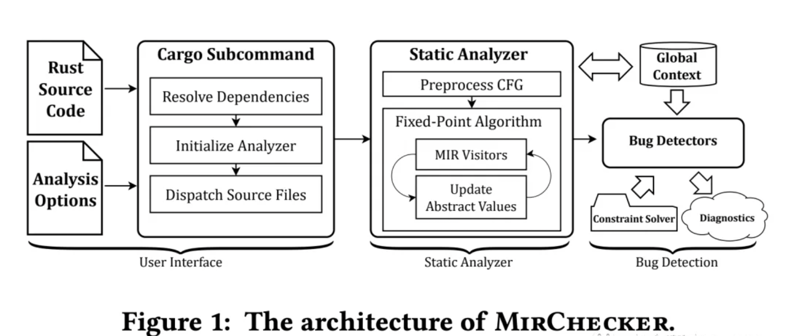
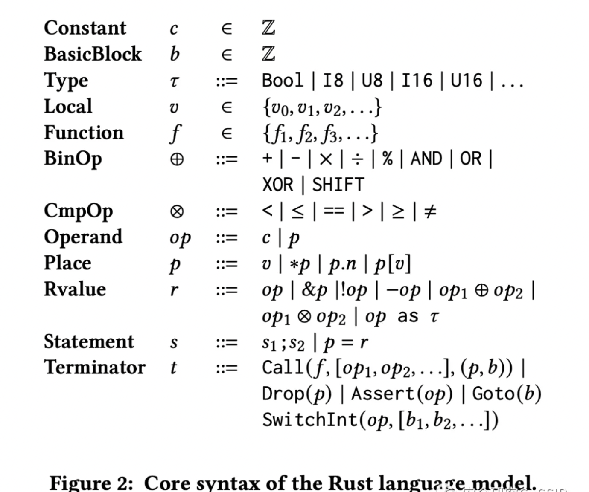
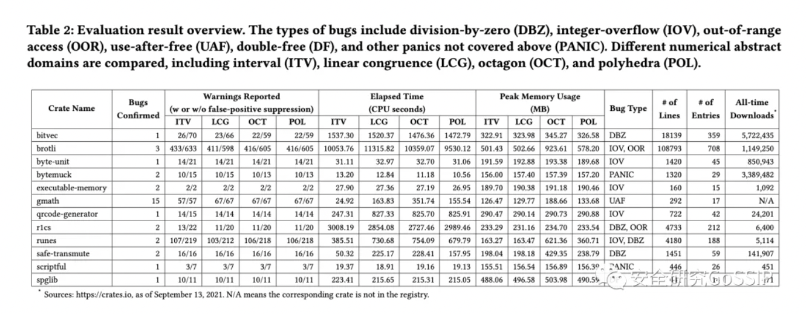

#  【论文导读】Rust 程序 Bug 静态检测工具 MirChecker

作者： **李卓华 **

> 本文转载自公众号 《 安全研究GoSSIP》，原文 [G.O.S.S.I.P 学术论文推荐 2021-11-24 Rust 程序 Bug 静态检测工具 MirChecker](https://mp.weixin.qq.com/s/E7XSa_evKpPEMk_xfzEq1w)
>
>  作者为香港中文大学ANSR Lab五年级博士生 李卓华，与[百度安全实验室](https://mp.weixin.qq.com/s?__biz=Mzg5ODUxMzg0Ng==&mid=2247485553&idx=1&sn=5839db63d9cb21900035e0ba9ee07815&scene=21#wechat_redirect)合作完成。他的研究方向为系统安全，程序分析和随机模型。
>
> - 论文下载：[https://zhuohua.me/assets/CCS2021-MirChecker.pdf](https://zhuohua.me/assets/CCS2021-MirChecker.pdf)
> - 源码：[https://github.com/lizhuohua/rust-mir-checker](https://github.com/lizhuohua/rust-mir-checker)

## MirChecker vs Rudra 

佐治亚理工 Teasoo Kim 研究组的研究论文[Rudra: Finding Memory Safety Bugs in Rust at the Ecosystem Scale @SOSP 2021](https://mp.weixin.qq.com/s?__biz=Mzg5ODUxMzg0Ng==&mid=2247487645&idx=1&sn=d92bb73232cc87d7a2d271308808c955&scene=21#wechat_redirect) ，里面介绍了 Rudra 这个静态检测工具。它和 MirChecker 有什么不同呢？

相同点：

1. MirChecker (CCS '21) 和 Rudra (SOSP '21) 都是静态分析工具找 Rust 程序的 bugs；
2. 都找到了真实世界的 bug；
3. 同样基于 Rust 的 MIR；
4. 两者都实现为Cargo子命令和Rust编译器的自定义回调函数

不同点：

1. 算法 – MirChecker 使用 abstract interpretation/symbolic execution with constraint solving (sound +1), Rudra 使用 static taint analysis with heuristics (简单的 taint propagation 算法，只分析 unsafe code body 等)；
2. Bug 类型 – 除了相同的 runtime panic bugs (buffer overflow, integer overflow），Rudra 也支持 higher-order safety invariant 和 unsafe Send/Sync 造成的 thread safety 问题；
3. 关于false positive 问题，MirChecker 通过 flags 开关一些分析路径 (e.g., bitwise ops)，Rudra 则是提供 high/medium/low 的 precision filter

## 研究背景

系统级编程既要能对底层硬件进行操作，同时还有极高的安全性需求。传统的系统编程语言如C/C++很难提供足够的安全性保障，因此Rust语言成为了呼声极高的替代品。Rust强大的类型系统和独特的“所有权（ownership）”机制，能够在支持底层操作的同时，很大程度地消除内存安全错误。谷歌、微软等公司均积极在自己的项目中引入Rust，Linux内核也正试图将Rust作为C之外的第二种内核开发语言。然而安全领域没有灵丹妙药，现有的研究已经显示，Rust仍然有很多问题，导致运行时错误和内存安全问题。

因此，论文作者实现了MirChecker，一个针对Rust程序的静态分析和错误检测工具。它以一个Rust软件包作为输入，分析可能出现的错误并输出错误报告。该工具与其他自动代码查错工具有以下不同：

1. 利用静态分析的方法，可以最大限度地利用Rust强大的类型系统；
2. 考虑了Rust语言特性导致的其特有的错误类型；
3. 基于Rust MIR而不是LLVM IR，最大限度地利用Rust编译器提供的类型信息。

## Rust 的错误分类

通过观察已报告的Rust漏洞，作者将常见的错误分成两类，并分析其产生的原因。

1. 运行时崩溃（Runtime Panics）。对于无法在编译期检测的错误，例如数组越界检查，整数溢出等，Rust编译器将自动在产生的可执行程序中插入assertion语句，动态地进行检查。一旦发生错误，程序将在运行时以panic的方式终止执行。这种设计虽然通过终止执行的方式阻止了内存错误的发生，但对于系统级的程序例如操作系统等，运行时的意外终止仍是不被接受的。
2. 生命周期损坏（Lifetime Corruption）。Rust的所有权机制可以静态地跟踪变量的生命周期，因而程序员无需显式地申请和释放内存。这种自动化的内存管理机制很大程度上消除了常见的内存错误，例如use-after-free和double-free。但Rust的unsafe关键字会使编译器放松一些安全性检查，可能会破坏所有权机制对内存生命周期的跟踪，再加之隐式的内存释放机制，从而导致程序员肉眼难以发觉的内存错误。

作者发现约40%的运行时崩溃都源于错误的整数数值操作，例如下标越界源于对下标变量错误的计算，整数溢出源于缺少必要的数值范围检查。因此利用静态数值分析，给出程序中整数数值的约束条件，再通过约束求解即可判断是否有可能的错误。同时，针对生命周期损坏，作者提出通过符号执行（symbolic execution）的方法，对于可能扰乱所有权系统的unsafe函数，跟踪其所有权的传递，检测是否存在一块可能仍在使用的内存被释放，或一块已经释放的内存被使用的情况，并生成错误检测报告。

## MirChecker 的设计

如下图所示，MirChecker采用了经典的三段式设计：（1）用户界面，（2）静态分析，（3）错误检测。

其执行流程可以总结为：

1. 用户界面读取要检测的Rust代码包，并下载其所依赖的包。将目标Rust代码包源文件送入静态分析器，而其依赖的代码仍由官方Rust编译器编译。这种设计使得MirChecker专注于用户希望检测的代码，避免了分析器盲目地深入依赖。
2. 在静态分析环节，使用了“抽象释义（abstract interpretation）”的分析框架，对于每个函数，提取并预处理其控制流图（control-flow graph），根据控制流的结构，迭代地对每一条语句进行分析（即执行其“转移函数（transfer function）”）直至分析结果收敛。
3. 最后在错误检测环节调用约束求解器，判断可能的错误并输出分析报告。

##  语言模型与内存模型

在静态分析环节，为了分析Rust编译器生成的中间代码（MIR），作者根据MIR的数据结构设计了一个简单的语言模型，并定义每一条语句的语义。

设计这个语言模型的目的有二：

1. 在此语言模型上，作者可以对每一条语句定义静态分析所需的转移函数（transfer function），即定义每一条语句对当前状态产生什么影响。
2. 根据此模型，作者可以构造符号执行所需的符号表达式，例如分支条件等。这些符号表达式还可以用作静态分析的内存模型，在分析内存读取和写入相关指令时，将符号表达式用作“抽象地址（abstract memory address）”，用于判断哪一块内存被访问了。

##  代码实现

MirChecker由Rust语言实现（共约12000行代码）。数值分析部分的底层实现使用了开源的Apron，它实现了常见的静态分析所用的数值模型，如Interval，Octagon，Polyhedra等。符号分析部分的实现基于MIRAI，一个利用符号执行进行程序验证的工具。在错误检测部分，使用了Z3约束求解器。

MirChecker的用户界面被实现为Rust的官方包管理器Cargo的子命令，从而可以方便地被Rust开发者安装和使用。静态分析部分算法被实现为Rust编译器的一个自定义回调函数，因而可以利用Rust编译器内部的数据和工具函数，输出结构化的错误报告。在现实使用中，MirChecker不仅可以输出可能的错误类型，还可以指出错误可能发生的位置，方便开发者快速定位程序中可能的错误。

## 分析结果

为了评估MirChecker的效果，作者从Rust官方包管理网站crates.io上抓取下载量前1000的代码包，同时也从GitHub上搜索得到数十个未注册到crates.io的包。经过MirChecker分析，检测出其中12个包中33个漏洞，其中包括了16个内存安全错误。作者已将这些问题报告给开发者，目前已有25个漏洞被修复。同时作者还比较了不同数值模型的运行时间以及内存占用情况。作者还实现了一些用于减少误报的用户选项，可以方便地结合MirChecker的用户界面使用。

## 小广告

一个小广告~ 如果对 CUHK ANSRLab 感兴趣，John 也在招收相关方向的博士生和博士后，详细信息可以参考以下链接：

- ANSR Lab主页：http://ansrlab.cse.cuhk.edu.hk/
- Important information for potential post-doc: https://www.cse.cuhk.edu.hk/~cslui/potential_postdoc.html
- Important information for potential Ph.D students: https://www.cse.cuhk.edu.hk/~cslui/potential_students.html