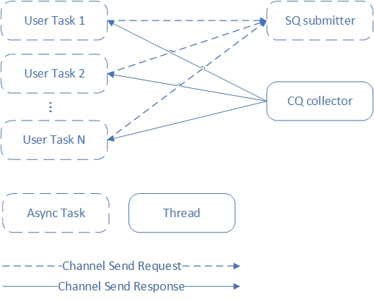

# Linux 新异步接口 io_uring 的 Rust 生态盘点

作者：施继成@DatenLord / 后期编辑：张汉东

-----

io_uring 无可置疑是近两年内核圈最火的话题之一，作为风头正劲的 Linux 异步 I/O 接口，其野心更大，不仅仅想将 Linux 的 I/O 操作全面异步化，还希望将所有[Linux系统调用异步化](https://lwn.net/Articles/810414/)。

Rust 作为一门系统级变成语言，兼具安全和高性能的特点，大家也一定是想使用Rust语言 “尝鲜” io_uring。然而遗憾的是 io_uring 作者 Jens Axboe 仅仅维护一个[C语言的库](https://github.com/axboe/liburing)。用户想要用Rust调用，一方面还需要自己进行一些封装，另一方面 C 语言的接口还是太底层，想在 Rust 的异步框架中使用仍有许多工作要做。

好消息是已经有一些 Rust 语言封装的 io_uring 库出现在 github 上，今天让我们来挑选一些使用人数较多（通过star数目来判断）的库进行分析，看看是否可以给大家使用 io_uring 带来便利。

# [Tokio io-uring](https://github.com/tokio-rs/io-uring)
Tokio 是 github 上 Star 数目最多的异步框架，那么他们团队封装的io_uring lib如何呢？通过阅读代码不难发现，该 io_uring 库完全撇弃了 C 语言的 liburing 库，自己在 io_uring 系统调用上从零开始封装了一层，实现了submission queue，completion queue 和 submitter。

上述的三层抽象比 C 语言的封装稍微高层一些，但仍然需用户将 request 放到submission queue上，将 response 从 completion queue 上取下，和同步读写方式区别巨大，且和 Rust 现有的异步 I/O 框架的设计相去甚远。以下是一个简单的样例代码：

```rust
let mut ring = IoUring::new(256)?;
let (submitter, mut sq, mut cq) = ring.split();

let mut accept = AcceptCount::new(listener.as_raw_fd(), token_alloc.insert(Token::Accept), 3);

// put request on the submission queue
accept.push_to(&mut sq);

// submit the request
match submitter.submit_and_wait(1) {
    Ok(_) => (),
    Err(ref err) if err.raw_os_error() == Some(libc::EBUSY) => (),
    Err(err) => return Err(err.into()),
}

// get complete events from the completion queue
for cqe in &mut cq {
    ...
}
```
该 io_uring 库的优缺点分列如下：

优点：

1. 纯 Rust 封装，安全性更好。
2. 比 C 语言库封装高层，使用起来接口更加简单。

缺点：

1. 维护成本更高，需要根据kernel的更新手动追加新 feature，包括新数据结构。
2. 封装还不够彻底，暴露了底层实现的两个队列，用户使用难度较高。

# [Spacejam rio](https://github.com/spacejam/rio)
该 io_uring 库在 github 上的 star 数目在写稿时已经达到了 590 个，该库的作者还创建了 [sled](https://github.com/spacejam/sled) 嵌入式数据库。由于 sled 数据库也使用了这个 io_uring 库，所以我们有理由相信， rio 是一个经过实际项目验证的库，其更友好的用户接口更是降低了用户的使用难度。

通过下面的简单示例，大家可以很容易感受到接口的易用性：

```rust
/// Read file example
let ring = rio::new().expect("create uring");
let file = std::fs::open("file").expect("openat");
let data: &mut [u8] = &mut [0; 66];
let completion = ring.read_at(&file, &mut data, at);

// if using threads
completion.wait()?;

// if using async
completion.await?
```
rio 同时提供了针对 thread 和 async 两种编程模型的接口，在提供便利性的同时大大降低了使用者的约束，可以自由选择喜欢的编程模型。

然而这个库是 unsoundness 的，即有可能被错误或者恶意使用。并且根据作者在 [issue](https://github.com/spacejam/rio/issues/25) 里面的回复，作者并不会对此进行修复。这将使得基于该库构建的软件都不安全。

该 io_uring 库的优缺点分列如下：

优点：

1. 接口丰富且使用简单。
2. 有实际使用的项目验证。

缺点：

1. Unsoundness，安全性不佳。

# [ringbahn](https://github.com/ringbahn/ringbahn)

ringbahn 的作者是 withoutboats, Rust 语言的核心开发者之一。该库由三个抽象层组成，第一层为 C 语言 libfuse 的 Rust 封装, 名称为 [uring-sys](https://github.com/ringbahn/uring-sys)；第二层为 Submission Queue 和 Completion Queue 等数据结构的封装，名称为 [iou](https://github.com/ringbahn/iou)；最后一层则封装了Rust 异步编程的接口。

不难看出，ringbahn 从设计上考虑了更多，从接口易用性到安全性都更加优秀。以下为拷贝文件的示例：

```rust
/// Copy File from props.txt to test.txt
futures::executor::block_on(async move {
    let mut input:  File = File::open("props.txt").await.unwrap();
    let mut output: File = File::create("test.txt").await.unwrap();
    let mut buf = vec![0; 1024];
    let len = input.read(&mut buf).await.unwrap();
    output.write(&mut buf[0..len]).await.unwrap();
    output.flush().await.unwrap();
});

```

该库也并非完美无缺，它也具有下列缺陷：

1. 并发不友好，在 Submission Queue 上有一把大锁，每个提交任务的线程都会被串行化。
2. 读写操作会导致内存在用户态被拷贝，对于大数据量的操作而言，多余的内存拷贝会带来明显的性能下降。之所以要进行内存拷贝，是为了保证传给内核的memory buffer不会被用户态异步修改，保证安全性。

作者也在 Readme 文件中说明了最上层的 ringbahn 封装只是一次尝试，并不适合在正式生产上使用。

# [DatenLord ring-io](https://github.com/datenlord/ring-io/tree/dev)

基于上述讨论，我们团队 Datenlord 也实现了自己的 io_uring Rust lib， 名称是 ring-io。现阶段的实现吸取了 Tokio io-uring 和 iou 的经验，同样实现了Submission Queue 和 Completion Queue 的抽象。具体的实现细节请参见王徐旸同学写的[文章](https://rustmagazine.github.io/rust_magazine_2021/chapter_1/io_uring_and_rust.html)。

现阶段的实现也具有下列问题：

1. 暴露了一些unsafe接口，提醒用户某些操作需要注意，和内核的错误交互会带来无法预知的结果。
2. 抽象层偏低，使用起来不方便。

接下去，我们会针对一些特定的 buffer 类型实现异步 I/O 接口，方便用户的使用，且暴露 safe 的接口。在实现的过程中，我们也会将高效考虑在内，避免不必要的内存拷贝。__和ringbahn 的方法不同，我们保证内存安全的方式为 Rust 提供的内存所有权转移，即用户在发送 I/O 请求之后就不在拥有 buffer 的所有权，直到 request 返回所有权才被归还__。具体的实现细节我们会在下一篇文章中进行讨论，这里先给出设计的架构图：



- SQ submitter 负责将用户 Task 发送来的 I/O 请求通过 io_uring 发送到 kernel。
- CQ collector 负责将 kernel 完成任务的返回结果返回给用户。
- User Task 会 block 在各自的 channel 上，直到 I/O 任务完成，User Task 才会被重新调度。

# 总结
虽然 io_uring 非常火爆，国内外也有很多团队进行了 Rust 封装，但是仍然没有一个完美的方案，同时解决了安全性、高性能和易用性的问题。

大家可以根据自己的情况选择一个符合需求的库，当然更希望大家积极贡献社区，提出自己的想法，创建出更好用、更安全和更快的 io_uring 库。

---

作者简介：

