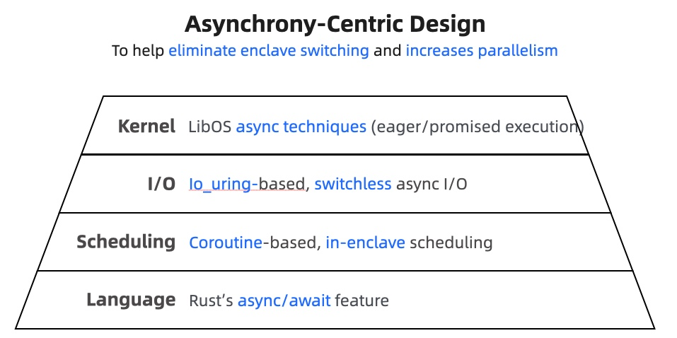
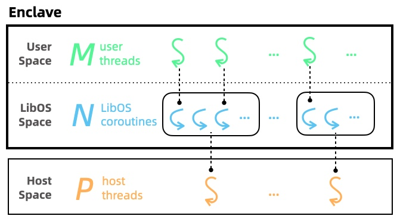
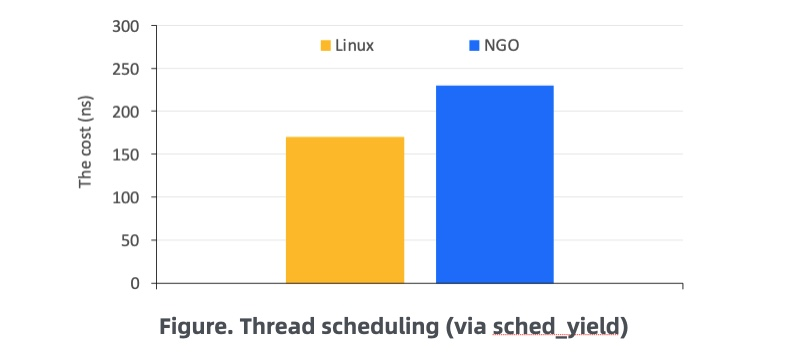
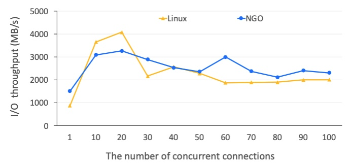
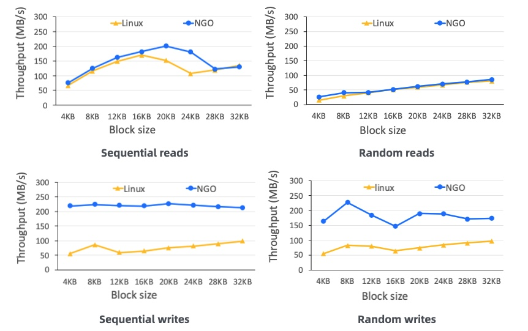

# 蚂蚁集团 | 异步化OS：利用 async/await 带来 10 倍性能提升

作者：蚂蚁集团 田洪亮 / 编辑： 张汉东

---

Rust是第一个对异步I/O提供语言级支持的系统编程语言。自async/await特性在2019年稳定以来，Rust的异步编程生态已经有了长足了发展，比如async运行时有流行的[Tokio](https://github.com/tokio-rs/tokio)和[async_std](https://github.com/async-rs/async-std)两大选择。最近，Rust官方博客又连续两个月发布了展望async/await未来的博客([3月](https://blog.rust-lang.org/2021/03/18/async-vision-doc.html)和[4月](https://blog.rust-lang.org/2021/04/14/async-vision-doc-shiny-future.html))。async/await特性在社区的受认可和重视程度可见一斑。

那么，如何在我们自己的项目中有效使用async/await特性呢？更进一步，如何搭建属于自己项目的异步架构、运行时和软件栈呢？

本文将分享作者在蚂蚁集团的开源项目Occlum ([https://github.com/occlum/occlum](https://github.com/occlum/occlum))中收获的实战经验。基于async/await特性，我们以一种名为“以异步为中心”的新设计对Occlum做了架构升级，并取得了大幅性能提升的理想效果。

具体来说，我们在实践中遇到并解决了如下一些async/await相关问题：
* 是否值得为一个项目引入async/await？
* 如何在no_std环境使用async/await？
* 如何重构大量老代码以适应async/await？
* 如何充分利用异步优化机会来提升性能？

如果你对这些Rust问题或对OS感兴趣，那来听我们的故事吧。

（长文预警，强烈建议阅读前准备充足的水和食物～）

## 让数据可用而不可见

> My safe bet: "In 10 years, most chips will have secure enclave capabilities.”
> — UC Berkeley华人教授Dawn Song

任何故事都有一个时代背景，而我们的是机密计算（Confidential Computing）。

机密计算是一种新兴的安全技术，其目标是保护内存中正在使用中数据的机密性和完整性——即便攻击者来自特权级软件（比如OS）也不例外！

这是一个非常强的安全保证，因为传统上来讲，软件栈是按照特权级分层的（特权从低到高）：应用 --> OS --> 虚拟机管理器 --> 固件。应用的安全性依赖于其下的所有特权软件的安全性。但机密计算颠覆了这一传统的安全模型！

那么，机密计算是如何做到这一点的呢？这就要引出机密计算的硬件基础了——可信执行环境（Trusted Execution Environment，简称TEE）。

TEE是由可信硬件（通常是CPU）提供的私有内存区域，能保证其中的代码和数据的安全，即任何TEE外的软硬件都无法窃取或者篡改TEE中的内容。该安全保证是硬件通过访问控制、内存加密等手段实现的。

因此，利用TEE的硬件安全能力，我们就可以实现机密计算的安全保证。

机密计算被广泛应用于公有云安全、隐私保护的机器学习、多方安全计算、区块链等应用场景。

所有的主流体系架构都已经推出了它们的TEE实现：[ARM TrustZone](https://developer.arm.com/ip-products/security-ip/trustzone)、[ARM CCA](https://www.arm.com/company/news/2021/03/arms-answer-to-the-future-of-ai-armv9-architecture)、[AMD SEV](https://developer.amd.com/sev/)、[Intel SGX](https://www.intel.com/content/www/us/en/architecture-and-technology/software-guard-extensions.html)、[Intel TDX](https://software.intel.com/content/www/us/en/develop/articles/intel-trust-domain-extensions.html)、[RISC-V Keystone](https://keystone-enclave.org/)等等。除了CPU以外，GPU以及AI加速器的硬件厂商也在积极筹划引入TEE能力。这也是为什么UC Berkeley的Dawn Song教授几年前就预测，几乎所有芯片都将拥有TEE能力！

目前适用于数据中心的、最成熟、经过最多测试和研究的TEE技术非Intel SGX莫属。在SGX中，TEE被称为Enclave（飞地）。就本文目的而言，我们可以忽略TEE和Enclave的差异，认为两者是同义词即可。

## 让天下没有难用的TEE

> Enpowering everyone to run every app inside TEEs.
> ——Occlum的项目目标

我们故事的主角是开源项目Occlum([https://github.com/occlum/occlum](https://github.com/occlum/occlum))，它可以将一个未经修改的Linux应用直接放在TEE中运行，从而大大降低使用TEE和采用机密计算的门槛。简而言之，项目使命就是“让天下没有难用的TEE”！

**图. Occlum的架构图**

从架构图可以看到，Occlum本质上是一个面向TEE的OS，向TEE中的可信应用提供Linux兼容的系统调用。Occlum中包含内存管理、进程管理、线程调度、进程间通信、文件和网路I/O等功能。

TEE总是依附于一个普通主机环境运行的（也就是Host OS，通常是Linux）。因此，TEE OS可以在必要的时候请求Host OS的服务，完成某些功能。但因为Host OS是不可信的，因此TEE OS需要确保这种请求是安全的，比如I/O需要做加密解密，防止Host OS窃取或者篡改隐私数据。

出于安全和性能考虑，Occlum的核心部分采用Rust语言开发。

Occlum项目历经三年，已经发展为目前业界最好的开源TEE OS之一。下面列出了部分重要里程碑：

* 2019年3月，项目正式开源；
* 2020年3月，国际顶级学术会议ASPLOS‘20录用Occlum的论文；
* 2020年5月，阿里云公布开源项目Inclavare Containers，采用Occlum作为后端引擎；
* 2020年9月，微软Ignite大会的Azure Confidential Computing在官方文档推荐Occlum；
* 2020年10月，Linux基金会下属的Confidential Computing Consortium组织接收Occlum为旗下开源项目之一。

## TEE的代价

> There ain't no such thing as a free lunch.
> ——诺贝尔经济学奖得主Milton Friedman

No free lunch的道理谁都懂，这当然也适用于安全。具体到TEE的话，就是TEE有一个几乎无法避免的硬件开销——TEE切换。

我们以Intel SGX为例说明（如下图所示）。我们知道CPU有很多执行模式；最为人熟知的，就是用户态（Ring 3）和内核态（Ring 0）。CPU在这两种模式之间做转换，就是用户-内核模式切换。在引入SGX之后，又多了一种模式，即TEE态（也就是Enclave态）。也因此多了一种额外的模式切换，即TEE切换。

**图. Intel CPU的模式切换，包括Enclave切换**

出于安全原因，TEE切换时，CPU要做更多的安全检查，更彻底的状态重置（比如寄存器、cache、TLB等等）。这最终导致TEE切换的开销要远高于传统的模式切换开销。实际上，根据我们的实际测试，TEE切换的开销是用户-内核切换的60倍以上！

而Occlum的原实现（异步化之前）在执行调度和I/O等系统调用时会触发TEE切换。因此，当TEE中的可信应用程序频繁请求Occlum做调度和I/O操作时，用户会观测到比较大的性能下降。

那怎么解决这一性能瓶颈呢？

想必你已经猜到了。对，这就是异步化！

## 异步OS之旅——Let's Go！

> Asynchrony, in computer programming, refers to the occurrence of events independent of the main program flow and ways to deal with such events... Doing so provides a degree of parallelism.
> ——维基百科关于“异步”的词条

对于Occlum来说，异步化对性能有两方面的提升效果：

1. **避免TEE切换.** 我们可以通过使用（不可信的）共享缓冲区与Host OS通信，来发起异步I/O的请求和接受异步I/O的完成，这样就可以避免为了I/O而触发TEE切换。
2. **提高OS并行性.** 如维基百科所描述的，异步的好处就是增加并行性，而并行性的增加通常意味着性能提升。实际上，增加OS并行性可以帮助掩盖TEE除切换以外的其他硬件相关性能开销（篇幅所限，无法详细介绍）。

**图. 以异步为中心的设计**

异步化是一个系统工程。我们提出了一个“以异步为中心的设计”，在四个层面（如上图所示）对Occlum做了相应的异步化改造。接下来，我们从底向上分四个小节依次介绍。

### 第1站：语言层

> A language that doesn’t affect the way you think about programming is not worth knowing.
— Alan Perlis

异步化会引入额外的代码复杂度，这是为什么大家通常都认为异步编程是困难的。

但幸运的是，我们是Rust开发者。Rust的async/await使得异步代码可以用同步代码的方式表达，这大大降低了编写异步代码的头脑负担。更难得的是，Rust对async/await实现，确实达到了零开销抽象（Zero-Cost Abstraction）的设计目标，在运行时只会带来几乎可以忽略不计的开销。

采用Rust的async/await特性，是我们实现异步化的语言层基础。

更多关于Rust的async/await以及异步编程，见[The Async Book](https://rust-lang.github.io/async-book/)，这里不再赘述。

### 第2站：调度层

运行异步代码依赖于执行器。在异步化的Occlum中，这个执行器就是调度层。

我们的调度层兼具两个职责，分别由Rust异步化的目标与OS语意的功能所决定：

1. 调度TEE OS中的协程。我们知道Rust的异步代码的执行单元是任务，或者说协程。一般来说，异步Rust程序中协程的调度是由一个异步运行时负责的，比如Tokio或async_std。但我们的TEE OS中没有现成的异步运行时可用，因此必须由我们自己实现。协程都是我们的OS代码，因此协作式调度就足够了。
2. 调度TEE OS上的用户线程。作为TEE OS，Occlum必须要为其上的可信应用提供进程和线程这两种OS资源。而且，因为可信应用的代码可以由任何语言编写，可能执行任意复杂的代码逻辑，因此Occlum有必要实现抢占式调度。

为了同时承担上述两个职责，我们在TEE中实现了一种M:N:P的调度模型（如下图所示）。

**图. 异步化Occlum的调度层**

在该调度模型中，处于中心地位的是TEE OS协程（数量记为N），他们具有内存占用少、启动延迟低、上下文切换快等协程的典型优点。这些协程是运行在Host OS的线程之上的（数量记为P），P的数量决定了硬件层面的并行性和CPU资源占用，可由用户在运行时指定。TEE OS协程既可以用于执行OS任务，也可以运行应用任务，而后者就是TEE OS的用户线程（数量记为M，且有M<=N）。我们实现了TEE的中断处理，因此可以强迫用户线程放弃CPU，实现抢占式调度。

相比Occlum原先的调度层（限于篇幅而没有介绍），异步化改造之后的调度层具有下面两方面的优势：

1. 完全TEE内调度，不会引发TEE切换，因此调度相关的性能大幅提升；
2. 引入了非常轻量的协程，这使得TEE OS可以以低成本和开销创建协程来增加OS的并行性，从而提高TEE OS的整体性能。

### 第3站：I/O层

有了调度层，异步代码已经可以执行了，我们的下一步就是要支持异步I/O。

在异步化的Occlum中，我们引入了[Linux的异步I/O机制io_uring](https://lwn.net/Articles/810414/)，这是一个Linux的非常新的特性，首次合入是在5.1版，目前仍在快速发展和迭代中。基于io_uring之后，Occlum的底层I/O就是如下图所示的样子了。

我们认为io_uring与Occlum的异步化架构可以说天作之合，理由有二：

1. **io_uring支持基于polling模式的I/O.** Polling模式使得Occlum和Linux之间的通信只需要访问共享内存（即I/O的submission queue和completion queue），不需要做TEE切换，因此避免TEE切换的开销。
2. **io_uring提供真正的异步I/O接口.** io_uring的API是真正的异步I/O：Occlum在发起I/O之后，并不需要等待该I/O的完成即可继续发起其他I/O（I/O并行性）或者执行其他代码逻辑（代码并行性）。

io_uring被认为是[目前Linux提供的最快的I/O机制](https://www.phoronix.com/scan.php?page=news_item&px=Linux-5.6-IO-uring-Tests)（无论是做网络还是磁盘I/O），而且其性能[还在持续提升](https://kernel.dk/io_uring.pdf)。但io_uring在接口上与传统I/O差异巨大，这要求应用做大幅修改和适配才能用上io_uring。而Occlum可以让TEE中的可信应用透明地获得io_uring的好处，“免费”获得性能提升。

### 第4步：内核层

我们的终极目标是，提升Occlum的系统调用的性能。

为此，我们提出了两类异步优化技巧：积极执行（Eager Execution）和承诺执行（Promised Execution）。

**积极执行**是一种在用户真正发起系统调用之前、就提前实施某种高耗时操作的异步优化技巧。由于高耗时操作已经提前发起执行，当用户向Occlum请求系统调用时，该高耗时操作很可能已经完成，这样Occlum可以直接返回结果。这就大大降低了用户可见的系统调用开销，也就是延迟。

积极执行主要适用于`read`类的系统调用，比如`read`、`recvmsg`、`accept`等系统调用。我们可以在用户发起这些系统调用之前，提前用io_uring发起相应的异步I/O，然后把返回结果暂存起来。取决于具体的系统调用，暂存结果的数据结构可能是文件系统的page cache、已连接socket的接收缓冲区、或监听socket的backlog等等。

**承诺执行**是一种延后高耗时操作执行、不等高耗时操作完成就提前返回系统调用结果的异步优化技巧。由于避免了对高耗时操作的等待，用户可见的系统调用延迟被大幅降低。承诺执行的关键在于对高耗时操作的延后执行不能影响相关系统调用的语意。

承诺执行主要适用于`write`类的系统调用，比如`write`和`sendmsg`等系统调用。当收到这类系统调用之后，我们可以先把这类数据暂存起来，然后就可以立刻返回该系统调用了。在未来某个合适的时间点，我们通过io_uring真正发起相应的I/O。取决于具体的系统调用，暂存结果的数据结构可能是文件系统的page cache、或已连接socket的发送缓冲区等等。

不管是积极执行、还是承诺执行，我们都通过异步的方法，降低了用户可感知的系统调用延迟，从而提高了应用程序的性能。

### 终点站：性能评估

为了评估“以异步为中心”设计的性能优化效果，我们比较了异步化Occlum（Next-Gen Occlum，简称NGO）和Linux在调度、网络I/O、文件I/O等方面的性能。结果显示（下图的三张图），异步化Occlum在这三个方面都达到了Linux的性能水平。而相对于异步化之前，Occlum的性能取得了显著的10X以上的提升（虽然图表中没有展示）。

**图. 调度性能（其中NGO表示异步化Occlum）**

**图. 网络I/O性能（其中NGO表示异步化Occlum）**

**图. （非加密）文件I/O性能（其中NGO表示异步化Occlum）**

## 旅程的尾声

对读到这里的读者，我想向你表示感谢，谢谢你的兴趣和耐心。希望我们在Rust的异步编程方面的探索和实践对你也能有所启发和帮助。

如果你对Rust编程、底层软件、系统安全或机密计算等方面感兴趣，欢迎联系我（email: tate.thl@antgroup.com，WeChat ID：tatetian），期待与你相遇。

# Backup

## 因为信任，所以简单

时势造英雄。

作为一支蚂蚁集团的团队，我们为什么要投身于机密计算的技术浪潮呢？而像蚂蚁集团这种金融科技公司又对机密计算有着怎样的应用场景和诉求呢？

对这个问题，我个人认为有一个很好的理解角度，这就是蚂蚁集团的初心和本源。

* 2003年，蚂蚁（原支付宝）推出了“担保交易”，解决了网购中买家和买家之间的信任问题，使得买家可以放心付款，卖家可以放心发货。
* 2010年，蚂蚁推出了“快捷支付”，解决了网银对网购的信任问题，用户不再受困于了难用的网银，付款变得丝般顺滑，网购支付的便利性大幅提升。
* 2012年，蚂蚁推出了“余额宝”，解决了用户对App的信任问题，也改变了人们对存款和理财的观念：过去人们认为钱就应该存在银行，现在人们认为用App理财也是一个便捷和安全的办法。
* 2015年，蚂蚁推出了“芝麻信用”，解决了商家对用户的信任问题，不用定金或押金也可以借书、用充电宝、租车、住酒店了，让守信成为每个人的习惯，让守信者享受各种生活便利。
* 2020年，蚂蚁推出了“蚂蚁链”，解决了分布式价值网络中的信任问题，让区块链像移动支付一样改变生产和生活。

“因为信任，所以简单。”这正是蚂蚁集团的初心，以及发展过程中坚持的理念。

也正是基于这一理念，笔者所在的团队一直专注于机密计算这一新兴方向，希望将机密计算作为一种建立“信任”的技术手段。

具体来说，机密计算可以帮助像蚂蚁这种金融科技公司建立三种信任关系：

* 与用户的信任：作为实施深度防御的一个环节，机密计算可以大幅提高安全水位，降低外部入侵或内部疏漏而引发的用户数据泄露风险。
* 与合作伙伴的信任：在业界，机密计算被认为是一种实现多方数据共享和分析的通用、安全和高效的手段。通过向合作伙伴提供机密计算的能力，我们可以帮助建立机构之间的信任，赋能客户挖掘数据的更大价值。
* 与监管部门的信任：国内外的数据安全与隐私保护法规日趋完善和严格。机密计算提供了一种满足更高更严的监管要求的技术手段，方便外部审计，增强监管者信心。