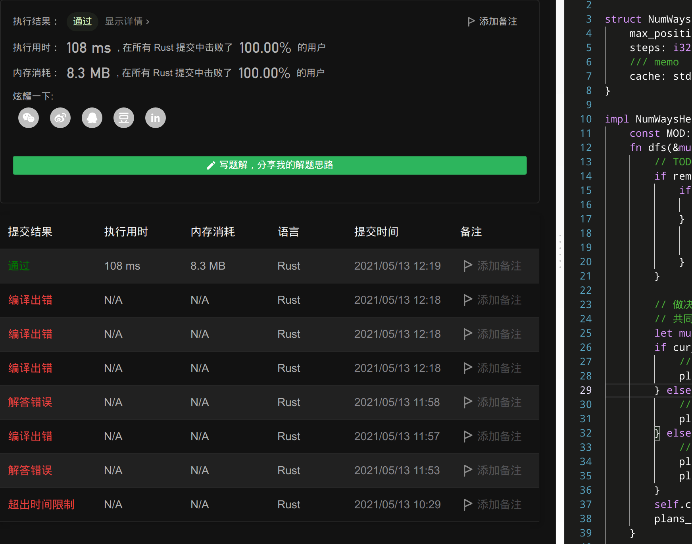

# 借鉴数据库缓存解决动态规划困难题

作者: 吴翱翔 / 后期编辑：张汉东

---

> 原文: [缓存解决动态规划难题](https://pymongo.github.io/#/2021/05/cache_and_recursion_memoization.md)

分享下 leetcode 困难题[停在原地的方案数](https://leetcode-cn.com/problems/number-of-ways-to-stay-in-the-same-place-after-some-steps/)
不断推敲和优化逐步通过题目的过程

看到这种不同路径求方案总数，很容易想到 [unique_path](https://leetcode-cn.com/problems/unique-paths/) 这道动态规划入门题，

这题跟 unique_path 一样也是「求从起点到终点不同行走路径的方案总数」，自然想到用动态规划去实现

## 无记忆化的搜索

由于动态规划迭代解法的状态表达较难抽象，于是我先写出更简单动态规划递归的无记忆化搜索版本

### 递归的结束条件

那么递归的结束条件显然是「剩余步数」为 0

### 解答的更新条件

方案数的更新条件则是 剩余步数为 0 且 当前位置也是 0，这时候可以将方案数+1

### 递归函数的入参

首先需要当前位置和当前剩余步数两个"可变"的入参

再需要一个"常数"表达最大可前往的位置，一旦移动到数组的右边界，下一步就只能原地走或向左走

最后需要一个已发现方案总数的可变指针，用来更新解答集

### 递归搜索的决策层

只能在数组范围 [0, arr_len] 行走，行走方向 原地不动、向左、向右 三种

1. 如果当前坐标是 0, 则只能 原地不动 或 向右
2. 如果当前坐标是 arr_len-1，则只能 原地不动 或 向左
3. 其余情况的行走方向决策则是 原地不动 或 向左 或 向右

### 无记忆化搜索代码

```rust
fn num_ways_dfs(cur_position: i32, remain_steps: i32, max_position: i32, plans_count: &mut u32) {
    if remain_steps == 0 {
        if cur_position == 0 {
            // panicked at 'attempt to add with overflow'
            *plans_count += 1;
        }
        return;
    }

    // 剪枝: 走的太远不可能移动回原点的情况
    if cur_position > remain_steps {
        return;
    }

    // 做决策
    // 决策: 原地不动
    num_ways_dfs(cur_position, remain_steps-1, max_position, plans_count);
    if cur_position == 0 {
        // 只能向右
        num_ways_dfs(cur_position+1, remain_steps-1, max_position, plans_count);
    } else if cur_position == max_position {
        // 只能向左
        num_ways_dfs(cur_position-1, remain_steps-1, max_position, plans_count);
    } else {
        num_ways_dfs(cur_position+1, remain_steps-1, max_position, plans_count);
        num_ways_dfs(cur_position-1, remain_steps-1, max_position, plans_count);
    }
}

fn num_ways_dfs_entrance(steps: i32, arr_len: i32) -> i32 {
    let mut plans_count = 0;
    num_ways_dfs(0, steps, arr_len-1, &mut plans_count);
    (plans_count % (10_u32.pow(9)+7)) as i32
}
```

虽然我加上了递归的剪枝条件，但是 leetcode 上只过了 1/3 的测试用例便在 (27,7) 这个测试用例上超时了

不仅如此，更新方案总数时还出现 u32 溢出的问题，我粗略估算下该函数的时间复杂度是 O(3^n) 指数级别的时间复杂度，其中 n 为剩余步数

### 非线性递归导致超时？

所谓线性递归大概指递归的决策层只有一个分支，或者说递归搜索树只有一个分支

像我上述代码的决策层有 向左/向右/原地不动 三种决策的就显然是个非线性递归，通常都很慢需要剪枝或记忆化才能提速

## 记忆化搜索

### 斐波那契递归的记忆化

斐波那契递归解法也是个典型的非线性递归

假设斐波那契数列的第 n 项为 fib(n)，很容易想到斐波那契数列的 fib(3) 的搜索树可以展开为:

> fib(3)=fib(2)+fib(1)=(fib(1)+fib(0))+fib(1)=2*fib(1)+fib(0)

我们发现 fib(1) 被重复计算了两次，所以业界有种「记忆化搜索」的优化策略

具体实现是定义一个 HashMap，key 为递归函数的入参，value 为该入参情况的计算结果

例如计算 fib(3) 的过程中，第一次遇到 fib(1) 这个入参时进行计算，并将计算结果存入 HashMap 中，

第二次递归调用 fib(1) 时可以直接从 HashMap 中查表取结果而不需要「重复计算」

这种优化思路有点像缓存，相信一个无状态的函数同样的入参一定能得到同样的结果，所以第二次遇到同样的入参时直接拿上一次相同入参的计算结果去返回

### 记忆化搜索的实现条件

我第一版的递归搜索代码中，方案总数作为可变指针参数来传入，这种写法「不能用记忆化搜索优化」

因函数 `fn num_ways_dfs(cur_position: i32, remain_steps: i32, max_position: i32, plans_count: &mut u32)`

**并没有返回值**，我无法实现一个 key 为入参，value 为该入参的上次计算结果返回值这样的记忆化缓存

### 逆向思维: 自下而上的递归

假设 `f(pos,steps)=plans` 表示从原点出发，当前位置 pos，剩余步数为 steps 的方案总数 plans

很容易想到 状态转移规律: f(0,0)=f(0,1)+f(1,1)

也就是终点是原点的前一个状态只能是: 前一个位置是 0 然后选择原地不动 或 前一个位置是 1 然后向左走

然后参考「数学归纳法」可以按照相同的规律将 f(0,1) 和 f(1,1) 也展开成子项，直到展开成 f(0, steps) 也就是起点

### 记忆化搜索的函数签名

```rust
struct NumWaysHelper {
    max_position: i32,
    steps: i32,
    /// memo
    cache: std::collections::HashMap<(i32, i32), u64>
}

impl NumWaysHelper {
    fn dfs(&mut self, cur_pos: i32, remain_steps: i32) -> u64 {
        // TODO 递归结束条件

        let mut plans_count = 0;
        // 做决策/状态转移
        // 上一步是: 原地不动
        // TODO
        if cur_pos == 0 {
            // 上一步是: 向左
            // TODO
        } else if cur_pos == self.max_position {
            // 上一步是: 向左
            // TODO
        } else {
            // 上一步是: 向左或向右
            // TODO
        }
        self.cache.insert((cur_pos, remain_steps), plans_count);
        plans_count
    }
}
```

### 缓存的写入

其中最关键的就是 `self.cache.insert((cur_pos, remain_steps), plans_count);` 这行

函数在 return 前先把(当前入参,返回值)这对计算结果「缓存到 HashMap」中

### 利用缓存避免重复计算

```rust
let mut plans_count = 0;
// 做决策/状态转移
// 上一步是: 原地不动
if let Some(plans) = self.cache.get(&(cur_pos, remain_steps+1)) {
    plans_count += *plans;
} else {
    plans_count += self.dfs(cur_pos, remain_steps+1);
}
```

因为递归调用的开销挺大的，以上上一步是原地不动的决策分支中，一旦发现之前运算过 (cur_pos, remain_steps+1) 的入参情况就直接取缓存中的上次计算结果(因为函数是无状态的，相同的入参一定能得到相同的结果)

### 记忆化搜索版本的实现

```rust
struct NumWaysHelper {
    max_position: i32,
    steps: i32,
    cache: std::collections::HashMap<(i32, i32), u64>
}

impl NumWaysHelper {
    fn dfs(&mut self, cur_pos: i32, remain_steps: i32) -> u64 {
        if remain_steps == self.steps {
            if cur_pos == 0 {
                return 1;
            } else {
                // 只有从起点出发的方案才是有效的方案，其余方案都不可取(0)
                return 0;
            }
        }

        let mut plans_count = 0;
        // 做决策/状态转移
        // 共同的决策分支-上一步是: 原地不动
        plans_count += self.calc_plans_from_cache(cur_pos, remain_steps+1);
        if cur_pos == 0 {
            // 上一步是: 向左
            plans_count += self.calc_plans_from_cache(cur_pos+1, remain_steps+1);
        } else if cur_pos == self.max_position {
            // 上一步是: 向右
            plans_count += self.calc_plans_from_cache(cur_pos-1, remain_steps+1);
        } else {
            // 上一步是: 向左或向右
            plans_count += self.calc_plans_from_cache(cur_pos+1, remain_steps+1);
            plans_count += self.calc_plans_from_cache(cur_pos-1, remain_steps+1);
        }
        self.cache.insert((cur_pos, remain_steps), plans_count);
        plans_count
    }

    fn calc_plans_from_cache(&mut self, last_pos: i32, last_remain_steps: i32) -> u64 {
        if let Some(plans) = self.cache.get(&(last_pos, last_remain_steps)) {
            *plans
        } else {
            self.dfs(last_pos, last_remain_steps)
        }
    }
}
```

## 本题缓存与数据库缓存的异同

MySQL 为了提高短时间相同 Query 的查询速度，会将查询的 SQL 语句计算哈希和对应的查询结果存入 Query Cache

在缓存的有效期内，遇到第二个相同的 SQL 查询就能直接从缓存中获取上次查询结果进行返回

MySQL 将 SQL 语句进行哈希是不是跟我们这题将递归调用的入参元祖作为 key 存入 HashMap 类似?

除了数据库，graphql 和 dataloader 也是大量用到了缓存，也是将查询计算 hash 作为 key 存入 HashMap 中

可以了解下 dataloader 这个 crate 的 [源码](https://docs.rs/dataloader/0.14.0/src/dataloader/cached.rs.html#8)
是如何进行缓存以及解决 `N+1` 查询的问题的

## 解决溢出错误

我们记忆化搜索的解法通过了80%的测试用例，但是在输入参数特别大时就出错了

```
输入：
93
85
输出：
468566822
预期结果：
623333920
```

看到期待值不对很多人以为「是不是我算法写错了」？

其实不是，一般这种入参很大的都是整数溢出的问题，leetcode 的 Rust 用的是溢出时自动 `wrapping` 的 release 编译

所谓 `wrapping` 值得就例如 `0_u8.wrapping_sub(1)==255`，0_u8 减 1 会下溢成 255

由于 leetcode 的题目描述中也提示了 方案总数可能会很大，所以每次加法都需要取模避免 i32 溢出

我也尝试修改 `type PlansCount = i32`，就算方案数用 u128 存储也会溢出，所以还是老老实实加法后取模

## 题解完整代码及测试代码

```rust
type PlansCount = i32;

struct NumWaysHelper {
    max_position: i32,
    steps: i32,
    /// memo
    cache: std::collections::HashMap<(i32, i32), PlansCount>,
}

impl NumWaysHelper {
    /// leetcode rust version not support const_fn pow
    const MOD: PlansCount = 1_000_000_007;
    fn dfs(&mut self, cur_pos: i32, remain_steps: i32) -> PlansCount {
        // 递归结束条件
        if remain_steps == self.steps {
            if cur_pos == 0 {
                return 1;
            }
            // 只有从起点出发的方案才是有效的方案，其余方案都不可取(0)
            return 0;
        }

        // 做决策/状态转移
        // 共同的决策分支: 上一步-原地不动
        let mut plans_count = self.calc_plans_from_cache(cur_pos, remain_steps + 1);
        if cur_pos == 0 {
            // 上一步是: 向左
            plans_count += self.calc_plans_from_cache(cur_pos + 1, remain_steps + 1);
        } else if cur_pos == self.max_position {
            // 上一步是: 向右
            plans_count += self.calc_plans_from_cache(cur_pos - 1, remain_steps + 1);
        } else {
            // 上一步是: 向左或向右
            plans_count += self.calc_plans_from_cache(cur_pos + 1, remain_steps + 1);
            plans_count =
                plans_count % Self::MOD + self.calc_plans_from_cache(cur_pos - 1, remain_steps + 1);
        }
        self.cache.insert((cur_pos, remain_steps), plans_count);
        plans_count
    }

    /// can't use map_or_else, reason: Error: closure requires unique access to `self` but `self` is already borrowed
    #[allow(clippy::option_if_let_else)]
    fn calc_plans_from_cache(&mut self, last_pos: i32, last_remain_steps: i32) -> PlansCount {
        (if let Some(plans) = self.cache.get(&(last_pos, last_remain_steps)) {
            *plans
        } else {
            self.dfs(last_pos, last_remain_steps)
        }) % Self::MOD
    }
}

fn num_ways_dfs_entrance(steps: i32, arr_len: i32) -> i32 {
    let mut helper = NumWaysHelper {
        max_position: arr_len - 1,
        steps,
        cache: std::collections::HashMap::new(),
    };
    helper.dfs(0, 0) % NumWaysHelper::MOD
}

#[test]
fn test_num_ways() {
    const TEST_CASES: [(i32, i32, i32); 4] = [(93, 85, 623333920), (3, 2, 4), (2, 4, 2), (4, 2, 8)];
    for (steps, arr_len, plans_count) in TEST_CASES {
        assert_eq!(num_ways_dfs_entrance(steps, arr_len), plans_count);
    }
}
```

完整源码: [https://github.com/pymongo/leetcode-rust/blob/b6f0101a50a70512c12dd33333bfa535307ac40e/src/dp/number_of_ways_to_stay_in_the_same_place_after_some_steps.rs#L277](https://github.com/pymongo/leetcode-rust/blob/b6f0101a50a70512c12dd33333bfa535307ac40e/src/dp/number_of_ways_to_stay_in_the_same_place_after_some_steps.rs#L277)

## 小结下逐步优化题解的过程

首先是根据题目意思写出了无缓存/无记忆化的从搜索树自上而下的递归解法，实现的过程中逐步理解了动态规划的状态转移方程，

进而写出了带缓存的深度优先搜索解法，解决了溢出等小问题后终于通过了



## 为什么不是 dp[i][j] 的动态规划写法

有读者可能疑惑，为什么 leetcode 这题官方题解或绝大部分题解都用 `dp[i][j]` 这种写法

我的题解运行速度比 `dp[i][j]` 的写法慢得多

首先我要明确一点动态规划其实是有两种主流的写法的，一种就是常见的 `dp[i][j]` 迭代写法去填表

另一种就是我介绍的递归记忆化/缓存化搜索

`dp[i][j]` 写法的最大毛病就是「可读性极差」，构思难度高

我以前写的动态规划代码，过五个月再看完全忘记 i 和 j 表达什么意思了

`dfs(cur_position: i32, remain_steps: i32)` 这种写法不比 `dp[i][j]` 的可读性强很多?

记忆化搜索另一种好处就是，可以快速写出简单的无缓存版本，再慢慢优化解决超时问题，而迭代的动态规划写法起步就很难

所以我个人更推荐大家多练习记忆化搜索解动态规划，这种借鉴数据库缓存的思路还是很简单的，面试中遇到不熟悉的动态规划题可以先试着用记忆化搜索去解决
