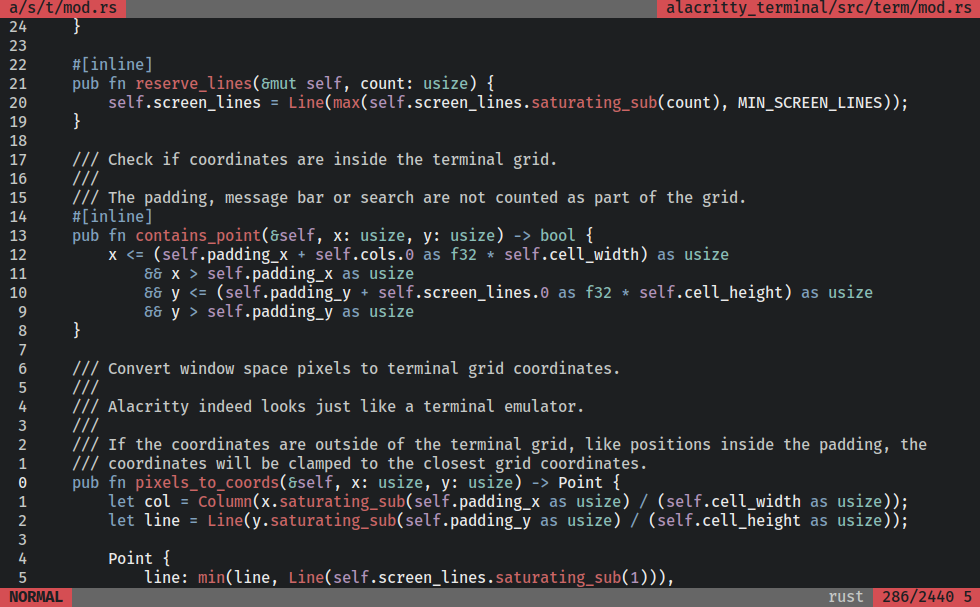

# GitHub 趋势榜

编辑：张汉东

---

盘点一下 本月 [GitHub 趋势榜上榜的 Rust 项目](https://github.com/trending/rust?since=daily)。

对于上期出现过的项目，就暂时不排到本文里了。

## Alacritty: 跨平台，OpenGL终端模拟器

Alacritty 号称是最快的终端模拟器，最近发布了最新版本。

[https://github.com/alacritty/alacritty](https://github.com/alacritty/alacritty)

## Awesome Alternatives in Rust

各个领域中可以用 Rust 替换的软件实现列表。可以关注或贡献。

[https://github.com/TaKO8Ki/awesome-alternatives-in-rust](https://github.com/TaKO8Ki/awesome-alternatives-in-rust)

## Git 工具： delta 和 gitui

Rust实现了有很多出色的终端工具，delta和gitui就是其中两个。

**delta: Git 和 Diff 输出的查看器**

[https://github.com/dandavison/delta](https://github.com/dandavison/delta)

gitui: Rust 实现的 Git 终端 UI

[https://github.com/extrawurst/gitui](https://github.com/extrawurst/gitui)

## Regex: 正则表达式引擎

Regex 本月发布了 1.5.4 版。该正则表达式引擎类似于 Perl 的正则引擎，但是缺乏 环视 和 反向引用，因为这两个特性会包含回溯功能，影响正则引擎的性能。如果想使用环视和反向引用可以使用其他第三方库，比如 [fancy-regex](https://github.com/fancy-regex/fancy-regex)。

[https://github.com/rust-lang/regex](https://github.com/rust-lang/regex)

## materialize: 用于实时应用程序的流数据库

Materialize 是基于pg 和 开源Timely Dataflow项目构建 开发的一个可以处理流式数据的平台，同时提供了强大的数据处理能力。最近发布了新版本。 

在无需复杂的数据管道的情况下，只须用标准SQL视图描述计算，然后将Materialize 连接到数据流，就能实现增量计算。 底层的差分数据流引擎能够运行增量计算，从而以最小的延迟，提供一致且准确的结果。经实验，将 Materialize 与 Spring Cloud Stream 以及 Kafka 配合使用，从而在分布式事件驱动的系统中，查询事件流并分析结果。其效果令人满意。

Materialize被称为“第一个真正的流式SQL数据库”。在 2020 年底，Materialize获得由Kleiner Perkins领投的3200万美元B轮投资。

[materialize](https://github.com/MaterializeInc/materialize)

## Youki : 实验性的容器运行时

youki 是根据 [runtime-spec 规范](https://github.com/opencontainers/runtime-spec)来实现的，参考 runc。

作者坦言：

> Rust是实现OCI运行时的最佳语言之一。 许多容器工具都是完全用 Go 写的。这是一件非常好的产品。但是，容器运行时需要使用系统调用，这需要用 Go 实现的时候需要一些特殊处理。 这非常棘手（例如，namespaces(7), fork(2)）; 使用Rust，它不是那么棘手，你可以使用系统调用。 此外，与 C 不同，Rust 提供了内存管理的好处。 Rust尚未成为容器领域的主流，但有可能为此领域提供更多贡献。 我希望 youki 成为该领域如何使用的 Rust 的例子之一。

[https://github.com/utam0k/youki](https://github.com/utam0k/youki)

## tree-sitter: Rust 实现的解析器生成器

最近发布了新版本 0.19.5。

它不仅仅是一个解析器生成器工具，还支持增量解析。 它可以为源文件构建一个具体的语法树，并在源文件更新的时候有效更新语法树。该库还依赖了部分 C 代码。

同类型工具还有：[https://github.com/lalrpop/lalrpop](https://github.com/lalrpop/lalrpop)

[https://github.com/tree-sitter/tree-sitter](https://github.com/tree-sitter/tree-sitter)

话说，用 Rust 实现的新语言在不断冒出来。

本月看到一个新的语言 Gleam ，Rust 实现的可以与 Erlang 兼容的新语言。刚发布 0.15版本。

[https://github.com/gleam-lang/gleam](https://github.com/gleam-lang/gleam)

## v86 : 用于模拟X86兼容的CPU和硬件

v86 机器代码在运行时转换为webassembly模块，以实现体面的性能。

- [试试在浏览器里跑一个操作系统](https://copy.sh/v86/)
- [https://github.com/copy/v86](https://github.com/copy/v86)

## tokenizers: Hugging Face公司推出的分词器发布新版本

Hugging Face（抱抱脸）公司是一家总部位于美国纽约的聊天机器人初创服务商。该公司在 NLP界鼎鼎大名，三月份刚刚完成4000万美元B轮融资。在GitHub上发布了开源 NLP 库 Transformers。

基于深度学习的现代 NLP 管道中的瓶颈之一就是tokenization，尤其是通用性强且独立于框架的实现。

所以，该分词器的核心是用Rust编写的，并且存在Node和Python的绑定。提供当今最常用的分词器的实现，重点是性能和多功能性。

[https://github.com/huggingface/tokenizers](https://github.com/huggingface/tokenizers)