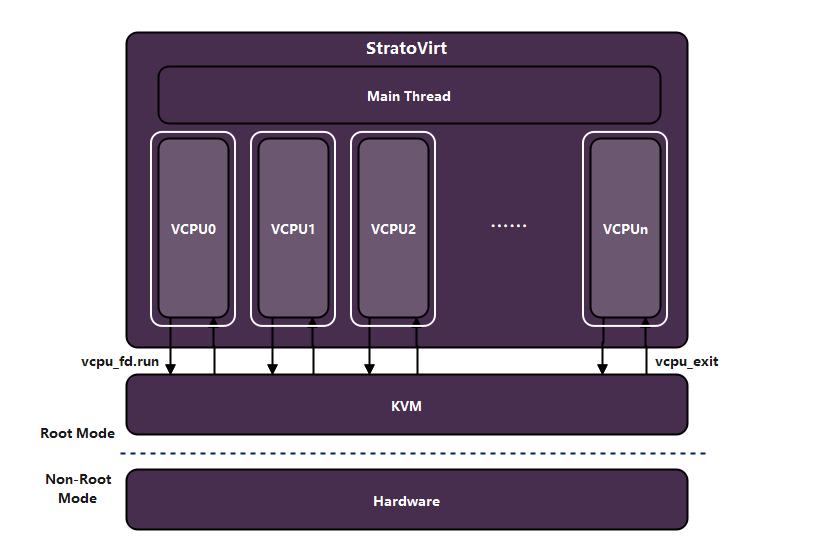

# 华为 | StratoVirt VCPU管理-Rust线程同步的实现

作者： 高炜 / 后期编辑：张汉东

--- 

StratoVirt是开源在openEuler社区的轻量级虚拟化平台，具备轻量低噪、强安全性的行业竞争力。

StratoVirt进程运行在用户态，在虚拟机启动之前，StratoVirt会完成启动之前的准备工作，包括虚拟机内存的初始化、CPU寄存器初始化、设备初始化等，启动，CPU寄存器初始化和虚拟机在运行过程中VCPU陷出事件的处理，都是由StratoVirt的VCPU管理模块`CPU`完成。如下是StratoVirt中VCPU管理模块的组成，以及其在StratoVirt中的位置。

```
stratovirt
├── address_space
├── boot_loader
├── Cargo.lock
├── Cargo.toml
├── cpu
│   ├── Cargo.toml
│   └── src
│       ├── aarch64
│       │   └── mod.rs
│       ├── lib.rs
│       └── x86_64
│           ├── cpuid.rs
│           └── mod.rs
├── devices
├── machine_manager
├── micro_vm
├── src
│   └── main.rs
├── sysbus
├── util
└── virtio
```


## StratoVirt VCPU模块的整体设计

StratoVirt的虚拟化解决方案也是一套软硬结合的硬件辅助虚拟化解决方案，它的运作依赖于硬件辅助虚拟化的能力（如VT-X或Kunpeng-V）。VCPU模块的实现也是紧密依赖于这一套硬件辅助虚拟化的解决方案的。

对于物理机的CPU而言，硬件辅助虚拟化为CPU增加了一种新的模式：Non-Root模式，在该模式下，CPU执行的并不是物理机的指令，而是虚拟机的指令。这种指令执行方式消除了大部分性能开销，非常高效。但是特权指令（如I/O指令）不能通过这种方式执行，还是会强制将CPU退出到普通模式（即ROOT模式）下交给内核KVM模块和用户态StratoVirt去处理，处理完再重新回到Non-Root模式下执行下一条指令。

而StratoVirt中的VCPU模块主要围绕着KVM模块中对VCPU的模拟来实现，为了支持KVM模块中对CPU的模拟，CPU子系统主要负责处理退出到普通模式的事件，以及根据在GuestOS内核开始运行前对VCPU寄存器等虚拟硬件状态的初始化。整个VCPU模块的设计模型如下图所示：



StratoVirt通过第三方库`kvm_ioctls`来完成和KVM模块的交互，通过匹配`vcpu_fd.run()`函数的返回值来处理退出到ROOT模式的事件，该函数的返回值是一个名为`VcpuExit`的枚举，定义了退出到ROOT模式的事件类型，包括I/O的下发、系统关机事件、系统异常事件等，根据事件的类型VCPU将对不同的事件作出各自的处理。以上的整个过程都被包含在一个独立的VCPU线程中，用户可以自己通过对VCPU线程进行绑核等方式让虚拟机的VCPU获取物理机CPU近似百分之百的性能。

同时，对VCPU寄存器虚拟硬件状态信息的初始化则是和StratoVirt的另一个模块BootLoader相互结合，在BootLoader中实现了一种根据Linux启动协议快速引导启动Linux内核镜像的方法，在这套启动流程中，BootLoader将主动完成传统BIOS对一些硬件信息的获取，将对应的硬件表保存在虚拟机内存中，同时将提供一定的寄存器设置信息，这些寄存器设置信息将传输给VCPU模块，通过设置VCPU结构中的寄存器值，让虚拟机CPU跳过实模式直接进入保护模式运行，这样Linux内核就能直接从保护模式的入口开始运行，这种方式让StratoVirt的启动流程变得轻量快速。

在整个VCPU模块中，因为涉及到内核的KVM模块，少不了与C语言代码做交互。作为系统编程语言，Rust对FFI有非常完善的支持，让VCPU中和KVM模块交互的部分高效且安全。

## VCPU线程模型同步

VCPU模块还有一大职责就是管理VCPU的生命周期，包括new（创建），realize（使能），run（运行），pause（暂停），resume（恢复），destroy（销毁）。New和realize的过程就是结构体创建和寄存器初始化的流程，run的过程即是实现KVM中VCPU运作和`VCPU_EXIT`退出事件处理的流程。

另外的三种生命周期的实现则涉及到对线程同步的精密控制，例如在虚拟机destroy的过程中，一般只有某一个VCPU接收到`VCPU_EXIT`中的`SHUTDOWN`事件，该VCPU线程需要把该事件传递到所有的VCPU线程，同步所有VCPU线程的状态，完成虚拟机的优雅关机。在这种场景下，我们就需要考虑在Rust中如何实现在多线程中进行状态同步。

### Rust中通过条件变量来实现同步

Rust多线程编程中，有一类用于同步的机制叫做屏障（Barrier），用于让多线程来同步一些流程开始的位置，它相当于一个闸口，使用wait方法，将该线程放进临界区并阻塞住，只有每个Barrier都到达wait方法调用的点，闸口才会打开，所有的线程同步往下运行。

而在比较复杂的同步场景中，Rust还提供了另一个同步机制条件变量（Condition Variable）来支持更复杂的同步场景，它和屏障的功能类似，但是它并不阻塞全部进程，而是在满足指定的条件之前阻塞某个得到互斥锁的进程。也就是说，通过条件变量，我们可以在达到某种条件之前阻塞某个线程，这个特性可以让我们很好得对线程进行同步。

为了支持各种场景的同步控制，条件变量还提供了三个方法：

* notify_one(): 用来通知一次阻塞线程，如果有复数个线程被阻塞住，`notify_one`会被一个阻塞的线程所消耗，不会传递到别的阻塞线程去。
* notify_all(): 用来通知所有的阻塞线程。
* wait_timeout(): 将当前线程置入临界区阻塞住并等待通知，可以设定一个`timeout`来设置阻塞的最大时间，以免造成永久的阻塞导致程序卡死。

需要注意的一点是条件变量需要和锁一起使用，而在程序运行中，每个条件变量每次只能和一个互斥体（被Mutex等锁包裹都可称为互斥体）进行使用。

### VCPU生命周期控制和线程同步

在`CPU`数据结构初始化时，创建一个互斥的生命周期枚举(`CpuLifecycleState`)和一个条件变量。

```rust
pub fn new(
        vcpu_fd: Arc<VcpuFd>,
        id: u8,
        arch_cpu: Arc<Mutex<ArchCPU>>,
        vm: Arc<Mutex<dyn MachineInterface + Send + Sync>>,
    ) -> Self {
        CPU {
            id,
            fd: vcpu_fd,
            arch_cpu,
            state: Arc::new((Mutex::new(CpuLifecycleState::Created), Condvar::new())),
            work_queue: Arc::new((Mutex::new(0), Condvar::new())),
            task: Arc::new(Mutex::new(None)),
            tid: Arc::new(Mutex::new(None)),
            vm: Arc::downgrade(&vm),
        }
    }
```

以destory生命周期为例，在`x86_64`架构下，当某个VCPU线程接收到`VcpuExit::Shutdown`事件后，会将该线程的`CpuLifecycleState`修改为`Stopped`，并调用保存在`CPU`数据结构中一个指向上层结构的虚拟机`destroy`方法，该方法能遍历一个保存着所有`CPU`数据结构的数组，执行数组中每一个`CPU`的`destory()`方法，该函数的实现如下：

```rust
fn destory(&self) -> Result<()> {
    let (cpu_state, cvar) = &*self.state;
    if *cpu_state.lock().unwrap() == CpuLifecycleState::Running {
        *cpu_state.lock().unwrap() = CpuLifecycleState::Stopping;
    } else {
        *cpu_state.lock().unwrap() = CpuLifecycleState::Stopped;
    }
    
    /* 省略具体的关机逻辑 */
    
    let mut cpu_state = cpu_state.lock().unwrap();
    cpu_state = cvar
            .wait_timeout(cpu_state, Duration::from_millis(32))
            .unwrap()
            .0;

    if *cpu_state == CpuLifecycleState::Stopped {
        *cpu_state = CpuLifecycleState::Nothing;
        Ok(())
    } else {
        Err(ErrorKind::DestroyVcpu(format!("VCPU still in {:?} state", *cpu_state)).into())
    }
}
```

作为`CPU`的成员方法，`destory`函数能获取到每个`CPU`数据结构的互斥状态和条件变量，此时将除触发VCPU外所有的`CPU`数据的互斥状态解锁，并将状态从运行时的`Running`修改为VCPU关机时的`Stopping`。这里要注意一点，此时所有`CPU`的`destroy`函数都是在触发关机事件的VCPU进程中进行的，而不是在每个VCPU各自的进程中进行。

紧接着进入`Stopping`状态后，`destroy`函数会执行每个VCPU各自的关机逻辑，包括触发VCPU，这部分主要还是与KVM模块进行交互，进行一些退出状态的变更等。在执行完VCPU的关机逻辑后，条件变量会进入到`wait_timeout`的等待状态，它的参数为每个VCPU的`CpuLifecycleState`生命周期状态枚举和等待超时时间，也就是说在该生命周期枚举状态变化前，该线程都会进入阻塞状态。

此时除触发VCPU外的VCPU线程中，`CpuLifecycleState`都已经进入了`Stopping`状态，在所有VCPU线程中，VCPU的指令模拟函数`kvm_vcpu_exec()`都运行在一个循环中，对于每次循环的入口，都会执行`ready_for_running()`函数进入是否继续模拟的判断，在该函数中会对每个VCPU对应的`CpuLifecycleState`进行监控，当发现`CpuLifecycleState`已经变成`Stopping`时，VCPU将会退出循环，不继续进行VCPU的模拟，退出模拟的循环后，将会修改`CpuLifecycleState`为`Stopped`:

```rust
// The vcpu thread is about to exit, marking the state of the CPU state as Stopped.
let (cpu_state, _) = &*self.thread_cpu.state;
*cpu_state.lock().unwrap() = CpuLifecycleState::Stopped;
```

修改VCPU线程中互斥的生命周期状态枚举后，将会触发阻塞线程中对应的`wait_timeout()`函数，同时，该VCPU线程的生命周期结束。而对于阻塞线程，当其余VCPU线程的状态都已经变成`Stopped`后，阻塞解除，此时，所有的VCPU线程都已经状态都已经同步到了`Stopped`，线程状态同步成功。

用类似思路也可以实现pause（暂停）和resume（恢复）的生命周期控制。

## 关注我们

StratoVirt当前已经在openEuler社区（openEuler是一个开源、免费的Linux发行版平台，将通过开放的社区形式与全球的开发者共同构建一个开放、多元和架构包容的软件生态体系）开源。在未来的一段时间我们将开展一系列主题的分享，让大家更加详细的了解StratoVirt实现，非常期待您的围观和加入！

项目地址：https://gitee.com/openeuler/stratovirt

项目wiki：https://gitee.com/openeuler/stratovirt/wikis

项目交流：[virt邮件列表](https://mailweb.openeuler.org/postorius/lists/virt.openeuler.org/)或是提交一个[issue](https://gitee.com/openeuler/stratovirt/issues)。