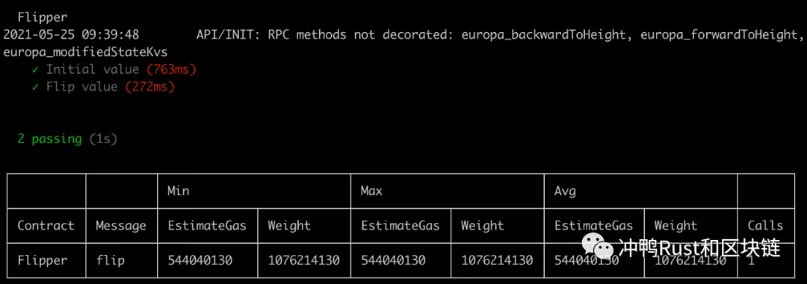
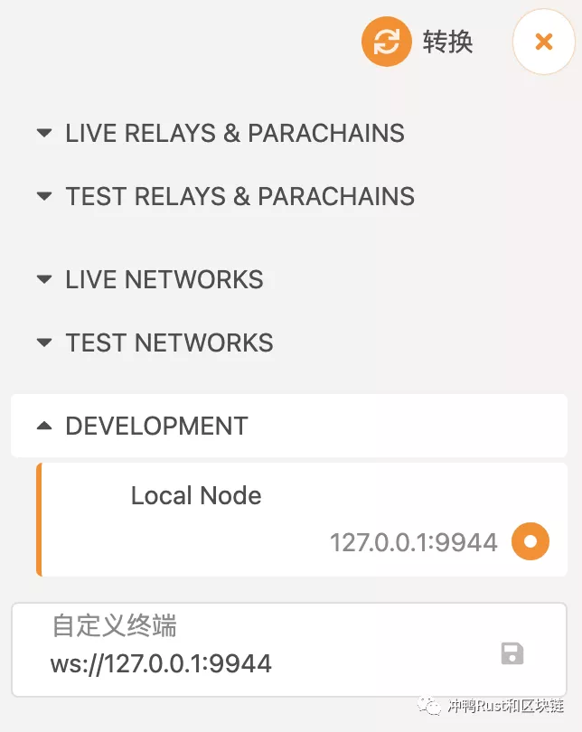
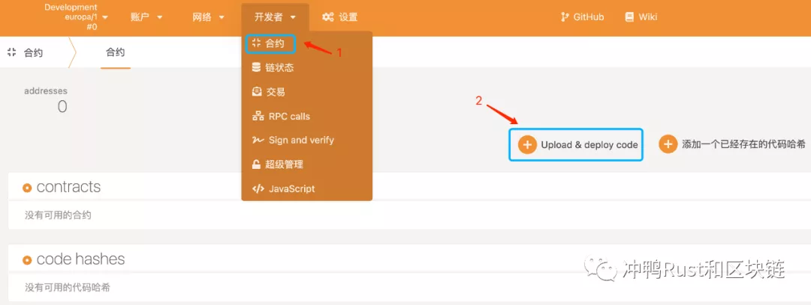
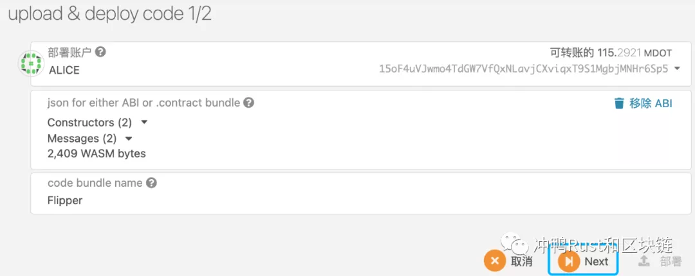
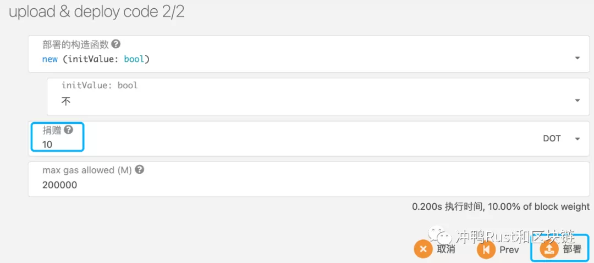
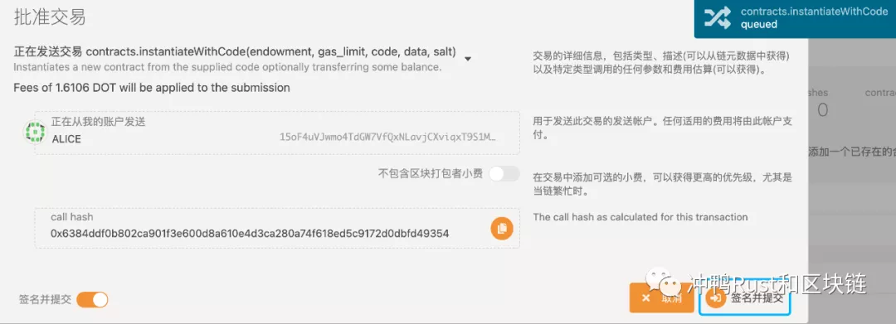
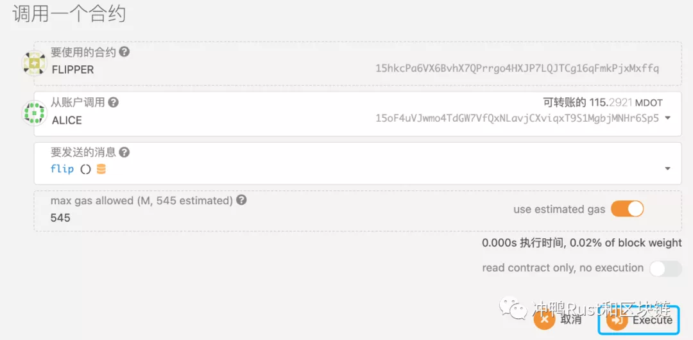
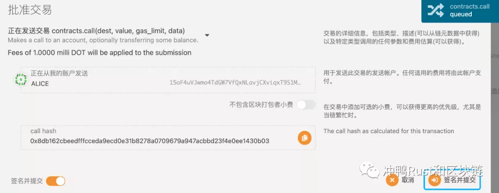
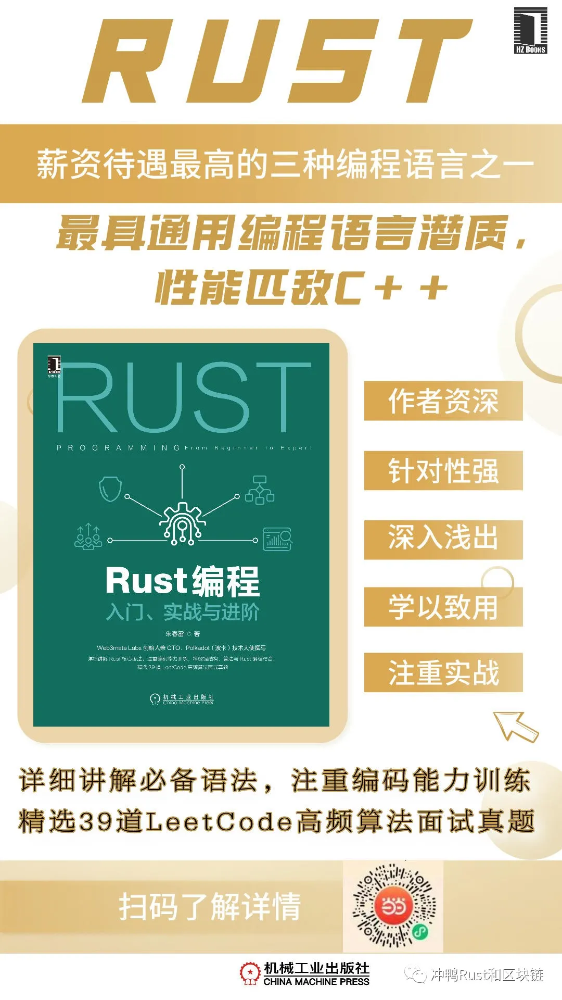

# Rust 与 区块链 | `ink!` 编程实战（一）: 初识 `ink!`

作者： 朱春雷

---

笔者注：本篇我们不会深入探讨 ink! 语法的细节，主要介绍编程环境的搭建，并引导读者逐步完成智能合约的创建、编译、测试和部署，具体的 ink! 语法将会在下一篇中详细讲解。此外，本系列文章将默认读者已经掌握 Rust 的基础语法，故不涉及对 Rust 语法的解释。如果读者对 Rust 基础语法还不熟练的话，可参阅相关资料或购买本文下方推荐的 Rust 入门书籍《Rust 编程入门、实战与进阶》学习。
​

## 1.1 ink! 简介

Parity 官方对 ink! 的定义是：“ink! is an eDSL to write smart contracts in Rust for blockchains built on the Substrate framework. ink! contracts are compiled to WebAssembly.” 也就是说，ink! 是使用 Rust 开发的嵌入式领域特定语言（eDSL），为基于 Substrate 框架构建的区块链编写 WASM（WebAssembly）智能合约。

WASM 是一种新的字节码格式，是一种全新的底层二进制语法，它所编译的代码指令具有体积小、可移植、加载快等特点。相对于基于 EVM 的 Solidity 智能合约，WASM 智能合约占用资源少，运行合约更快速且稳定，网络传输信息更加高效。WASM 支持 Rust、C/C++、C#、Go、Typescript 等语言编写智能合约所编译的字节码，目前 Substrate、ETH 2.0 以及多条联盟链均表示将支持 WASM 智能合约。
​

## 1.2 搭建编程环境
“工欲善其事，必先利其器”。在开始 ink! 编程之前，需要先安装和配置相关的编程环境。

### 1.2.1 Rust 环境安装及配置
#### 1. 安装 Rust
Rust 由工具 rustup 安装和管理。rustup 既是 Rust 安装器，也是版本管理工具。

在终端运行以下命令，遵循指示即可完成最新稳定版 Rust 的下载与安装。
```
curl --proto '=https' --tlsv1.2 -sSf https://sh.rustup.rs | sh
```


如果安装成功，将会出现以下内容。
```
Rust is installed now. Great!
```


#### 2. 设置 PATH 环境变量
在 Rust 开发环境中，rustc、cargo 和 rustup 等所有 Rust 工具都安装在 ~/.cargo/bin 中，我们可以将其加入 PATH 环境变量中。
​

在 ~/.bash_profile 文件中增加以下内容：
```
export PATH="$HOME/.cargo/bin:$PATH"
```


保存文件，回到终端命令行窗口，使用 source 命令使配置立即生效。
```
source ~/.bash_profile
```


运行以下命令，检查是否已正确设置 PATH 环境变量。
```
rustc --version
```


如果能显示 Rust 最新稳定版的版本号、提交哈希和日期等信息，代表环境变量设置成功。如果未看到这些信息，请检查 ~/.bash_profile 文件中 PATH 环境变量设置的路径是否正确。
​

### 1.2.2 ink! 环境安装及配置
在配置了基本的 Rust 环境后，我们来配置 ink! 所需的开发环境。
​

#### 1. 安装 WASM 工具链
由于 ink! 需要 Rust 的 WASM 工具链，且当前 WASM 只能在 nightly 工具链下运行，我们需要先准备 WASM 编译环境。
```
rustup install nightly
rustup component add rust-src --toolchain nightly
rustup target add wasm32-unknown-unknown --toolchain nightly
```


#### 2. 安装 cargo-contract
我们可以安装 Parity 官方提供的编译智能合约的工具 cargo-contract。
```
cargo install cargo-contract --force --feature=“binaryen-as-dependency”
```


也可以使用由 Patract 提供的 cargo-contract，它与 Europa 配合使用可以打印详细的出错信息。
```
cargo install cargo-contract --git https://github.com/patractlabs/cargo-contract --branch=v0.10.0 --force
```


#### 3. 安装区块链节点
智能合约必须运行在区块链上，推荐安装由 Patract 开发的用于智能合约测试的沙盒 Europa（https://github.com/patractlabs/europa）。Europa 提供智能合约在部署与调用过程中的详细日志，能够最大程度地呈现合约模块这个“黑盒”的运行情况，对开发者有很大的帮助。
​

可以执行如下命令在本地安装 Europa。
```
cargo install europa --git https://github.com/patractlabs/europa --locked --force
```


### 1.2.3 Node 环境安装及配置
下文用到的 Redspot 需要使用 Node，因此请确定系统已安装的 Node 版本 >= 12.0。如果不是，可以访问官方网站（https://nodejs.org/zh-cn）进行安装或升级。
​

## 1.3 使用 ink! CLI 开发 ink! 项目
### 1.3.1 创建 flipper 合约
使用 cargo contract new 命令在当前目录下创建智能合约项目 flipper。
```
cargo contract new flipper
```
​

flipper 的目录结构如下所示。
```
flipper
|
+-- .gitignore
|
+-- Cargo.toml
|
+-- lib.rs
```
​

flipper 合约的核心代码在 lib.rs 文件，如代码清单 1-1 所示。flipper 是仅包含一个布尔对象的简单合约，它通过 flip 方法转换布尔值（从 true 转换为 false，或从 false 转换为 true），并通过 get 方法返回当前布尔对象的状态。
​

代码清单 1-1 flipper 合约代码​
```rust
#![cfg_attr(not(feature = "std"), no_std)]

use ink_lang as ink;

#[ink::contract]
mod flipper {

    /// Defines the storage of your contract.
    /// Add new fields to the below struct in order
    /// to add new static storage fields to your contract.
    #[ink(storage)]
    pub struct Flipper {
        /// Stores a single `bool` value on the storage.
        value: bool,
    }

    impl Flipper {
        /// Constructor that initializes the `bool` value to the given `init_value`.
        #[ink(constructor)]
        pub fn new(init_value: bool) -> Self {
            Self { value: init_value }
        }

        /// Constructor that initializes the `bool` value to `false`.
        ///
        /// Constructors can delegate to other constructors.
        #[ink(constructor)]
        pub fn default() -> Self {
            Self::new(Default::default())
        }

        /// A message that can be called on instantiated contracts.
        /// This one flips the value of the stored `bool` from `true`
        /// to `false` and vice versa.
        #[ink(message)]
        pub fn flip(&mut self) {
            self.value = !self.value;
        }

        /// Simply returns the current value of our `bool`.
        #[ink(message)]
        pub fn get(&self) -> bool {
            self.value
        }
    }

    /// Unit tests in Rust are normally defined within such a `#[cfg(test)]`
    /// module and test functions are marked with a `#[test]` attribute.
    /// The below code is technically just normal Rust code.
    #[cfg(test)]
    mod tests {
        /// Imports all the definitions from the outer scope so we can use them here.
        use super::*;

        /// Imports `ink_lang` so we can use `#[ink::test]`.
        use ink_lang as ink;

        /// We test if the default constructor does its job.
        #[ink::test]
        fn default_works() {
            let flipper = Flipper::default();
            assert_eq!(flipper.get(), false);
        }

        /// We test a simple use case of our contract.
        #[ink::test]
        fn it_works() {
            let mut flipper = Flipper::new(false);
            assert_eq!(flipper.get(), false);
            flipper.flip();
            assert_eq!(flipper.get(), true);
        }
    }
}
```
​

### 1.3.2 编译 flipper 合约
运行以下命令，可以编译合约。
```
cargo +nightly contract build
```


代码编译成功会在当前目录下生成 target/ink 文件夹，里面有 3 个重要文件：flipper.contract、flipper.wasm、metadata.json。flipper.wasm 是代码编译后的字节码文件，metadata.json 是元数据文件，其中包含合约提供的可被调用的方法信息。flipper.contract 是将 flipper.wasm 和 metadata.json 合并到一个文件中，在区块链上部署合约时使用。
​

### 1.3.3 测试 flipper 合约
运行以下命令，可以对合约做单元测试。
```
cargo +nightly test
```
​

看到如下结果，代表已成功完成测试。
```
running 2 tests
test flipper::tests::it_works ... ok
test flipper::tests::default_works ... ok

test result: ok. 2 passed; 0 failed; 0 ignored; 0 measured; 0 filtered out; finished in 0.00s
```
​

## 1.4 使用 Patract 工具套件开发 ink! 项目
Patract Labs 为波卡 WASM 智能合约开发提供全面的解决方案，为开发者提供覆盖开发、测试、调试、部署、监控和前端开发等阶段的全栈工具和服务支持。

我们这里主要用到 Patract 工具套件中的 Redspot 和 Europa。Redspot 是智能合约开发、测试和调试的脚手架工具，Europa 提供智能合约运行环境的模拟节点并在运行过程中记录合约执行的信息日志。
​

### 1.4.1 创建 flipper 合约
Redspot 提供了合约开发模版，可以让用户快速搭建起一个项目。执行以下命令将会拉取最新版的 Redspot，并以 erc20 为模板构建项目。
```
npx redspot-new flipper
```


flipper 的目录结构如下所示。
```
flipper
|
+-- contracts
|  |
|  +-- Cargo.toml
|  |
|  +-- lib.rs
|
+-- scripts
|  |
|  +-- deploy.ts
|
+-- tests
|  |
|  +-- erc20.test.ts
|
+-- .gitignore
|
+-- package.json
|
+-- redspot.config.ts
|
+-- tsconfig.json
```
​

修改 contracts/lib.rs 文件，用代码清单 1-1 中的代码替换原代码。
​

### 1.4.2 编译 flipper 合约
运行 npx redspot compile 命令进行合约编译。对于 compile 命令，我们可以传入合约的路径来指定需要编译的合约，如下所示的命令将仅对 contracts/flipper 目录下的合约进行编译。
```
npx redspot compile contracts/flipper
```


编译完成后，可以在 artifacts 目录中找到 Flipper.contract 和 Flipper.json 两个文件。Flipper.json 是元数据文件，Flipper.contract 是在区块链上部署合约时使用。
​

### 1.4.3 测试 flipper 合约
可以使用 Redspot 对合约进行单元测试。首先，删除 tests 目录下默认的 erc20.test.ts 文件，再创建 flipper.test.ts 文件，其内容如代码清单 1-2 所示。
​

代码清单 1-2 flipper 单元测试脚本
```typescript
import BN from 'bn.js';
import { expect } from 'chai';
import { patract, network, artifacts } from 'redspot';

const { getContractFactory, getRandomSigner } = patract;

const { api, getSigners } = network;

describe('Flipper', () => {
  after(() => {
    return api.disconnect();
  });

  async function setup() {
    const one = new BN(10).pow(new BN(api.registry.chainDecimals[0]));
    const signers = await getSigners();
    const Alice = signers[0];
    const sender = await getRandomSigner(Alice, one.muln(10000));
    const contractFactory = await getContractFactory('Flipper', sender);
    const contract = await contractFactory.deploy('new', false);
    const abi = artifacts.readArtifact('Flipper');
    const receiver = await getRandomSigner();

    return { sender, contractFactory, contract, abi, receiver, Alice, one };
  }

  it('Initial value', async () => {
    const { contract } = await setup();
    const result = await contract.query.get();
    expect(result.output).to.equal(false);
  });

  it('Flip value', async () => {
    const { contract } = await setup();
    await contract.tx.flip();

    const result = await contract.query.get();
    expect(result.output).to.equal(true);
  });
});
```
​

其次，在运行测试命令前需要确保正确配置了区块链节点信息，这里使用 redspot.config.ts 文件中的默认配置。
​

最后，通过 europa 命令启动本地开发节点。
```
europa --tmp
```


运行 npx redspot test 命令进行单元测试。对于 test 命令，我们可以传入单元测试脚本的路径来指定需要测试的合约，如下所示的命令将仅对 flipper 合约进行单元测试，同时设置 --no-compile 可以避免自动运行编译命令。
```
npx redspot test tests/flipper.test.ts --no-compile
```
​

看到如下结果，代表已成功完成测试，Redspot 的插件会自动计算并打印出执行合约操作的 Gas 费用。

​

### 1.4.4 部署 flipper 合约
在 Substrate 中，部署合约的过程分为两个步骤：

- 上传代码到区块链上 
- 创建合约实例

​

通过这种模式，诸如标准的 ERC20 合约代码只需上传一次，就可以实例化任意次，避免了因上传相同功能的源代码而浪费区块链上的存储空间。
​

下面首先也是使用 europa 命令启动本地开发节点。
```
europa --tmp
```
​

打开网址 https://polkadot.js.org/apps，配置连接本地启动的开发节点。

​

点击菜单栏上“开发者”中的子菜单“合约”，打开合约页面后，点击“Upload & deploy code”按钮。

​

“upload & deploy code 1/2”窗口对应部署合约的第一个步骤——上传代码到区块链上。选择有帐户余额的部署帐户，再上传 Flipper.contract 文件，确认智能合约的信息后，点击“Next”按钮。





“upload & deploy code 2/2”窗口对应部署合约的第二个步骤——创建合约实例。设置捐赠的数量用以支付合约的存储租金与 Gas 费，再点击“部署”按钮。

​

在“批准交易”窗口，点击“签名并提交”按钮，即可完成合约部署。



​

### 1.4.5 调用 flipper 合约
flipper 合约已成功部署，可以与它进行交互了！
​

我们可以看到布尔对象的当前值是 false，这是因为创建合约实例时将初始值设置为 false。


点击“flip()”左边的“exec”按钮，调用合约的 flip 方法，签名提交后布尔对象的当前值变成了 true，这个合约交互结果符合预期。






我们可以看到，Patract 工具套件为开发 ink! 项目带来了极大的便利，本系列后续文章的示例都将使用 Patract 工具套件来构建。
​

## 1.5 参考资料
1. ink! Smart Contracts Tutorial
https://substrate.dev/substrate-contracts-workshop

2. ink! 官方文档
https://paritytech.github.io/ink-docs
​

3. Patract 官方文档
https://docs.patract.io

---

推荐 Rust 入门学习书籍《Rust 编程入门、实战与进阶》，该书详细讲解 Rust 核心语法，注重编码能力训练，将数据结构、算法与 Rust 编程结合，精选 39 道 LeetCode 高频算法面试真题。需要购买书籍的朋友，可以扫描下方二维码。



---

**扫码关注公众号**


