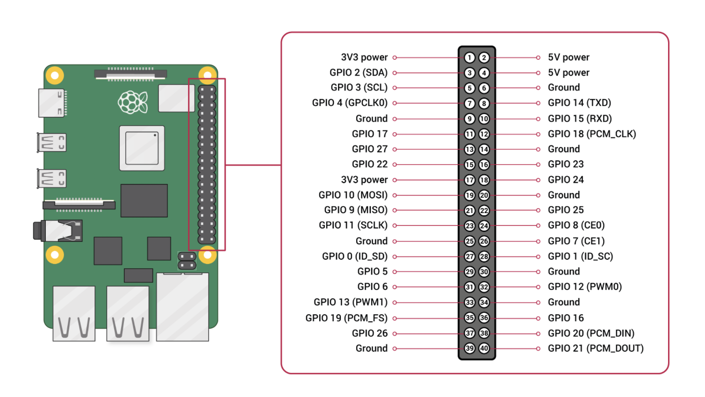
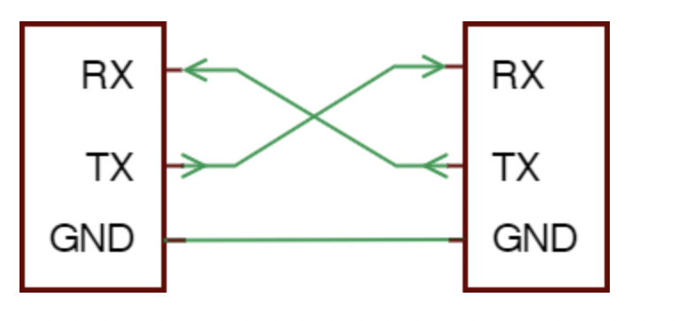

# 学习笔记 ｜ 树莓派 Rust 嵌入式操作系统 之 驱动：GPIO 和 UART

作者：张汉东

> 学习笔记系列在线阅读地址：[https://zhanghandong.github.io/raspberrypi-os-tutorials-notes/](https://zhanghandong.github.io/raspberrypi-os-tutorials-notes/)

---

这是我对官方 [Operating System development tutorials in Rust on the Raspberry Pi](https://github.com/rust-embedded/rust-raspberrypi-OS-tutorials) 的学习笔记。以此来学习 Rust 裸机（Bare-Matel）编程。

学习笔记代码仓库：[https://github.com/ZhangHanDong/raspberrypi-os-tutorials-notes](https://github.com/ZhangHanDong/raspberrypi-os-tutorials-notes)，欢迎反馈交流。

注意：如果需要动手实现，请使用官方教程源码仓库配合本学习笔记。

当前已更新：

- ARM 汇编基础
- 00: 准备工作
- 01: 循环等待
- 02: 初始化执行环境（runtime）
- 03: 硬核输出 Hello World
- 04: 安全访问全局数据结构
- 05: 驱动：GPIO 和 UART

本文节选第五章内容。

---

# 驱动：GPIO 和 UART

> 注意：这章不支持 `BSP=rpi4 make qemu`。


## 一些前置知识

### Arm 物理内存 vs Arm 虚拟地址空间 

Arm 与物理内存等外设统一编址在4GB(32位)的地址空间中。而 x86 是将内存单独编址在一个地址空间，外设I/O端口在另外的地址空间，要访问IO地址空间需要用专门的指令操作。

Linux的每个进程都有4GB的虚拟地址空间，其中1~3GB是每个进程独占的用户空间，3GB~4GB是所有进程共享的内核空间（`0xC0000000~0xFFFFFFFF`）。因此虚拟地址空间包括内核空间与用户空间。linux的实虚地址的转换就是有MMU通过页表的形式完成转换的。

Arm 虚拟地址空间布局是一个标准的linux kernel实现，地址空间被分割成 1G 内核空间和 3G 用户空间，内核空间地址范围为`0xC0000000 - 0xEFFFFFFF`, 用户空间地址范围为 `0x00000000 - 0xBFFFFFFF`。

通过操作内存来访问外设，这种方式称为 `memory-mapped IO`。

需要注意：外设(Peripherals)的物理地址空间为 `0x20000000+16MB`，一般在内核虚拟地址中被映射到`0x7E000000+16MB`。

> 树莓派 4b bcm 2711 文档中描述了ARM所见地址之间的映射：
>
>  rpi4: 0xFE200000 - 0xFE2000b3 : gpio@ 0x7E200000
> 
>  只需把 fe200000 减去GPIO-BaseAddr（0x00200000），就可获得树莓派的PeripheralBaseAddr（PBase）：0xFE000000。

### GPIO 与 UART

在学习这一章之前，还是需要一些前置知识的。对树莓派如果不了解的话，很难理解它的代码在做什么。这部分内容，如果你暂时不想看，或者已经了解过，可以跳过。需要的时候可以回头看看。

GPIO（General Purpose I/O Ports）意思为通用输入/输出端口，通俗地说，就是一些引脚，可以通过它们输出高低电平或者通过它们读入引脚的状态-是高电平或是低电平。GPIO是个比较重要的概念，用户可以通过GPIO口和硬件进行数据交互(如UART)，控制硬件工作(如LED、蜂鸣器等),读取硬件的工作状态信号（如中断信号）等。GPIO口的使用非常广泛。掌握了GPIO，差不多相当于掌握了操作硬件的能力。

以树莓派 4B 为例，其 40 针脚见下图:



UART（Universal Asynchronous Receiver/Transmitter)，是一种串行通信协议，其中数据是串行传输的，一次传输一个字节的数据，即逐位传输。作为把并行输入信号转成串行输出信号的芯片，UART 通常被集成于其他通讯接口的连结上。

为了和树莓派串口通信，我们将树莓派的 UART 针脚连接到个人电脑（下面简称 PC）上。

UART 的端口至少有 RX、TX 和地线三个针脚。RX 负责读取，TX 负责输出。如果有两个 UART 端口，它们的连接方式如下：



注意这里是：`usb2ttl(RXD) <-> gpio(TXD)` 以及 `usb2ttl(TXD) <-> gpio(RXD)`。另外注意，不要连接usb2tt 上的电源线到树莓派，小心烧坏树莓派。

**uart 协议层**

协议层中，规定了数据包的内容，它由起始位、主体数据、校验位以及停止位组成，通信双方的数据包格式要约定一致才能正常收发数据 。
- 波特率：异步通信中由于没有时钟信号，所以2个通信设备需约定好波特率，常见的有4800、9600、115200等。
- 通信的起始和停止信号：串口通信的一个数据包从起始信号开始，知道停止信号结束。数据包的起始信号由一个逻辑0的数据位表示，而数据包的停止信号可由0.5、1、1.5或2个逻辑1的数据位表示，只要双方约定一致即可。
- 有效数据：在数据包的起始位之后紧接着的就是要传输的主体数据内容，也称为有效数据，有效数据的长度常被约定为8位或9位长。
- 数据校验：在有效数据之后，有一个可选的数据校验位。由于数据通信相对容易受到外部干扰导致传输数据出现偏差，可以在传输过程加上校验位来解决这个问题。校验方法有奇校验(odd)、偶校验(even)、0校验(space)、1校验(mark)以及无校验(noparity)。
- 奇校验要求有效数据和校验位中“1”的个数为奇数，比如一个 8 位长的有效数据为：01101001，此时总共有 4 个“1”，为达到奇校验效果，校验位为“1”，最后传输的数据将是 8 位的有效数据加上 1 位的校验位总共 9 位。偶校验与奇校验要求刚好相反，要求帧数据和校验位中“1”的个数为偶数，比如数据帧：11001010，此时数据帧“1”的个数为 4 个，所以偶校验位为“0”。0 校验是不管有效数据中的内容是什么，校验位总为“0”，1 校验是校验位总为“1”

**uart 波特率计算**

公式：


其中，`fck`为 USART 时钟， `USARTDIV` 是一个存放在波特率寄存器(USART_BRR)的一个无符号定点数。其中 `DIV_Mantissa[11:0]`位定义 USARTDIV 的整数部分，`DIV_Fraction[3:0]`位定义 USARTDIV 的小数部分。

例如：`DIV_Mantissa=24(0x18)`，`DIV_Fraction=10(0x0A)`，此时 USART_BRR 值为`0x18A`；那么USARTDIV的小数位`10/16=0.625`；整数位24，最终USARTDIV的值为`24.625`。

波特率的常用值有 `2400`、`9600`、`19200`、`115200`。

如何设定寄存器值得到波特率的值?

假设：串口设置为`961200  8N1`，即 波特率为 961200，8数据位，N表示没有校验位，1位停止位。

而在内核 `config.txt`中将时钟设置为 `48MHZ`（`init_uart_clock=48000000`）。

那么波特率（baud）计算为: `(48_000_000 / 16) / 921_600 = 3.2552083`。这意味着整数部分（DIV_Mantissa）为`3`，小数部分是`0.2552083`。

根据PL011技术参考手册进行的 DIV_Fraction计算： `INTEGER( (0.2552083 * 64) + 0.5 ) = 16`。`INTEGER`代表取整。

因此生成的波特率分频器（baud rate divider）为 `3 + 16/64 = 3.25`，那么生成的波特率是`48_000_000 / (16 * 3.25) = 923_077`。误差率为 `((923_077 - 921_600) / 921_600) * 100 = 0.16%`。

那么反过来，如果想用波特率为 `115200 8N1`，则：

- 整数部分：`(48000000/16)/115200 = 26.0416666667`。
- 小数部分： `INTEGER((0.0416666667 * 64) + 0.5) = 3`

设置正确的波特率比较重要。

### 树莓派启动流程

树莓派在设计的时候，为了节省成本，没有使用掉电非易失性存储介质，也就在板子上不能找到相关的flash。这样芯片启动的程序只能放在sd卡里面了。本来U盘启动也是一种方式，但是树莓派4代之前的设计并不是很好，导致这种启动方式不可以使用。树莓派4也有一些尝试，但是目前树莓派4最主流的方式还是使用SD卡启动。

Raspberry Pi 4具有一个SPI连接的EEPROM（4MBits / 512KB）。其中包含用于启动系统的代码，并替换了先前在SD卡的启动分区中找到的`bootcode.bin`。如果你的树莓派4通电了但是一直无法启动系统，且绿灯常亮不闪，需要检查两种情况：

1. 有没有插入 sd 卡。
2. 如果有sd卡，那么就是EEPROM被损坏了。你需要重新格式化sd卡，并去官网下载Recovery固件修复即可。

在树莓派裸机实验中，从 sd 卡启动系统必须包含必要的文件：

1. `bootcode.bin` （树莓派4不需要，之前的需要）。
2. `config.txt`
3. `kernel8.img`，内核镜像
4. `start4.elf`
5. `bcm2711-rip-4.dtb`

启动流程：

1. 芯片上电，执行固化在内部的 `first-stage bootloader`，用于加载sd卡中的`bootcode.bin`文件。但是在树莓派4上，不需要这个文件，因为有了有了SPI的EEPROM。
2. 启动 GPU。ARM Cortex-A72 Core处于standby状态，VideoCore IV GPU Core负责启动系统。
3. 将`bootcode.bin`读取到了128K大小的二级缓存(L2 Cache)中。开始执行`bootcode.bin`代码。用于初始化RAM，并且把start4.elf加载到内存中，并且去读取config.txt中的配置信息，设置这些配置信息。当然，树莓派4就没有`bootcode.bin`什么事了。
4. `bcm2711-rpi-4-b.dtb`文件也是需要的，如果不存在也会影响串口的输出，也就是只会有乱码输出。所以推测start4.elf文件也会去读取设备树文件，然后设置一些基本的参数。

**config.txt 配置信息**

```rust
enable_uart=1 // 表示使用的是miniUART
arm_64bit=0 // 告诉arm要启动的程序是32位的
core_freq=250 // 设置arm的频率
kernel=kernel7.img // 表示从start4.elf执行的程序是哪一个
kernel_address=0x8000 // 表示需要执行的内存地址，这个地址就是裸机程序在链接时的入口地址
```
这些配置并不是每个都必须，主要看实际情况。前期理解芯片的启动过程有助于对后面编写裸机代码的分析。


**重要**

以上概念，需要配合本章代码和真实的树莓派实机来验证才能有更深刻的领会。

## 代码释意

第五章算是一个里程碑。

前四章完成了从树莓派裸机到建立 Rust 执行环境，但都是基于QEMU。从第五章开始支持真实的树莓派执行内核代码。

所以，为了和真实的树莓派通信，我们需要实现两个驱动程序。

### 引导程序

引导程序基本和上一章代码一样。只是在 `src/_arch/aarch64/cpu.rs` 里增加了针对树莓派3的相关代码：

```rust
pub use asm::nop;

/// Spin for `n` cycles.
#[cfg(feature = "bsp_rpi3")]
#[inline(always)]
pub fn spin_for_cycles(n: usize) {
    for _ in 0..n {
        asm::nop();
    }
}
```
这个后面会用到。此处使用条件编译，指定`bsp_rpi3` feature。使用汇编的`nop`操作实现cpu 空等待。

### 内核初始化

打开 `src/main.rs` ，看到 `kernel_init` 函数有了很大变化。

```rust
// 因为只有单核（core0）被激活执行初始化代码，能保证正确执行顺序，所以现在是安全的
/// # Safety
///
/// - Only a single core must be active and running this function.
/// - The init calls in this function must appear in the correct order.
unsafe fn kernel_init() -> ! {
    // 此处增加了 驱动管理
    use driver::interface::DriverManager;
    // 迭代驱动实例初始化，如果失败则 panic
    for i in bsp::driver::driver_manager().all_device_drivers().iter() {
        if let Err(x) = i.init() {
            panic!("Error loading driver: {}: {}", i.compatible(), x);
        }
    }
    // 
    bsp::driver::driver_manager().post_device_driver_init();
    // println! is usable from here on.

    // 这个是安全的函数
    // Transition from unsafe to safe.
    kernel_main()
}

/// The main function running after the early init.
fn kernel_main() -> ! {
    use bsp::console::console;
    use console::interface::All;
    use driver::interface::DriverManager;

    println!(
        "[0] {} version {}",
        env!("CARGO_PKG_NAME"),
        env!("CARGO_PKG_VERSION")
    );
    println!("[1] Booting on: {}", bsp::board_name());

    // 打印驱动加载过程
    println!("[2] Drivers loaded:");
    for (i, driver) in bsp::driver::driver_manager()
        .all_device_drivers()
        .iter()
        .enumerate()
    {
        println!("      {}. {}", i + 1, driver.compatible());
    }

    println!(
        "[3] Chars written: {}",
        bsp::console::console().chars_written()
    );

    // 下面打印回显信息
    println!("[4] Echoing input now");

    // 进入回显模式之前，请丢弃所有接收到的噪音字符
    // Discard any spurious received characters before going into echo mode.
    console().clear_rx();
    loop {
        let c = bsp::console::console().read_char();
        bsp::console::console().write_char(c);
    }
}
```


### 内存映射


MMIO 映射物理内存代码被定义在 `src/bsp/raspberrypi/memory.rs`中。

```rust
//--------------------------------------------------------------------------------------------------
// Public Definitions
//--------------------------------------------------------------------------------------------------

/// The board's physical memory map.
#[rustfmt::skip]
pub(super) mod map {

    pub const GPIO_OFFSET:         usize = 0x0020_0000;
    pub const UART_OFFSET:         usize = 0x0020_1000;

    /// Physical devices.
    #[cfg(feature = "bsp_rpi3")]
    pub mod mmio {
        use super::*;

        pub const START:            usize =         0x3F00_0000;
        pub const GPIO_START:       usize = START + GPIO_OFFSET;
        pub const PL011_UART_START: usize = START + UART_OFFSET;
    }

    // 注意，树莓派4 的物理内存基址为 0xFE00_0000 （前置知识有描述）
    /// Physical devices.
    #[cfg(feature = "bsp_rpi4")]
    pub mod mmio {
        use super::*;

        pub const START:            usize =         0xFE00_0000;
        pub const GPIO_START:       usize = START + GPIO_OFFSET;
        pub const PL011_UART_START: usize = START + UART_OFFSET;
    }
}

```

### 驱动

在看 `src/bsp/raspberrypi.rs` 代码：

```rust
//--------------------------------------------------------------------------------------------------
// Global instances
// 这里定义俩全局静态变量 GPIO 和 PL011_UART ，用于持有相应的基址。
// --------------------------------------------------------------------------------------------------
use super::device_driver;

static GPIO: device_driver::GPIO =
    unsafe { device_driver::GPIO::new(memory::map::mmio::GPIO_START) };

static PL011_UART: device_driver::PL011Uart =
    unsafe { device_driver::PL011Uart::new(memory::map::mmio::PL011_UART_START) };

//--------------------------------------------------------------------------------------------------
// Public Code
//--------------------------------------------------------------------------------------------------

/// Board identification.
pub fn board_name() -> &'static str {
    #[cfg(feature = "bsp_rpi3")]
    {
        "Raspberry Pi 3"
    }

    #[cfg(feature = "bsp_rpi4")]
    {
        "Raspberry Pi 4"
    }
}
```

接下来我们看一下 `src/driver.rs` 代码。

```rust
// 为驱动定义一个 interface 模块，当命名空间使用
// 该模块定义了两个 trait，规范了驱动的行为 和 管理操作
/// Driver interfaces.
pub mod interface {

    /// Device Driver functions.
    pub trait DeviceDriver {
        // 设备树基本属性之一，用于指定兼容的系统
        /// Return a compatibility string for identifying the driver.
        fn compatible(&self) -> &'static str;


        // 这段 Unsafe Rust 代码写的很标准
        // 初始化函数 init 为 unsafe 操作，因为在初始化的时候，驱动可能会对整个系统产生影响，所以这里加上 `#Safety` 注释来说明这种情况，并且为函数加上 `unsafe` 标签。
        // 整个函数是由内核调用以启动设备
        /// Called by the kernel to bring up the device.
        ///
        /// # Safety
        ///
        /// - During init, drivers might do stuff with system-wide impact.
        unsafe fn init(&self) -> Result<(), &'static str> {
            Ok(())
        }
    }

    /// Device driver management functions.
    /// `BSP` 应该提供一个全局实例
    /// The `BSP` is supposed to supply one global instance.
    pub trait DriverManager {
        // 返回所有实例化驱动的引用集合（切片）
        // 该函数返回 DeviceDriver trait对象，用 `'static`是因为该trait中方法返回都是 `'static str`。
        /// Return a slice of references to all `BSP`-instantiated drivers.
        ///
        /// # Safety
        /// 设备的顺序是调用`DeviceDriver::init()`的顺序
        /// - The order of devices is the order in which `DeviceDriver::init()` is called.
        fn all_device_drivers(&self) -> &[&'static (dyn DeviceDriver + Sync)];

        // 驱动程序初始化后运行的初始化代码
        /// Initialization code that runs after driver init.
        ///
        /// For example, device driver code that depends on other drivers already being online.
        fn post_device_driver_init(&self);
    }
}
```

具体的驱动代码实现在 `src/bsp/device_driver/bcm.rs` 模块中。

先来看一下 `src/bsp/device_driver/common.rs`

```rust
//! Common device driver code.

use core::{marker::PhantomData, ops};

//--------------------------------------------------------------------------------------------------
// Public Definitions
//--------------------------------------------------------------------------------------------------
// 对 MMIO 指针地址做了一个 Rust 包装，此处引入 `PhantomData<fn() -> T>`，为的保证只能传入 `'static`的引用。
pub struct MMIODerefWrapper<T> {
    start_addr: usize,
    phantom: PhantomData<fn() -> T>,
}

//--------------------------------------------------------------------------------------------------
// Public Code
//--------------------------------------------------------------------------------------------------

impl<T> MMIODerefWrapper<T> {
    /// Create an instance.
    pub const unsafe fn new(start_addr: usize) -> Self {
        Self {
            start_addr,
            phantom: PhantomData,
        }
    }
}

// 为 `MMIODerefWrapper<T>` 实现 Deref ，作为智能指针使用，返回一个引用
impl<T> ops::Deref for MMIODerefWrapper<T> {
    type Target = T;

    fn deref(&self) -> &Self::Target {
        unsafe { &*(self.start_addr as *const _) }
    }
}

```

再看 `src/bsp/device_driver/bcm/bcm2xxx_gpio.rs`，这是 GPIO 驱动的具体实现。下面摘录一些只和树莓派4b相关的关键代码：

```rust
use crate::{
    bsp::device_driver::common::MMIODerefWrapper, driver, synchronization,
    synchronization::NullLock,
};
// 此处用到了 `register-rs` 库，是一个类型安全的 MMIO 和 CPU 寄存器访问的库。
use register::{mmio::*, register_bitfields, register_structs};


// GPIO registers.
// 下面连接是 GPIO 寄存器的一些规格文档
// Descriptions taken from
// - https://github.com/raspberrypi/documentation/files/1888662/BCM2837-ARM-Peripherals.-.Revised.-.V2-1.pdf
// - https://datasheets.raspberrypi.org/bcm2711/bcm2711-peripherals.pdf

// Raspberry Pi 3/4 具有两个UART器件：PL011 UART和 mini UART。 
// 而 PL011 UART连接到蓝牙模块，而 mini UART 用作主要 UART。
// 但我们可以初始化 GPIO 寄存器来直接使用 PL011 UART 来替代 mini UART。

// 此宏为 `register-rs` 库提供，用于定义 MMIO 寄存器
register_bitfields! {
    u32,

    // 为了使用 PL011 UART 
    // 需要将 GPFSEL1寄存器 的 FSEL14 和 FSEL15 位字段设置为与 AltFunc0 功能相对应的 0b100 地址。
    /// GPIO Function Select 1
    GPFSEL1 [
        /// Pin 15
        FSEL15 OFFSET(15) NUMBITS(3) [
            Input = 0b000,
            Output = 0b001,
            AltFunc0 = 0b100  // PL011 UART RX

        ],

        /// Pin 14
        FSEL14 OFFSET(12) NUMBITS(3) [
            Input = 0b000,
            Output = 0b001,
            AltFunc0 = 0b100  // PL011 UART TX
        ]
    ],

    // 为了使用 PL011 UART 
    // 通过将GPPUD寄存器设置为0
    // 树莓派3需要，此处省略
    // ... ...

    // 为了使用 PL011 UART 
    // 将GPIO_PUP_PDN_CNTRL_REG0 寄存器 GPIO_PUP_PDN_CNTRL15 和 GPIO_PUP_PDN_CNTRL14位字段设置为1来关闭 Pullup 来启用这些引脚。 
    /// GPIO Pull-up / Pull-down Register 0
    ///
    /// BCM2711 only.
    GPIO_PUP_PDN_CNTRL_REG0 [
        /// Pin 15
        GPIO_PUP_PDN_CNTRL15 OFFSET(30) NUMBITS(2) [
            NoResistor = 0b00,
            PullUp = 0b01
        ],

        /// Pin 14
        GPIO_PUP_PDN_CNTRL14 OFFSET(28) NUMBITS(2) [
            NoResistor = 0b00,
            PullUp = 0b01
        ]
    ]
}

register_structs! {
    #[allow(non_snake_case)]
    RegisterBlock {
        (0x00 => _reserved1),
        (0x04 => GPFSEL1: ReadWrite<u32, GPFSEL1::Register>),
        (0x08 => _reserved2),
        (0x94 => GPPUD: ReadWrite<u32, GPPUD::Register>),
        (0x98 => GPPUDCLK0: ReadWrite<u32, GPPUDCLK0::Register>),
        (0x9C => _reserved3),
        (0xE4 => GPIO_PUP_PDN_CNTRL_REG0: ReadWrite<u32, GPIO_PUP_PDN_CNTRL_REG0::Register>),
        (0xE8 => @END),
    }
}

// 关联的MMIO寄存器的抽象
/// Abstraction for the associated MMIO registers.
type Registers = MMIODerefWrapper<RegisterBlock>;

//--------------------------------------------------------------------------------------------------
// Public Definitions
//--------------------------------------------------------------------------------------------------

pub struct GPIOInner {
    registers: Registers,
}

// Export the inner struct so that BSPs can use it for the panic handler.
pub use GPIOInner as PanicGPIO;

// GPIO 硬件抽象
/// Representation of the GPIO HW.
pub struct GPIO {
    inner: NullLock<GPIOInner>,
}

//--------------------------------------------------------------------------------------------------
// Public Code
//--------------------------------------------------------------------------------------------------

impl GPIOInner {
    /// Create an instance.
    ///
    /// # Safety
    /// 此处用户必须确保提供正确的 MMIO start 地址，所以用 unsafe 标记函数
    /// - The user must ensure to provide a correct MMIO start address.
    pub const unsafe fn new(mmio_start_addr: usize) -> Self {
        Self {
            registers: Registers::new(mmio_start_addr),
        }
    }

    // 关闭引脚 14 和 15 的 pull-up/down 
    /// Disable pull-up/down on pins 14 and 15.
    #[cfg(feature = "bsp_rpi4")]
    fn disable_pud_14_15_bcm2711(&mut self) {
        self.registers.GPIO_PUP_PDN_CNTRL_REG0.write(
            GPIO_PUP_PDN_CNTRL_REG0::GPIO_PUP_PDN_CNTRL15::PullUp
                + GPIO_PUP_PDN_CNTRL_REG0::GPIO_PUP_PDN_CNTRL14::PullUp,
        );
    }

    // 将  PL011 UART 映射为标准输出
    /// Map PL011 UART as standard output.
    ///
    /// TX to pin 14
    /// RX to pin 15
    pub fn map_pl011_uart(&mut self) {
        // Select the UART on pins 14 and 15.
        self.registers
            .GPFSEL1
            .modify(GPFSEL1::FSEL15::AltFunc0 + GPFSEL1::FSEL14::AltFunc0);

        // Disable pull-up/down on pins 14 and 15.
        #[cfg(feature = "bsp_rpi3")]
        self.disable_pud_14_15_bcm2837();

        #[cfg(feature = "bsp_rpi4")]
        self.disable_pud_14_15_bcm2711();
    }
}

impl GPIO {
    /// Create an instance.
    ///
    /// # Safety
    ///
    /// - The user must ensure to provide a correct MMIO start address.
    pub const unsafe fn new(mmio_start_addr: usize) -> Self {
        Self {
            inner: NullLock::new(GPIOInner::new(mmio_start_addr)),
        }
    }

    /// Concurrency safe version of `GPIOInner.map_pl011_uart()`
    pub fn map_pl011_uart(&self) {
        self.inner.lock(|inner| inner.map_pl011_uart())
    }
}

//------------------------------------------------------------------------------
// OS Interface Code
//------------------------------------------------------------------------------
use synchronization::interface::Mutex;

// 注意，这里还有个 init 方法使用默认实现。
impl driver::interface::DeviceDriver for GPIO {
    fn compatible(&self) -> &'static str {
        "BCM GPIO"
    }
}

```

接下来看 `src/bsp/device_driver/bcm/bcm2xxx_pl011_uart.rs`中 PL011 uart 的驱动实现。

只摘录关键代码聊聊。定义寄存器和 GPIO 驱动类似。有一些关于 uart 读取的代码就没贴出来。

```rust
use register::{mmio::*, register_bitfields, register_structs};

impl PL011UartInner {
    // ... ...

    pub fn init(&mut self) {
        self.flush();

        // Turn the UART off temporarily.
        self.registers.CR.set(0);

        // Clear all pending interrupts.
        self.registers.ICR.write(ICR::ALL::CLEAR);

        // Set the baud rate, 8N1 and FIFO enabled.
        // 这里设置波特率，关于波特率的计算可以查看本章前置知识
        // 这里有一个坑：
        //    现在这个注释的波特率设置最终值为 `921600`，
        //    但是实际在真实树莓派硬件执行的时候，
        //    有的 utf2ttl 可能不支持这么高的波特率，所以可能会出现乱码。
        //    如果遇到乱码输出可以尝试将波特率改为 115200 ，对应设置（26,3）
        // self.registers.IBRD.write(IBRD::BAUD_DIVINT.val(3));
        // self.registers.FBRD.write(FBRD::BAUD_DIVFRAC.val(16));
         self.registers.IBRD.write(IBRD::BAUD_DIVINT.val(26));
        self.registers.FBRD.write(FBRD::BAUD_DIVFRAC.val(3));
        self.registers
            .LCR_H
            .write(LCR_H::WLEN::EightBit + LCR_H::FEN::FifosEnabled);

        // Turn the UART on.
        self.registers
            .CR
            .write(CR::UARTEN::Enabled + CR::TXE::Enabled + CR::RXE::Enabled);
    }
}

// ... ...

impl driver::interface::DeviceDriver for PL011Uart {
    fn compatible(&self) -> &'static str {
        "BCM PL011 UART"
    }

    // 这里使用了同步锁，在当前示例下，不需要这个也可以
    // 因为内核初始化的时候只绑定了单核
    unsafe fn init(&self) -> Result<(), &'static str> {
        self.inner.lock(|inner| inner.init());

        Ok(())
    }
}

```

### 驱动管理

驱动定义好以后，就可以管理了。看 `src/bsp/raspberrypi/driver.rs` 中代码：

```rust
// 定义设备驱动管理器，这里是两个元素的固定大小数组
/// Device Driver Manager type.
struct BSPDriverManager {
    device_drivers: [&'static (dyn DeviceDriver + Sync); 2],
}

// 创建一个静态常量，持有 GPIO 和 PL011_UART 的引用地址
static BSP_DRIVER_MANAGER: BSPDriverManager = BSPDriverManager {
    device_drivers: [&super::GPIO, &super::PL011_UART],
};

//--------------------------------------------------------------------------------------------------
// Public Code
//--------------------------------------------------------------------------------------------------

/// Return a reference to the driver manager.
pub fn driver_manager() -> &'static impl driver::interface::DriverManager {
    &BSP_DRIVER_MANAGER
}

//------------------------------------------------------------------------------
// OS Interface Code
//------------------------------------------------------------------------------
use driver::interface::DeviceDriver;

// 实现 DriverManager trait
impl driver::interface::DriverManager for BSPDriverManager {
    fn all_device_drivers(&self) -> &[&'static (dyn DeviceDriver + Sync)] {
        &self.device_drivers[..]
    }

    // 在 GPIO 启动以后执行 映射 pl011_uart 引脚
    fn post_device_driver_init(&self) {
        // Configure PL011Uart's output pins.
        super::GPIO.map_pl011_uart();
    }
}
```

## 代码在真实树莓派上执行过程

如果没有树莓派，在 qemu 也可以。但是如果在真实硬件上启动内核，需要注意避开一些坑。我分享一下我的流程：

1. 在测试内核之前，先安装树莓派官方的 Respbian OS 操作系统。这样做可以完整测试树莓派硬件的功能完整性，为后续启动 rust 实现的内核排坑。
2. 如果遇到无法启动 OS 的情况，观察绿灯是否闪烁，排除是不是EEPROM损坏了。
3. 如果遇到输出字符乱码，请确认内核设置的波特率，和你的串口调试工具波特率是否一致。
4. 确保 usb2ttl RX/TX 连线对接正确。并且 usb2ttl 驱动安装正确。
5. 烧录工具推荐：balenaetcher。官方推荐的不太好使。如果展示烧录失败，可以点击 skip 跳过 验证那一环节。
6. 串口输出推荐使用 Rust 实现的这个工具：[https://github.com/umaYnit/rust-serial-tool](https://github.com/umaYnit/rust-serial-tool)。不推荐 官方教程自带的这个 Ruby 实现，因为在 mac m1下有点坑。


## 小结

前五章，以一个非常短小精悍的 Rust 内核程序，为我们展示了如何在树莓派裸机上运行 Rust 代码。为后面的操作系统实现奠定了初步的基础。

在实际树莓派硬件上执行的时候，遇到坑不要轻易放弃，多半是因为知识经验不足导致的，此时正是学习的机会。


## 参考


1. [https://www.raspberrypi.com.tw/tutorial/faq/](https://www.raspberrypi.com.tw/tutorial/faq/)
2. [https://zhuanlan.zhihu.com/p/136806005](https://zhuanlan.zhihu.com/p/136806005)
3. [https://github.com/bztsrc/raspi3-tutorial](https://github.com/bztsrc/raspi3-tutorial)
4. [https://datasheets.raspberrypi.org/bcm2711/bcm2711-peripherals.pdf](https://datasheets.raspberrypi.org/bcm2711/bcm2711-peripherals.pdf)
5. [https://e-mailky.github.io/2016-12-06-dts-introduce](https://e-mailky.github.io/2016-12-06-dts-introduce)