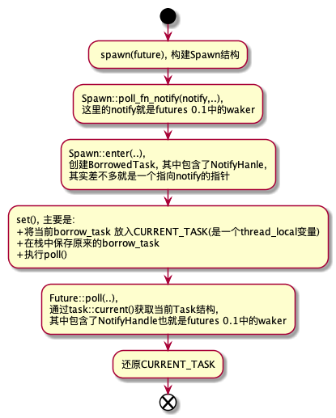
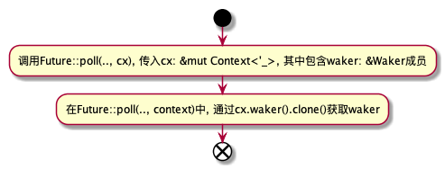
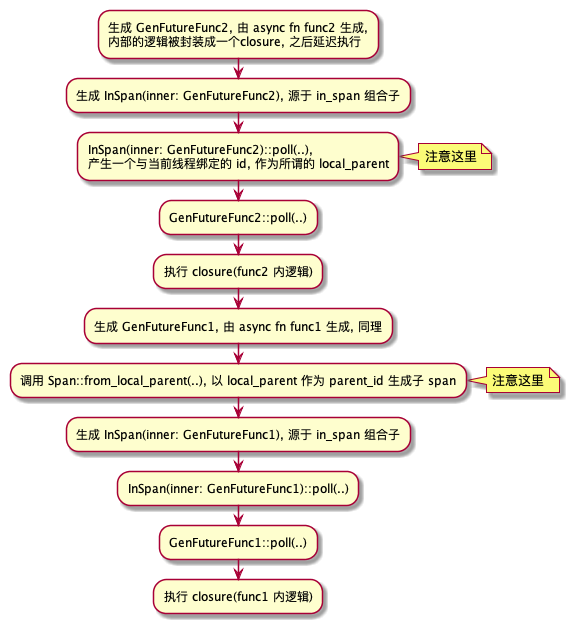
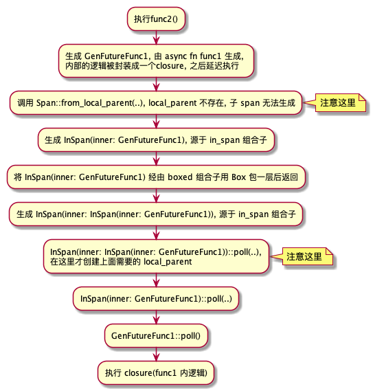

# 蚂蚁集团 ｜ Futures 0.1 和 0.3 兼容层的分析与应用

作者： Rachelint

## 背景

我们团队在 futures 0.1 版本时便在项目中对其进行了广泛使用，但 futures 发展到 0.3 加上 rust 引入了async/await 关键字后，明显具有了更高的可读性和可维护性，将 futures crate 进行版本升级是迟早要做的事情。但是如果一次性将项目中所有相关代码进行升级，工作量之大明显是难以接受的，稳定性方面也难以确保。因此我们决定利用 futures 0.3 提供的兼容层，对 futures 相关代码进行逐步升级。
在本文中，我想分享一下对兼容层实现的一些理解，还有在实践中得到的一些经验。文章大致分为三部分：

- 兼容层的大致使用方法
- 兼容层原理分析
- 实践经验

部分观点可能存在过于主观，或者存在错误等情况，欢迎指正。

## 1. Future01 和 Future03 的区别
首先看看两个版本中trait的声明 (在文中，futures 0.1 的 Future trait 称为 Future01，而 futures 0.3 的称为 Future03，下同)：
```rust
// 0.1
pub trait Future {
    type Item;
    type Error;
    fn poll(&mut self) -> Poll<Self::Item, Self::Error>;
}

// 0.3
pub trait Future {
    type Output;

    fn poll(self: Pin<&mut Self>, cx: &mut Context) -> Poll<Self::Output>;
}
```
可以看出，主要有三处不同：
1. Future01 有两个关联类型 Item 和 Error，因为其中的 Poll 其实就是一个特殊的 Result 类型；
而 Future03 则只有一个关联类型 Output，而其中的 Poll 变为一个枚举类型；
2. Future03 poll 中的参数之一从 Future01 中的 &mut self 变为了Pin<&mut Self>；
3. Future03 poll 中多了一个参数cx: &mut Context；
这里主要简单介绍一下第2和第3点区别：

- Future03 为什么需要 Pin<&mut Self>？首先 Pin 只会限制实现了 !Unpin 的类型的移动，而 rust 只为一些如下特例实现了 !Unpin：
   - PhantomPinned；
   - 编译器为 async/await desugar 之后生成的 impl Future结构体；

很明显，Pin 主要是为了解决 async/await 自动生成 Future 的问题，那问题就是自引用，移动自引用结构体会造成指针失效。限于篇幅问题，这里先不再展开了，想更详细地了解关于 Pin 的知识，推荐阅读以下文章：
1. [Rust的Pin与Unpin](https://folyd.com/blog/rust-pin-unpin/)
2. [Rust Async: Pin概念解析](https://zhuanlan.zhihu.com/p/67803708)

- Future03 为什么需要 cx: &mut Context？现在 Context 当中还是只有一个 waker: &Waker 成员，新加入这个参数，按个人理解主要是用于改变按个人理解主要是用于改变 Waker（在01中起相同作用的是Notify) 设置和在 poll(..) 中对其进行获取的方式。

	Future01 中 notify 的传入与获取大致流程：

	

	Future 0.3 中 notify 的传入与获取大致流程：

	

很明显，实现 Future01 和 03 相互间的转换只要解决以后区别即可，而实际的实现大致上也是这么一个思路。

## 2. 使用方法
我们的目的是在项目中让 futures 0.1 和 0.3 相关内容并存，并根据需要实现它们之间的相互转换。
### Cargo.toml 配置

- 首先要解决 futures 0.1 和 futures 0.3 两个 crate 都叫 futures 的问题。利用 cargo 提供的重命名功能即可，由于项目中暂时还是以 futures 0.1为主，因此把 futures 0.3 重命名为了 future03。
```rust
[dependencies]
futures = "0.1"
futures03 = { package = "futures", version = "0.3" }
```

- 然后需要解决它们之间的相互转换的问题。这里可以启用 futures 0.3 提供的 compat feature，可以使用组合子的方式很方便解决相互转换的问题，在 Cargo.toml 中进行简单设置即可启用。
```rust
[dependencies]
futures = "0.1"
futures03 = { package = "futures", version = "0.3", features = ["compat"] }
```
### 转换方法
那么具体要如何相互转换呢？
这比较简单，利用compat组合子就可以直接实现了。
```rust
use futures::future::Ok;
use futures03::compat::Future01CompatExt;
use futures03::executor::block_on;

fn main() {
    let fut01 = futures::future::ok::<i32, ()>(42);
    let fut03 = fut01.compat();
    let res = block_on(fut03);
    println!("the fut03 res:{}", res.unwrap());
}
```
Future03 转 Future01。这就没那么简单了，能转 Future01 的 Future03 需要满足以下两个限制（文章后面会解析为什么）：

- 这个 Future03 需要是一个TryFuture。怎样的 Future03 才会是 TryFuture 呢？其实很简单，关联类型 Output 为 Result 就行了，看相关源码就很容易知道，会自动为这类 Future 实现 TryFuture：
```rust
impl<F, T, E> TryFuture for F
where
    F: ?Sized + Future<Output = Result<T, E>>,
{
	...
}
```

- 这个 Future03 需要是 Unpin 的。Pin 解析起来比较复杂，这里就先不进行解析了，留到后面。
  所以如果当前的 Future03 既不是 TryFuture，也不是 Unpin 的。那要怎么转 Future01 呢？还是利用组合子就可以解决了。

unit_error 组合子可以通过将 Future03<Ouput=T> 转换为Future03<Output=Result<T, ()>> 解决问题1；		
而 boxed 组合子则可以通过将其放到堆区的方法使之满足 Unpin，从而解决问题2。
```rust
use futures03::future::{FutureExt, TryFutureExt};
use futures::Future;

async fn make_fut03() -> i32 {
    42
}

fn main() {
    // 这是一个既不是TryFuture也不满足Unpin的Future
    let fut03 = make_fut03();
    // let fut01 = fut03.compat(); 错误做法，编译时会报不满足trait限制的错
    let fut01 = fut03.unit_error().boxed().compat();
    let res = fut01.wait();
    println!("the fut01 res:{}", res.unwrap());
}
```


## 3. 原理分析
### Compat01As03 分析
接下来，按照以上思路简单分析一下在 futures03::compat 的具体实现，先介绍 Future01 到 Future03 的转换，主要逻辑为位于 compat/compat01as03.rs 中。

- 关于关联类型和 Poll 的转换：
```rust
#[derive(Debug)]
#[must_use = "futures do nothing unless you `.await` or poll them"]
pub struct Compat01As03<T> {
    pub(crate) inner: Spawn01<T>,
}

impl<Fut: Future01> Future03 for Compat01As03<Fut> {
    type Output = Result<Fut::Item, Fut::Error>;

    fn poll(mut self: Pin<&mut Self>, cx: &mut Context<'_>) -> task03::Poll<Self::Output> {
        poll_01_to_03(self.in_notify(cx, Future01::poll))
    }
}

fn poll_01_to_03<T, E>(x: Result<Async01<T>, E>) -> task03::Poll<Result<T, E>> {
    match x? {
        Async01::Ready(t) => task03::Poll::Ready(Ok(t)),
        Async01::NotReady => task03::Poll::Pending,
    }
}
```
可以看到，Compat01As03<Fut> 被实现为 Future03<Output = Result<Fut::Item, Fut::Error>>，poll 返回值的转换逻辑也很比较简单；

- 关于 Pin，直接为 Compat01As03 实现了 Unpin。个人看法，在这个源文件中没发现对 T 为 Unpin 的限制，或许是因为是当前如果要自行实现自引用结构，只能使用 unsafe 的缘故？
```rust
impl<T> Unpin for Compat01As03<T> {}
```

- 将 Waker 转换为 NotifyHandle：
```rust
struct NotifyWaker(task03::Waker);

#[allow(missing_debug_implementations)]
#[derive(Clone)]
struct WakerToHandle<'a>(&'a task03::Waker);

impl From<WakerToHandle<'_>> for NotifyHandle01 {
    fn from(handle: WakerToHandle<'_>) -> Self {
		// 将waker放到堆区
        let ptr = Box::new(NotifyWaker(handle.0.clone()));
		
        // 获取指针放到NotifyHandle中
        unsafe { Self::new(Box::into_raw(ptr)) }
    }
}

// 将waker封装一层后为其实现Notify，
// notify方法的实现其实就是直接调用waker.wake_by_ref()
impl Notify01 for NotifyWaker {
    fn notify(&self, _: usize) {
        self.0.wake_by_ref();
    }
}


// 在上一节所列的源码中，可以看到in_notify的身影，在这里看到：
// in_notify的作用就是将Waker转化而成的NotifyHanle传入到Spawn::poll_fn_notify中，
// 之后的过程就可以参考之前的流程图了
fn in_notify<R>(&mut self, cx: &mut Context<'_>, f: impl FnOnce(&mut T) -> R) -> R {
    let notify = &WakerToHandle(cx.waker());
    self.inner.poll_fn_notify(notify, 0, f)
}
```
如上所述，主要实现思路还是比较简单的，将 Waker 放到堆区，然后获取其指针放到 NotifyHanle，然后将构建出的 NotifyHanle 传到 Spawn::poll_fn_notify 中。这样在调用 task.notify() 对内层 Futures01 进行唤醒时，就能转而调用外层 Compat01As03 的 waker.wake_by_ref()，对其进行唤醒，其他相关函数同理。
### Compat 分析
Future03 到 01 的思路也是比较类似的，主要逻辑位于 compat/compat03as01.rs。

- 关于关联类型和Poll的转换：
```rust
#[derive(Debug, Clone, Copy)]
#[must_use = "futures do nothing unless you `.await` or poll them"]
pub struct Compat<T> {
    pub(crate) inner: T,
}

fn poll_03_to_01<T, E>(x: task03::Poll<Result<T, E>>) -> Result<Async01<T>, E> {
    match x? {
        task03::Poll::Ready(t) => Ok(Async01::Ready(t)),
        task03::Poll::Pending => Ok(Async01::NotReady),
    }
}

impl<Fut> Future01 for Compat<Fut>
where
	// 注意这里，对Fut进行了限制，需要实现TryFuture03和Unpin
    Fut: TryFuture03 + Unpin,
{
    type Item = Fut::Ok;
    type Error = Fut::Error;

    fn poll(&mut self) -> Poll01<Self::Item, Self::Error> {
        with_context(self, |inner, cx| poll_03_to_01(inner.try_poll(cx)))
    }
}
```
可以看到，Compat<T> 被实现为 Future01<Item = Fut::Ok, Error = Fut::Error>，poll 返回值的转换逻辑同样比较简单。从源码中可以看出 Fut 需要实现 TryFuture03 和 Unpin，这就能解析为什么 Future03 转 01 需要用到unit_error 和 boxed 组合子(详细可看第一章)。

- 关于 Pin，Future03 一般是由 async/await 自动生成而来的，而入本章第一节所示，该自动生成的 Future 是少数由rust 自动实现 !Unpin 的类型之一，所以这里进行了限制，只会有关联类型 T 满足 Unpin的Compat<T> 实现Future01。

当想要将 async/await 自动生成的 Future03(大多数情况下) 转化为 Future01 时，必须先调用boxed 组合子
重建构建一个满足 Unpin的 新 Future03。

- 将 NotifyHandle 转换为 Waker：
```rust
#[derive(Clone)]
struct Current(task01::Task);

impl Current {
    fn new() -> Self {
       	// 注意了, 这里是不是很眼熟, task::current()可以获取当前的Task结构，
        // 然后利用其构建Current结构，并转换为空指针在构建RawWaker时候传入，
        // 最后再经由vtable调用并传参到wake中，最终进行熟悉的task.notify()调用。
        Self(task01::current())
    }

    fn as_waker(&self) -> WakerRef<'_> {
        // 对指针解引用后获取再借用
        unsafe fn ptr_to_current<'a>(ptr: *const ()) -> &'a Current {
            &*(ptr as *const Current)
        }

        // 将self转为void*
        fn current_to_ptr(current: &Current) -> *const () {
            current as *const Current as *const ()
        }
		
        // vtable中需要实现的方法 ////////////////////////////////
        unsafe fn clone(ptr: *const ()) -> RawWaker {
   			...
        }

        unsafe fn drop(_: *const ()) {}

        unsafe fn wake(ptr: *const ()) {
            ptr_to_current(ptr).0.notify()
        }
		////////////////////////////////////////////////////////
       	
        // 将self转化为空指针，主要为了之后构建RawWaker时传入
        let ptr = current_to_ptr(self);

        // 构建vtable
        let vtable = &RawWakerVTable::new(clone, wake, wake, drop);
        
        // 构建RawWaker，构建Waker
        WakerRef::new_unowned(std::mem::ManuallyDrop::new(unsafe {
            task03::Waker::from_raw(RawWaker::new(ptr, vtable))
        }))
    }
}
```
在注释中已经说的较为详细了，具体的思路和 Compat01As03 是类似的，为了能在调用内层 Future03 waker.wake()/waker.wake_by_ref() 时，能转而调用到外层 Compat 的 task.notify()，从而对其进行唤醒，其他相关函数亦同理。

## 4. 一些实践经验
### 如何较好地进行局部升级
在这次的任务中，我需要对特定路径进行 futures 0.1 到 0.3 的升级，以适配想要加入到项目中的 crate。我想趁机在相关路径上引入 async/await，以提高代码可读性和可维护性。在实现的过程中，主要遇到了两个问题：

- 当前 Trait 不支持 async fn；
- 还需要保持旧的 runtime，因为如果升级 runtime 的话，影响太大(几乎要对整个项目所有相关的地方进行升级)；

对于 Trait 不支持 async fn 的问题，暂时可以通过使用第三方库 async-trait 来解决，使用方法很简单。其大致原理是，async_trait 宏将代码转换为一个返回 Pin<Box<dyn Future + Send + 'async>> 的同步方法。
```rust
use futures03::executor::block_on;
use async_trait::async_trait;

#[async_trait]
trait TestTrait {
    async fn method1(&self);
    async fn method2(&self);
}

struct TestStruct;

#[async_trait]
impl TestTrait for TestStruct {
    async fn method1(&self) {
        println!("I am async method1");
    }

    async fn method2(&self) {
        println!("I am async method2");
    }
}

fn main() {
    let ts = TestStruct;
    block_on(ts.method1());
    block_on(ts.method2());
}
```
那么如何有效地在保持旧版本 runtime 的情况下，将调用路径升级到 async/await 方式呢？个人比较推荐将最底层返回的 Future01 使用 compat 组合子转为 03，然后中间路径一直使用 async/await，再在最上层再次使用 compat 等组合子再次转为 Future01，放入到旧版 runtime 执行，示例如下：
```rust
use futures::Future;
use futures03::compat::Future01CompatExt;
use futures03::{FutureExt, TryFutureExt};
use futures_cpupool::CpuPool;

type BoxedFuture<T> = Box<dyn Future<Item = T, Error = ()> + Send>;

fn func1() -> BoxedFuture<i32> {
    Box::new(futures::future::ok(42))
}

async fn func2() -> Result<i32, ()> {
    // convert to Future 0.3
    let res1_compat_03 = func1().compat().await?;
    Ok(res1_compat_03 + 42)
}

async fn func3() -> Result<i32, ()> {
    let res2_03 = func2().await?;
    Ok(res2_03 + 42)
}

fn main() {
    let pool = CpuPool::new(4);

    let fut03 = func3();
    // convert back to Future 0.1
    let fut01 = fut03.boxed().compat();

    // spawn to the old runtime
    let res = pool.spawn(fut01).wait();
    
    println!("res:{}", res.unwrap());
}
```
### 返回 Future 的函数和 async fn 的区别
在 futures 0.1 中，由于没有 async fn 所以返回 Future 的函数是一种比较普遍的写法，例如：
```rust
type BoxedFuture<T> = Box<dyn Future<Item = T, Error = ()> + Send>;

fn func1() -> BoxedFuture<i32> {
    Box::new(futures::future::ok(42))
}
```
但这和 async fn 其实是有着微妙的区别，借用 minitrace-rust crate 来进行示例（这里返回的是 Future03，因为这是 01 和 03 共有的区别，用 01 来写这例子的话要多次来回 compat，代码非常绕）
```rust
use futures03::{Future as Future03, FutureExt};
use minitrace::{CollectArgs, FutureExt as MiniFutureExt, Span};
use std::pin::Pin;

type BoxedFuture<T> = Pin<Box<dyn Future03<Output=T> + Send>>;

async fn func1() -> i32 {
    42
}

// async fn func2() -> i32 {
//     func1().in_span(Span::from_local_parent("func1")).await
// }

fn func2() -> BoxedFuture<i32> {
    func1().in_span(Span::from_local_parent("func1")).boxed()
}

#[tokio::main]
async fn main() {
    let (span, collector) = Span::root("func2");
    let f = func2().in_span(span);

    tokio::spawn(f).await.unwrap();

    let spans = collector.collect_with_args(CollectArgs::default().sync(true));

    for span in spans {
        println!("span: event:{}, id:{}, pid:{}", span.event, span.id, span.parent_id);
    }
}


##当前结果：
span: event:func2, id:1, pid:0

##注释掉func2，而去除async func2注释后结果：
span: event:func1, id:65537, pid:1
span: event:func2, id:1, pid:0

```
可以看出，当把 async fn func2() -> i32 改成 func2() -> BoxedFuture<i32> 后，func1 相关的 span 生成失败了 (Span::from_local_parent("func1"))，这是为什么呢？
	
我刚开始遇到这个问题时也被搞晕了，后来用调试器进行跟踪，发现问题主要在于各层次 Future 生成和 poll() 执行顺序方面。

- async fn 情况下的大致执行顺序，GenFutureFuncx 表示 funcx 所生成或返回的 Future：




- 返回 Future 的 fn 情况下的可能执行顺序：




正如流程图中所示，导致最终结果差别的，正是 Span::from_local_parent() 和 最外层 InSpan::poll() 执行的先后顺序不同（在上述流程图中对这两个步骤进行了相关标注）。

因为经过在 InSpan::poll() 中会将进行一些操作，产生一个与当前线程绑定的 span_id 作为所谓的local_parent，而在返回 Future 的情况下，Span::from_local_parent() 先于 最外层 InSpan::poll() 执行从而导致了前者的执行失败，因为 local_parent 在其执行时根本还没被构建。

这个差别比较隐蔽，一般也不会造成影响，毕竟 Future::poll() 的执行顺序还是正确的，但在以上例子中还是使执行结果产生了差异，还是值得稍微知道一下的。


## 5. 总结
以上为本人对 futures 兼容层的一些理解和经验，之前由于要进行这方面的工作，看了比较多的相关资料，但一直没空进行梳理。这次重新看了一下并进行总结，感觉还是收获颇大的。


## 参考
1. [异步代码的几种写法 Rust学习笔记](https://segmentfault.com/a/1190000025153586)
2. [Compatibility Layer](https://rust-lang.github.io/futures-rs/blog/2019/04/18/compatibility-layer.html)
3. [Rust - Future与异步](https://snowstar.org/2019/11/30/rust-future-async-and-await/)
4. [TiKV Rust Client 迁移记 - Futures 0.1 至 0.3](https://copyfuture.com/blogs-details/20190927110724330tylc3e6v1u655pl)
5. [Rust的Pin与Unpin](https://folyd.com/blog/rust-pin-unpin/)
6. [Async/Await](https://os.phil-opp.com/async-await/#executor-with-waker-support)
7. [Rust Async: Pin概念解析](https://zhuanlan.zhihu.com/p/67803708)
8. [rfcs - 2349](https://github.com/rust-lang/rfcs/blob/master/text/2349-pin.md)
	