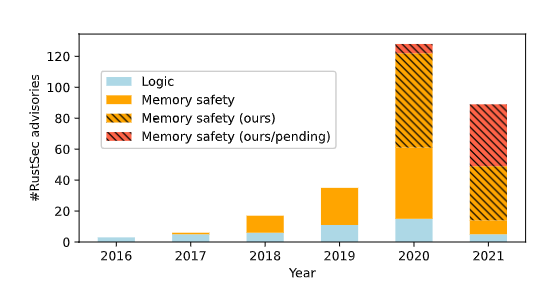
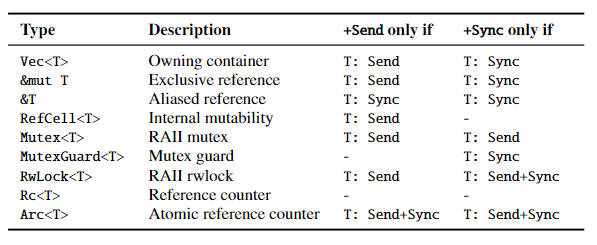
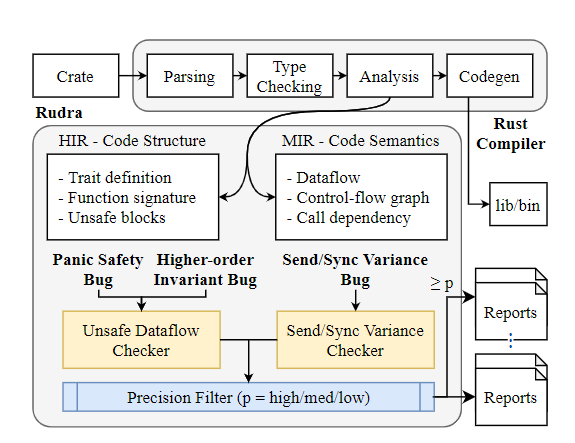

# 论文导读 | Rudra : 查找 Rust 生态系统中的内存安全 Bug 

作者：张汉东

---

## 引子

[美国佐治亚理工学院的系统软件安全实验室](https://github.com/sslab-gatech)开源了[`Rudra`](https://github.com/sslab-gatech/Rudra) ，用于分析和报告 Unsafe Rust 代码中潜在的内存安全和漏洞，为此他们也将在 2021 年第 28 届 ACM 操作系统原则研讨会论文集上发表相关论文，该论文目前在 Rudra 源码仓库中提供[下载](https://github.com/sslab-gatech/Rudra-Artifacts/raw/master/paper/sosp21-paper341.pdf)。

说明：本篇文章不是论文的翻译，而是本人对该论文的梳理和总结。

## 概要

Rust 语言关注内存安全和性能，Rust 目前已经在传统的系统软件中得到了广泛的应用，如操作系统、嵌入式系统、网络框架、浏览器等，在这些领域，安全和性能都是不可或缺的。

Rust 内存安全的思想是在编译时验证内存的所有权，具体而言是验证内存分配对象的访问和生存期。Rust 编译器对值的共享和独占引用通过借用检查提供两个保证：

1. 引用的生存期不能长于其拥有者变量的生存期。为了避免  use-after-free (UAF) 。
2. 共享和独占引用不能同时存在，排除了并发读写同一个值的风险。

不幸的是，这些安全规则太过限制。在某些需要调用底层硬件系统，或需要获得更好性能时，需要暂时绕过安全规则。这些需求无法被 Safe Rust 解决，但是对于系统开发却是必不可少的，所以 Unsafe Rust 被引入。Unsafe Rust 意味着，编译器的安全检查职责被暂时委托给了程序员。

Unsafe Rust代码的健全性（soundness ）对于整个程序的内存安全是至关重要的，因为大多数系统软件，如操作系统或标准库，都离不开它。

有些人可能比较天真地以为，Unsafe Rust 只要在审查源码的时候就可以排除它的风险。然而，问题的关键在于，健全性的推理是非常微妙的，且很容易出错，原因有三：

1. 健全性的错误会顺道破坏Rust的安全边界，这意味着所有的外部代码，包括标准库都应该是健全的。
2. Safe 和 Unsafe 的代码是相互依赖的。
3. 编译器插入的所有不可见的代码路径都需要由程序员正确推理。

为了让 Rust 有一个健全性的基础，已经有了很多研究型项目，比如形式化类型系统和操作语义，验证其正确性，并且建立模型用于检查。这些都是非常重要的，但还不够实用，因为它没有覆盖到整个生态系统。另外还有一些动态方法，比如 Miri 和 Fuzz 模糊测试，但是这些方法不太容易被大规模使用，因为它需要大量的计算资源。

当前，Rust 语言正在变得流行，Unsafe Rust 的包也逐渐变多。因此，设计一个实用的检测内存安全的算法就很重要了。 

这篇论文介绍了三种重要的Bug模式，并介绍了 Unsafe 代码，以及提供 Rudra 这样的工具。该论文作者的工作一共有三个贡献：

1.  确定了三种 Unsafe Rust 中的 Bug 模式，并且设计了两种新的算法可以发现它们。
2. 使用 Rudra 在Rust 生态系统中发现263个新的内存安全漏洞。这代表了自2016年以来RustSec中所有bug的41.4%。
3. 开源。Rudra 是开源的，我们计划 贡献其核心算法到官方的Rust linter中。

## Rudra 

[`Rudra`](https://github.com/sslab-gatech/Rudra) 用于分析和报告Unsafe Rust 代码中潜在的内存安全漏洞。 由于Unsafe 代码中的错误威胁到 Rust 安全保证的基础，`Rudra` 的主要重点是将我们的分析扩展到 Rust  包注册仓库（比如 `crates.io`）中托管的所有程序和库。`Rudra`  可以在 6.5 小时内扫描整个注册仓库（`43k` 包）并识别出 263 个以前未知的内存安全漏洞，提交 98 个 `RustSec` 公告和 74 个` CVE`，占自 2016 年以来报告给 `RustSec` 的所有漏洞的 41.4%。



`Rudra` 发现的新漏洞很微妙，它们存在于Rust 专家的库中：两个在 `std` 库中，一个在官方 `futures` 库中，一个在 Rust 编译器 `rustc` 中。  `Rudra` 已经开源， 并计划将其算法集成到官方 Rust linter 中。

> Rudra， 这个名称来自于 梵文，译为鲁特罗（或楼陀罗），印度神话中司风暴、狩猎、死亡和自然界之神。他在暴怒时会滥伤人畜；他又擅长以草药来给人治病。其名意为“狂吼”或“咆哮”（可能是飓风或暴风雨）。 

`Rudra` 和 `Miri` 的区别 ： 

> `Rudra` 是静态分析，无需执行即可分析源码。`Miri` 是解释器，需要执行代码。
>
> 两者可以结合使用。

## 关于 Unsafe Rust

因为 `unsafe` 关键字的存在，引出了一个有趣的 API 设计领域： 如何交流 API 的安全性。

通常有两种方法：

1. 内部 Unsafe  API 直接暴露给 API 用户，但是使用 unsafe 关键字来声明该 API 是不安全的，也需要添加安全边界的注释。
2. 对 API 进行安全封装（安全抽象），即在内部使用断言来保证在越过安全边界时可以Panic，从而避免 UB 的产生。

第二种方法，即将 Unsafe 因素隐藏在安全 API 之下的安全抽象，已经成为 Rust 社区的一种约定俗成。

Safe 和 Unsafe 的分离，可以让我们区分出谁为安全漏洞负责。Safe Rust 意味着，无论如何都不可能导致未定义行为。换句话说，Safe API 的职责是，确保任何有效的输入不会破坏内部封装的 Unsafe 代码的行为预期。

这与C或C++形成了鲜明的对比，在C或C++中，用户的责任是正确遵守 API 的预期用法。

比如，在 `libc` 中的`printf()`，当它调用一个错误的指针而导致段错误的时候，没有人会指责它。然而这个问题却导致了一系列的内存安全问题：格式字符串漏洞（format-string vulnerability）。还记得前段时间 苹果手机因为加入一个经过特别构造名字的Wifi就变砖的漏洞否？

而在 Rust 中，`println!()` 就不应该也不可能导致一个段错误。此外，如果一个输入确实导致了段错误，那么它会被认为是 API 开发者的错误。

### Rust 中内存安全Bug 的定义

在 Rust 中有两类 Unsafe 定义： Unsafe 函数 和 Unsafe 特质（trait）。

Unsafe 函数希望调用者在调用该函数时，可以确保其安全性。

Unsafe 特质则希望实现该 trait 的时候提供额外的语义保证。比如标准库里的 `pub unsafe trait TrustedLen: Iterator { }`，该 trait  要求必须检查 `Iterator::size_hint()` 的上界，才能保证 `TrustedLen` 所表达的“可信的长度”语义。

该论文对 内存安全 Bug 提供了一个清晰的一致性的定义，而非 Rust 操作语义：

**定义 1**： 类型（Type）和值（Value）是以常规方式定义的。类型是值的集合。

**定义2**： 对于 类型 T， `safe-value(T)` 被定义为可以安全创建的值。例如 Rust 里的字符串是内部表示为字节的数组，但它在通过 安全 API 创建的时候只能包含 `UTF-8` 编码的值。

**定义3**：函数 F 是接收类型为 `arg(F)`的值，并返回一个类型为 `ret(F)` 的值。对于多个参数，我们将其看作元组。

**定义4**： 如果 在 `safe-value(arg(F))`集合中存在`v` （记为：`∃𝑣 ∈ safe-value(𝑎𝑟𝑔(𝐹)) `），使得当调用 `F(v)`时触发违反内存安全的行为，或者返回一个不属于` safe-value(𝑟𝑒𝑡(𝐹))` 集合中的返回值`𝑣𝑟𝑒𝑡 `时（记为：𝑣𝑟𝑒𝑡 ∉ safe-value(𝑟𝑒𝑡(𝐹))），则 函数 F 有内存安全缺陷。

**定义5**： 对于一个泛型函数`Λ`，`pred(Λ)`被定义为满足`Λ`的类型谓词（指trait 限定）的类型集合。给定一个类型`𝑇∈pred(Λ)`，`resolve(Λ,𝑇)`将泛型函数实例化为具体函数𝐹。

**定义6**： 如果一个泛型函数`Λ`可以被实例化为一个具有内存安全缺陷的函数，即，`∃𝑇 ∈ pred(Λ)`，使得`𝐹=resolve(Λ,𝑇)`具有内存安全缺陷，则该泛型函数具有内存安全缺陷。

**定义7**：如果一个类型的`Send`实现不能跨越线程边界传输，那么该类型就有内存安全问题。

**定义8**： 如果一个类型的`Sync`实现不能通过别名指针（aliased pointer）并发地访问该类型，那么它就有内存安全问题。即，定义了一个非线程安全的方法，该方法接收`&self`。


## Unsafe Rust 中三类重要 Bug 模式

论文通过对已知漏洞进行定性分析，总结出 Unsafe Rust 中三类重要的 Bug 模式：

1. Panic Safety （恐慌安全）： 由恐慌导致的内存安全 Bug。
2. Higher-order Safety Invariant（高阶安全不变性 ）：由高阶类型没有给定安全保证而引发的 Bug。
3. Propagating Send/Sync in Generic Types（泛型中`Send/Sync`传播）：由泛型内部类型不正确的手工`Send/Sync`实现引起泛型 `Send/Sync` 约束不正确而引发的 Bug。


### Panic Safety

这与其他编程语言（如C++）中的异常安全的概念类似。Rust 中类似其他编程语言中异常（Exception）的概念叫 恐慌（Panic）。恐慌一般在程序达到不可恢复的状态才用，当然在 Rust 中也可以对一些实现了 `UnwindSafe` trait 的类型捕获恐慌。

当 Panic 发生时，会引发栈回退（stack unwind），调用栈分配对象的析构函数，并将控制流转移给恐慌处理程序中。所以，当恐慌发生的时候，当前存活变量的析构函数将会被调用，从而导致一些内存安全问题，比如释放已经释放过的内存。

但是想要正确的推理在 Unsafe 代码中的恐慌安全，是非常困难且易于出错的。通常， 封装的Unsafe 代码可能会暂时绕过所有权检查，而且，安全封装的 API 在内部unsafe 代码的值返回之前，会根据安全边界条件确保它不会违反安全规则。但是，假如封装的Unsafe 代码发生了恐慌，则其外部安全检查可能不会执行。这很可能导致类似 C/C++ 中 未初始化（Uninitialized ）或双重释放（Double Free）的内存不安全问题。

**论文对此给出定义：**

如果一个函数`𝐹` `Drop`一个类型为`𝑇`的值`𝑣`，使得`𝑣`在Unwind 过程中 `𝑣 ∉ safe-value(𝑇)`，并导致违反内存安全，则说明该函数存在恐慌性安全漏洞。

```rust
// 标准库 `String::retain()` 曝出的 CVE-2020-36317 Panic safety bug

pub fn retain<F>(&mut self, mut f: F)
where 
    F: FnMut(char) -> bool
{
    let len = self.len();
	let mut del_bytes = 0;
 	let mut idx = 0;
 
    unsafe { self.vec.set_len(0); }    // + 修复bug 的代码
 	while idx < len {
 		let ch = unsafe {
  			self.get_unchecked(idx..len).chars().next().unwrap()
 		};
 		let ch_len = ch.len_utf8();
 
 		// self is left in an inconsistent state if f() panics
        // 此处如果 f() 发生了恐慌，self 的长度就会不一致
 		if !f(ch) {
 			del_bytes += ch_len;
 		} else if del_bytes > 0 {
 			unsafe {
 				ptr::copy(self.vec.as_ptr().add(idx),
 				self.vec.as_mut_ptr().add(idx - del_bytes),
 				ch_len);
 			}
 		}
 		idx += ch_len; // point idx to the next char
 	}
 	unsafe { self.vec.set_len(len - del_bytes); } // + 修复bug 的代码 ，如果 while 里发生panic，则将返回长度设置为 0 
}

fn main(){
    // PoC: creates a non-utf-8 string in the unwinding path
    // 此处传入一个 非 UTF-8 编码字符串引发恐慌
    "0è0".to_string().retain(|_| {
        match the_number_of_invocation() {
            1 => false,
            2 => true,
            _ => panic!(),
        }
    });
}

```


### Higher-order Safety Invariant

一个函数应该安全地执行所有安全的输入，包括参数数据类型、泛型类型参数以及外部传入的闭包。

换句话说，一个安全的函数不应该提供比 Rust 编译器提供的安全不变式更多的东西。所谓 安全不变式就是指 Rust 里的安全函数，在任何有效输入的情况下，都不应该发生任何未定义行为。

例如，Rust 里的 sort 函数，不应该触发任何未定义行为，哪怕用户提供的比较器不遵循全序关系，也不会发生段错误。但是 Cpp 中的排序函数，当用户提供一个不兼容当前的比较器的情况下，就会发生段错误。

Rust 为 高阶类型提供的唯一安全不变式是 类型签名的正确性。然而常见的错误是，对调用者提供的函数在以下方面产生了不正确的假设：

1. 逻辑一致性：比如，sort函数遵循全序关系。
2. 纯洁性：对相同的输入总是返回相同的输出。
3. 语义约束：只针对参数，因为它可能包含未初始化字节。

对于 Unsafe 代码，必须自己检查这些属性，或者指定正确的约束（例如，用Unafe 的特质）让调用者义务检查这些属性。

在 Rust 类型系统下，执行高阶类型的安全不变式是很困难的。比如，将一个未初始化的缓冲区传给一个调用者提供的 Read 实现。

不幸的是，许多Rust程序员为调用者提供的函数提供一个未初始化的缓冲区来优化性能，而没有意识到其固有的不健全性。由于其普遍性和微妙性，Rust标准库现在[明确指出](https://doc.rust-lang.org/std/io/trait.Read.html#tymethod.read)，用一个未初始化的缓冲区调用`read() `本身就是不健全的行为。

**论文对此给出定义：**

高阶不变性bug是指函数中的内存安全bug，它是由假设保证高阶不变性引起的，而 Rust 的类型系统对调用者提供的代码没有保证。


```rust
1 // CVE-2020-36323: a higher-order invariant bug in join()
2 fn join_generic_copy<B, T, S>(slice: &[S], sep: &[T]) -> Vec<T> 
3 where T: Copy, B: AsRef<[T]> + ?Sized, S: Borrow<B>
4 {
5     let mut iter = slice.iter();
6
7 	  // `slice`is converted for the first time
8     // during the buffer size calculation.
9     let len = ...;  // `slice` 在这里第一次被转换	
10    let mut result = Vec::with_capacity(len);
11    ...
12    unsafe {
13        let pos = result.len();
14        let target = result.get_unchecked_mut(pos..len);
15
16        // `slice`is converted for the second time in macro
17        // while copying the rest of the components.
18        spezialize_for_lengths!(sep, target, iter; // `slice` 第二次被转换
19        0, 1, 2, 3, 4);
20
21        // Indicate that the vector is initialized
22        result.set_len(len);
23    }
24    result
25 }
26
27 // PoC: a benign join() can trigger a memory safety issue
28 impl Borrow<str> for InconsistentBorrow {
29     fn borrow(&self) -> &str {
30         if self.is_first_time() {
31             "123456"
32         } else {
33             "0"
34         }
35     }
36 }
37
38 let arr: [InconsistentBorrow; 3] = Default::default();
39 arr.join("-");
```

该代码是为 `Borrow<str>`实现 join 方法内部调用的一个函数 `join_generic_copy`的展示。 在 `join_generic_copy` 内部，会对 `slice` 进行两次转换，而在 `spezialize_for_lengths!` 宏内部，调用了`.borrow()`方法，如果第二次转换和第一次不一样，而会返回一个未初始化字节的字符串。

这里， ` Borrow<B>` 是高阶类型，它内部 `borrow` 的一致性其实并没有保证，可能会返回不同的slice，如果不做处理，很可能会暴露出未初始化的字节给调用者。

### Propagating Send/Sync in Generic Types

当涉及泛型时候， `Send/Sync` 的规则会变得很复杂，如图：



通常 `Send/Sync` 会由编译器自动实现，但是当开发者涉及 Unsafe 时，可能需要手动实现这俩 trait。手动实现 `Send/Sync` 想要正确很困难。一个不懂 `Send/Sync` 如何手动实现的开发者，很容易在代码中引入 Bug。

**论文对此给出定义：**

如果泛型在实现`Send/Sync`类型时，如果它对内部类型上指定了不正确的`Send/Sync`约束，那么泛型的`Send/Sync`约束就会变得不正确。这就是 泛型中 `Send/Sync` 传播引发的不安全 Bug。

```rust
1 // CVE-2020-35905: incorrect uses of Send/Sync on Rust's futures
2 pub struct MappedMutexGuard<'a, T: ?Sized, U: ?Sized> {
3     mutex: &'a Mutex<T>,
4     value: *mut U,
5     _marker: PhantomData<&'a mut U>, // + 修复代码
6 }
7
8 impl<'a, T: ?Sized> MutexGuard<'a, T> {
9     pub fn map<U: ?Sized, F>(this: Self, f: F)
10        -> MappedMutexGuard<'a, T, U>
11        where F: FnOnce(&mut T) -> &mut U {
12            let mutex = this.mutex;
13            let value = f(unsafe { &mut *this.mutex.value.get() });
14                  mem::forget(this);
15                  // MappedMutexGuard { mutex, value }
16                  MappedMutexGuard { mutex, value, _marker: PhantomData } //  + 修复代码
17    }
18 }
19
20 // unsafe impl<T: ?Sized + Send, U: ?Sized> Send
21 unsafe impl<T: ?Sized + Send, U: ?Sized + Send> Send // + 修复代码
22 for MappedMutexGuard<'_, T, U> {}
23 //unsafe impl<T: ?Sized + Sync, U: ?Sized> Sync
24 unsafe impl<T: ?Sized + Sync, U: ?Sized + Sync> Sync // + 修复代码
25 for MappedMutexGuard<'_, T, U> {}
26
27 // PoC: this safe Rust code allows race on reference counter
28 * MutexGuard::map(guard, |_| Box::leak(Box::new(Rc::new(true))));
```

Rust futures 库中发现的问题，错误的手工 `Send/Sync`实现 破坏了线程安全保证。

受影响的版本中，`MappedMutexGuard`的`Send/Sync`实现只考虑了`T`上的差异，而`MappedMutexGuard`则取消了对`U`的引用。

当`MutexGuard::map()`中使用的闭包返回与`T`无关的`U`时，这可能导致安全Rust代码中的数据竞争。

这个问题通过修正`Send/Sync`的实现，以及在`MappedMutexGuard`类型中添加一个`PhantomData<&'a mut U>`标记来告诉编译器，这个防护也是在U之上。


## Rudra 的设计

整体设计图如下：




Rudra 通过 `HIR` 来获取 crate 的代码结构（包括 trait定义、函数签名、Unsafe 块等），通过 `MIR` 来获取代码语义（数据流、控制流图、调用依赖等）。为什么不使用 LLVM IR 呢？因为在这个层面上 Rust 的抽象已经消失了。

 然后通过内部的 `Unsafe Dataflow Checker (UD)` 来检查 `Panic Safety Bug` 和 `Higher-order Invariant Bug`，通过 `Send/Sync Variance Checker(SV)`来检查 `Send/Sync Variance Bug`。最终将结果按优先级汇总输出报告。

 `Unsafe Dataflow Checker (UD)`  和 `Send/Sync Variance Checker(SV) ` 对应两套算法，具体可参加论文和代码。


## 关于安全性相关英文术语解释

英文中关于安全性有多个单词，比如 Security和Safety，但是中文只有“安全性”这一个词。所以这里需要说明一下：

1. Security，通常指信息安全、网络安全之类。
2. Safety，通常指功能性安全。

通常，会因为功能性的漏洞，而造成信息安全问题。

## 小结

该论文的最后一章，还包含了很多数据来证明 Rudra 的效果，以及 Rudra 和 Fuzz 测试、Miri 和其他 Rust 静态分析工具的比较等结果。


上图是论文作者们使用 Rudra 对 Rust 实现的几个操作系统进行检查的结果，详细内容参加论文。

这篇论文非常值得一看，对于我们真正理解 Rust 的安全理念有所帮助。该论文也为 Rust 语言的安全状况提供了新的视角，也提供了一个静态检查工具，值得我们关注。


