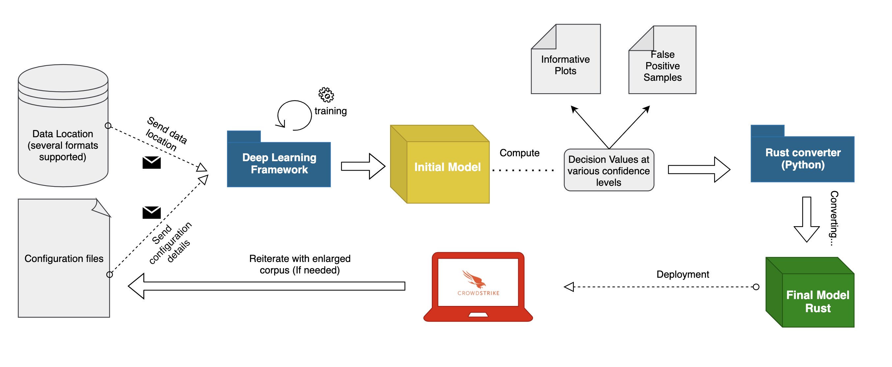

# 外刊评论三篇

编辑：张汉东/ 王江桐（华为）

> 编者按：国外的 Rust 资源非常丰富，将其都翻译过来也不现实，所以想到这样一个栏目。外刊评论，主要是收集优秀的 Rust 相关文章，取其精华，浓缩为一篇简单评论。
> 
> 欢迎大家贡献：[https://github.com/RustMagazine/rust_magazine_2021/discussions/129](https://github.com/RustMagazine/rust_magazine_2021/discussions/129)

---

## 目录

- [将 TensorFlow 模型移植到 Pure Rust 的开发成本有多高？](#TensorFlow)
- [Rust 2021 有哪些新功能](#Rust2021)
- [周期性服务发现](#grpc)


---


## 将 TensorFlow 模型移植到 Pure Rust 的开发成本有多高？
<span id="TensorFlow" />


> 原文： [https://www.crowdstrike.com/blog/development-cost-of-porting-tensorflow-models-to-pure-rust/](https://www.crowdstrike.com/blog/development-cost-of-porting-tensorflow-models-to-pure-rust/)

> 该文来自于美国网络安全软件开发商 CrowdStrike Holdings（纳斯达克上市代码:CRWD）的官方博客。该公司雇员三千多人，致力于重塑云时代的安全性。

此文作者之前写过一篇文章: [站在巨人的肩膀上：结合 TensorFlow 和 Rust](https://www.crowdstrike.com/blog/how-crowdstrike-combines-tensorflow-and-rust-for-performance/)，其中阐述了如何进行超参数调整和实验已知的深度学习框架（如TensorFlow，PyTorch，Caffe），同时用底层语言重新实现这些模型的最佳版本，以加快预测过程。然而，在那篇文章中没有触及的一个同样重要的部分是将 TensorFlow 模型移植到 Rust 中的开发成本，所以就有了现在这篇文章。

可扩展性是CrowdStrike的重点之一，因此出现了对实现可扩展性的自动化机制的需求。该文介绍了一种新颖的通用转换机制，可以在短时间内成功地将TensorFlow模型转换为纯Rust代码，以及这种技术带来的挑战。

### 从普通的训练过程说起：



一般机器学习项目的理想工作流程是从收集和清理训练阶段要用到的语料库开始的。同样重要的是选择模型架构，以及定义它的超参数集。一旦这些要求得到满足，训练阶段就可以开始了。在这个过程结束时，我们有多个候选模型可以选择。

在所有生成的候选模型中，将使用具有最有希望的结果的模型，该模型与一组预定义的指标（如验证损失、召回率、AUC）以及定义分类器信心水平的决策值相匹配。

此外，在安全等领域，检查模型对新数据进行预测时产生的FN（false negatives）和FP（false positives）可能被证明有助于通过应用聚类或人工技术发现相关信息。如果获得的结果令人满意（例如，高TPR、低FPR，并证明在设想的对抗性攻击方面具有鲁棒性），使用所选模型进行推理的代码将被转换成底层语言，该语言将被进一步优化并提供安全保证（即防止内存泄漏、内存损坏、竞赛条件）。

Rust被证明是这项特定任务的一个杰出候选者。当然，它也可以被任何其他底层编程语言所取代。

最终目标是彻底分析分类器在受控环境中的行为，并检查决策阈值是否选择得当，并有可能进一步微调。最后，在目标终端上发布模型，同时仔细监测其性能。这个过程通常会在分类器的生命周期中多次重复，以提高检测能力，并跟上每天出现的最新威胁。

### 转换机制


转换机制是一个通用工具，旨在将TensorFlow模型转化为纯Rust代码。它的主要目的是过滤冗余信息，只保留推理所需的相关细节（即每层的权重和描述性超参数），并根据计算图中描述的依赖关系重新创建目标模型。最后，产生的Rust文件就可以用来在生产中安全地运行模型，同时实现性能的显著提升。

该转换机制包括：

- 神经层（Neural-Layers Crate）：目前构建于Ndarray Rust crate之上，但是还未使用它的多线程功能，未来还有性能潜力。还有一些其他优化：
    - 使用迭代器而不是直接索引矩阵
    - 批量服务能力
    - 对瓶颈层（如卷积层）使用通用矩阵乘法程序
    - 启用了BLAS（基本线性代数子程序），以使所需的乘法运算更快，而不引入预测错误
- Rust 转换器（Rust Converter）：重新创建给定神经网络背后的整个逻辑，采用了面向对象的编程风格。

### 结论

1. 下一步的改进是采用一种更加标准化的格式，可以统一来自各种深度学习框架的模型（即ONNX）。这将确保没有必要强加一个特定的开发框架，而是让工程师根据自己的喜好来决定。
2. 即使 Rust 被证明是深度学习模型的一个显著的候选者（在时间、空间和解决安全问题方面），该团队也将继续探索进一步的优化策略。
3. 一个通用的转换机制，使该团队能够将注意力转移到更有创造性的任务上--比如设计、微调或验证不同的架构，同时将准备这些模型用于生产的成本降到最低。

---

## Rust 2021

通常情况下来说，Rust语言组尽量让所有新增的功能在未来的版本都能适用。然而，在一些情况下，新增的功能会使之前的代码失效。例如，新版本中或许会使用新的关键词，比如await，如果之前的代码里有名为await的变量，那么变量就会因为关键词的原因而失效，造成错误。在这种情况下，Rust会发布一个新版本，并用版本（edition）来使编译器知晓代码将使用哪个版本的Rust。

在Rust 2018之后，Rust的新版本Rust 2021（1.56.0）目前暂定于9月9号进行beta 测试，10月21号正式上线。


## Rust 2021 有哪些新功能
<span id="Rust2021" />

> 来自《This Week in Rust 》第404篇博文

#### 对于std::preclude, 增加了新的引用

std::preclude是每一个rs module默认引入的库，不需要程序员自己手动引用。当与用户自定义的库有冲突时，会优先使用用户引入的库来保证代码没有二义性。当用户自定义try_into方法时，如果同时引用标准库的try_into，并且希望同一个rs文件中，两个不同的对象一个使用用户自定义的try_into，一个使用标准库的try_into，此时由于try_into具有二义性，编译器会报错。为了解决这个问题，Rust 2021决定将新的trait加入std::preclude.

新版本的preclude与老版本相比，没有删除任何项，只是新增了三个trait: std::convert::TryInto, std::convert::TryFrom, std::iter::FromIterator。


#### Cargo Feature Resolver

自从1.51.0，Rust引入了新的resolver（resolver = "2"），来解决功能对于编译环境与发布环境不同时兼容的问题。

例如，对于依赖<span style="background-color:#D2D2D2">foo</span>与其功能A和B，假设有两个包，<span style="background-color:#D2D2D2">bar</span>依赖于<span style="background-color:#D2D2D2">foo + A</span>，和<span style="background-color:#D2D2D2">baz</span>依赖于<span style="background-color:#D2D2D2">foo + B</span>。当resolver = “1”时，Cargo在编译的时候会合并功能A和B，并且编译<span style="background-color:#D2D2D2">foo + AB</span>。这样做的好处是，<span style="background-color:#D2D2D2">foo</span>只会被编译一次；但是问题在于，如果<span style="background-color:#D2D2D2">foo + A</span>仅作为dev dependencies使用、<span style="background-color:#D2D2D2">foo + B</span>仅作为target dependencies使用、且开发环境和目标环境并不同时兼容A和Ｂ呢？<span style="background-color:#D2D2D2">foo + AB</span>将无法同时在两个平台上编译。

resolver = "2"可以解决这个问题，因为它将单独编译并使用这些功能。比如在这个例子中，<span style="background-color:#D2D2D2">foo + A</span>只会在当前build包含dev dependencies时被启用，模块将会被分开单独编译，而不会一起编译。这确实或许会增加编译时间，但是同时可以解决在不同平台与环境上的编译问题。

对于1.56（Rust 2021）之前的版本，虽然或许resolver = "2"已被引入，但是默认的resolver仍然是”1“。Rust 2021以及后续版本将把默认resolver设定为”2“。如果项目确实有以上顾虑，请不要忘记修改Cargo.toml。


#### 闭包与所有权

闭包提供匿名函数功能，并且闭包中可以捕获调用者作用域中的值。在之前版本中，对于结构体a，

```rust
struct a{
	x: int,
	y: int,
}
```

如果有如下闭包：

```rust
|| a + 1;
```

闭包将会获取对于a的不可变引用。

如果有如下闭包：

```rust
|| a.x + 1;
```

闭包将会获取对a（整个a）的不可变引用，而不是单独对于a.x的。如果a的其他属性（e.g. a.y）被删除，那么这个闭包将无法编译，因为闭包要求获取对于整个a的引用，而a的部分属性已经失效。

```rust
let a = SomeStruct::new();

drop(a.x); // Move out of one field of the struct

println!("{}", a.y); // Ok: Still use another field of the struct

let c = || println!("{}", a.y); // Error: Tries to capture all of `a`
c();
```

然而对于Rust 2021，闭包将不会再获取对于整个a的引用。对于<span style="background-color:#D2D2D2">a.x + 1</span>，闭包将只获取<span style="background-color:#D2D2D2">a.x</span>这个属性的引用。


####　语法与前缀

其他一些有关于语法，格式，前缀的修改：

- panic!将允许单一参数，并将其识别为format string；
- 列表循环支持类python写法：for e in [1, 2, 3]；
- 为未来的语法和新功能保留一些前缀：<span style="background-color:#D2D2D2">prefix#identifier</span>, <span style="background-color:#D2D2D2">prefix"string"</span>, <span style="background-color:#D2D2D2">prefix'c'</span>, and <span style="background-color:#D2D2D2">prefix#123</span>，其中prefix可能是任何标识符；
  - 未来计划会有的新前缀：类同python写法的format string: <span style="background-color:#D2D2D2">f""</span>，<span style="background-color:#D2D2D2">c""</span>或者<span style="background-color:#D2D2D2">z""</span>表示C类型的String，etc.
- Warning升格至Error；
- macro_rules的Or（|）的使用；

更详细的说明请参阅：https://blog.rust-lang.org/2021/05/11/edition-2021.html。


### 如何升级到Rust新版本

在Cargo.toml中我们可以手动配置使用的Rust版本：

```rust
[package]
edition = "2021"
```

同时可以利用Cargo帮助我们自动修订对于版本不适用的代码。<span style="background-color:#D2D2D2">cargo fix --edition (--all features --target (platform, x86, lib/bin, etc.))</span>可以帮助修复<span style="background-color:#D2D2D2">cargo check</span>所找出的所有在local package以及这些package的dependencies之中的错误。

例如dyn，对于一些语法关键词，可以通过<span style="background-color:#D2D2D2">cargo fix --edition-idioms</span>进行自动修改。

如果不怕代码报错的话，可以使用<span style="background-color:#D2D2D2">cargo fix --edition-idioms --broken-code</span>，让Cargo修改所有它觉得有问题的地方。这可能导致代码无法编译。


## 周期性服务发现
<span id="grpc" />

> 来自《This Week in Rust 》第404篇博文

<span style="background-color:#D2D2D2">ginepro</span>是由truelayer公司开发的一个Rust crate，在<span style="background-color:#D2D2D2"><span style="background-color:#D2D2D2">tonic</span></span>的gRPC channel基础之上增加了周期性服务发现的功能来更好地实现负载均衡。


### 什么是gRPC

要知道gRPC，首先我们要知道RPC。

RPC（Remote Procedure Call）称为远程过程调用。当项目较小时，项目或可以完全部署在本地，调用本地服务并且获得结果。当项目规模逐渐增大，本地部署不再能完全满足需求，服务或部署至远程服务器，新的问题由此产生：部署在A服务器上的应用需要调用B服务器上应用提供的函数或方法，让B服务器应用进行计算，并得到其返回结果。

RPC框架是这个问题的一个解法。通过远程过程调用协议，不需要了解底层细节，客户端应用可以向服务端请求服务，并且像访问本地资源一样访问服务器资源。

RPC的过程广义上可以被形容为：

1. 客户端传参；
2. 服务器（函数）运行；
3. 服务器返回结果。

RPC涉及到的组件通常包含：

- 客户端；

- 客户端存根/打桩（Client Stub）：存放服务端地址信息，请求参数打包成网络信息，etc.；

- 服务器存根/打桩（Server Stub）：类同客户端存根/打桩；

- 服务器。

  

gRPC是谷歌开发的一个开源通用高性能的RPC框架，有严格的接口约束条件，支持流式通讯，并可以将数据序列化为二进制编码，大幅减少传输的数据量，提高性能。然而，gRPC没有针对分布式系统数据传输的必要组件，比如负载均衡，限流熔断，服务注册，等等。


#### 什么是<span style="background-color:#D2D2D2">tonic</span>

toinc是基于HTTP/2的gRPC的rust实现。相比于rust的其他gRPC库，<span style="background-color:#D2D2D2">tonic</span>已经实现了负载均衡并且可以动态更新节点，而其他的Rust库还没有实现这一点。

<span style="background-color:#D2D2D2">tonic</span>涉及到的其他相关模块：

- <span style="background-color:#D2D2D2">hyper</span>(异步，底层http)
- <span style="background-color:#D2D2D2">tokio</span>(异步)
- <span style="background-color:#D2D2D2">prost</span>(a Protocol Buffers：读写序列化结构数据 e.g. XML)


#### 问题：负载均衡

gRPC的负载均衡问题来自于HTTP/2协议的稳定性。gRPC使用HTTP/2协议在单个TCP连接中实现请求和响应的多路复用（一个信道同时传输多路信号）。由于连接是持久的，在已有连接建立以后，即使有新的服务器，连接也不会向新服务器倾斜，可能造成原有的服务器过载。

我们需要负载均衡来使得针对于每一个新请求，客户端可以合理选择一个服务器并且通过现有链接发出请求。


####　解决方案

分析问题，可知总体解决方案如下：

- 服务器周期性强制客户端重连（解决连接不发现问题，使得连接不过于持久）
- 客户端周期性执行服务发现（解决服务不发现问题）
- 引入应用级负载均衡（在应用层面监控负载均衡相关）

应用级负载均衡通常可以分为两类，客户端侧维护，以及代理或外部线程维护，也就是边车模式。前者便于测试，不会过于复杂，但没有语言或平台兼容；后者相对比较复杂，或导致系统延迟，并且难于维护和监控，或是需要额外的投入去监控，比如service mesh。

由于流量和项目要求，truelayer希望能实现负载均衡。当前Rust关于gRPC的crate有三个：<span style="background-color:#D2D2D2">grpc-rs</span>，<span style="background-color:#D2D2D2">grpc-rust</span>，<span style="background-color:#D2D2D2">tonic</span>，但是它们没有完全满足要求。出于性能和维护原因，truelayer也不考虑使用service mesh。这使得truelayer最终选择在三个库中最贴近需求的<span style="background-color:#D2D2D2">tonic</span>基础之上编写了一个crate: <span style="background-color:#D2D2D2">ginepro</span>。


#### ginepro

<span style="background-color:#D2D2D2">tonic</span>已经实现了大部分解决方案，但是它缺少周期性服务发现的功能。<span style="background-color:#D2D2D2">ginepro</span>为<span style="background-color:#D2D2D2">tonic</span>的channel增加了此功能来解决问题。

总体思路大致如下：

1. 服务名字和IP相关联：通过trait LookupService来解析得到IP并存入socketaddr set；
   - 不限制解决方案，在例中truelayer使用Kubernetes' DNS或者API做
   - Kubernetes是一个开源的 Linux 容器自动化运维平台，它消除了容器化应用程序在部署、伸缩时涉及到的许多手动操作。换句话说，你可以将多台主机组合成集群来运行 Linux 容器，而 Kubernetes 可以帮助你简单高效地管理那些集群。
2. LoadBalancedChannel将使用tonic的Channel，并进行事件循环，在循环中实现服务发现功能，并且维护endpoints列表。

具体代码如下：

```rust
/// Interface that provides functionality to
/// acquire a list of ips given a valid host name.
#[async_trait::async_trait]
pub trait LookupService {
    /// Return a list of unique `SockAddr` associated with the provided
    /// `ServiceDefinition` containing the `hostname` `port` of the service.
    /// If no ip addresses were resolved, an empty `HashSet` is returned.
    async fn resolve_service_endpoints(
        &self,
        definition: &ServiceDefinition,
    ) -> Result<HashSet<SocketAddr>, anyhow::Error>;
}
```

```rust
loop {
      let discovered_endpoints = self
          .lookup_service
          .resolve_service_endpoints(service_definition).await;
    
      let changeset = self.create_changeset(&discovered_endpoints).await;
      // Report the changeset to `tonic` to update the list of available server IPs.
      self.report_and_commit(changeset, endpoints).await?;    
      
      // Wait until the next interval.
      tokio::time::sleep(self.probe_interval).await;
}
```

#### 评估

<span style="background-color:#D2D2D2">ginepro</span>可以很好地解决truelayer的问题，但是同样，没有银弹，这个解决方案仍然不是完美的。如果endpoint失效，除非客户端收到显式指令（e.g. Kubernets删除了这个端点），不然客户端不会将其从端点列表中删除；其次，<span style="background-color:#D2D2D2">ginepro</span>是客户端侧解决方案，只适用于truelayer的Rust服务，它并不通用。

#### 引用

- [gRPC load balancing in Rust](https://truelayer.com/blog/grpc-load-balancing-in-rust/)
- [The Plan for the Rust 2021 Edition](https://blog.rust-lang.org/2021/05/11/edition-2021.html)
