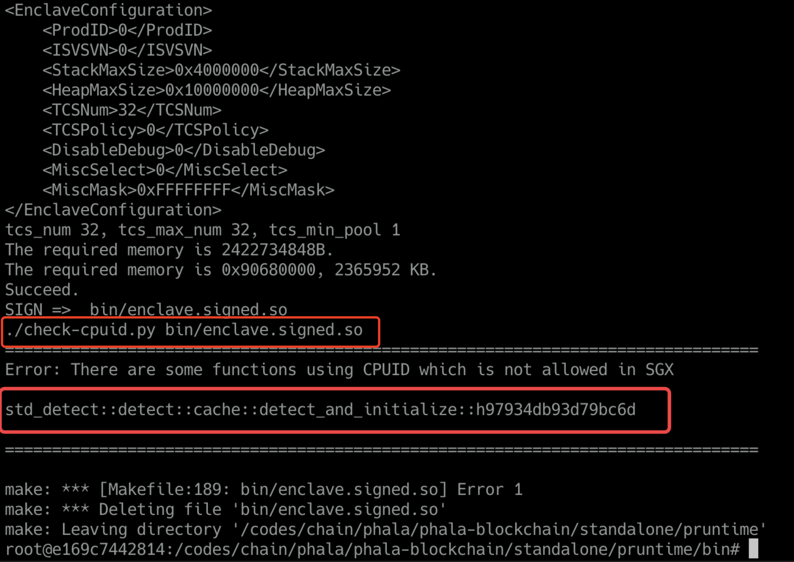
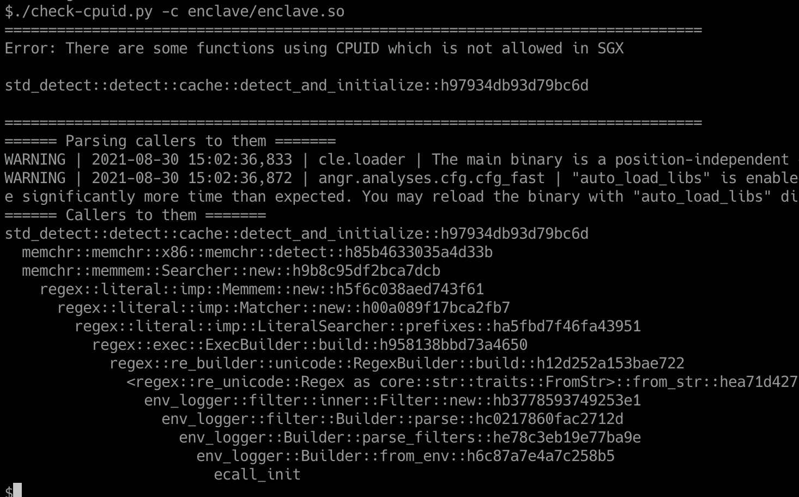
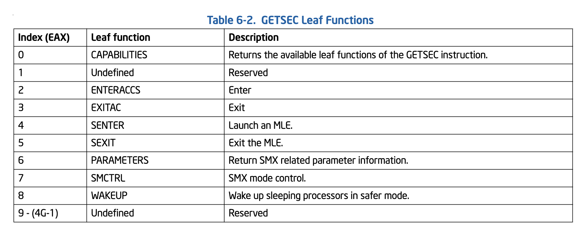

# Phala Network | 在Intel SGX环境下实现Rust原生std支持

作者：Kevin Wang

---

**简介**：Intel SGX是一个把应用与OS完全隔离的可信执行环境，应用无法直接访问OS提供的资源。我们采用的Teaclave-SGX-SDK只提供了no_std环境，导致crates生态下大量的库都无法被使用。我们通过添加libc函数模拟linux平台特性，实现依赖std的Rust生态库无需修改即可在SGX环境使用。为了保证尽可能小的安全边界，我们对每个增补的libc函数做了权限控制。同时引入了二进制分析，确保程序不会出现SGX非法指令。

---

## 背景

[Phala Network](https://github.com/Phala-Network/phala-blockchain)的隐私云计算服务基于[teaclave-sgx-sdk](https://github.com/apache/incubator-teaclave-sgx-sdk)开发，由于Intel CPU的SGX执行环境相当于裸机无系统，自然地基于teaclave-sgx-sdk开发的rust程序也只能用no_std开发。

但当项目复杂后，我们还是希望能够充分利用Rust的crate生态，这个生态里大部分crate是依赖rust std的。我们no_std环境想要使用这些std的crate的话那就得做移植了。

如果单纯地将std的crate移植到no_std环境，那每一个crate都会有比较大的工作量。teaclave-sgx-sdk为了方便移植，给我们准备了一个sgx_tstd（一个sgx环境的std仿制品）。sgx_tstd保留了rust std中的大部分功能，因此，一般简单的crate移植到sgx_tstd仅需要改动数行代码，比如在crate根部添加`extern sgx_tstd as std`，以及添加一些`use std::prelude::v1::*;` 。这样移植rust crate生态就方便了许多，teaclave-sgx-sdk团队甚至将一些常用的crate都移植好了放到[github.com/mesalock-linux](https://github.com/mesalock-linux/)中.

## sgx_tstd的问题

移植一个crate看上去工作量并不大，但我们很多时候引入一个crate并不是单纯的一个crate，他背后的依赖树连根拔起可能有数十个crate。原本正常Rust生态使用一个第三方crate只需要在Cargo.toml中添加一行代码，而现在变成要去移植一大车crate到sgx环境。

这种开发模式已经事实上导致了Rust生态被分叉成了`crates.io`和`mesalock-linux`两个世界，这种分裂甚至让一些no_std的crate也受影响让两边互不兼容，比如混用一些依赖log或serde的no_std crate就不能正常编译，不得不修改他们使用log-sgx和serde-sgx。如果哪天有人再为arm/AMD的TEE做一个类似的rust sdk，难道我们要将`crates.io`继续分叉下去？

这种分叉行为同时会导致被移植的生态可能代码更新不及时，一些针对`crates.io`，`github.com`的安全扫描公共设施可能也会漏掉mesalock-linux生态中的隐患，从而影响下游开发或带来安全威胁。

## 让SGX支持Rust原生std

teaclave-sgx-sdk开发应用目前标准做法是开启`#![no_std]`并编译target到 `x86_64-unknown-linux-gnu`。

既然已经target到了`x86_64-unknown-linux-gnu`，那么我们如果不开启`#![no_std]`编译会有什么问题呢？

简单尝试会得到类似如下链接错误：


Rust的std会依赖libc来和OS交互，intel sgx-sdk里面有一个不完全实现的sgx libc。但Rust需要的和系统交互这部分libc函数往往是SGX不信任的，所以sgx libc没有直接提供，而是大部分实现在ocall模块下以rust ABI函数的方式提供对等功能，以此提醒开发者这是不受信任的操作。

因此，我们想提供一个转接层，把这些缺失libc函数都补齐，并代理到sgx-sdk的对等实现基本就能正常编译使用原生std了。比如，上图缺失write函数，我们就补一个write函数：

```rust
#[no_mangle]
pub extern "C" fn write(fd: c_int, buf: *const c_void, count: size_t) -> ssize_t {
	unsafe { ocall::write(fd, buf, count) }
}
```

这样，我们转接层对上模拟一个linux glibc的行为，对下转接到sgx特别实现，可让针对linux的编译的Rust应用程序跑在sgx内。

经验证的确如此，在[添加了相应libc函数](https://github.com/Phala-Network/phala-blockchain/blob/550843a14bbc96bdf59033dfa2850429cf9b039e/standalone/pruntime/enclave/src/patch.rs)并拆掉一部分特殊代码后，我们enclave程序就运行起了。

## std和sgx_tstd共存

上面提到，拆掉了一部分代码，主要这些代码依赖sgx_tstd里面特有功能，比如`sgx_tstd::sgxfs::SgxFile`。而开启原生std后sgx_tstd就因为rust的`lang_item`冲突而不能编译了。要想恢复使用这些功能，我们要么自己重新实现（copy）一份，要么让sgx_tstd和std共存。显然，后者更符合可持续发展原则。因此，我们给sgx_tstd打个[补丁](https://github.com/Phala-Network/incubator-teaclave-sgx-sdk/commit/ec42fc49ccbfd1174b60c96548de009647ab1f9d)，让lang_item变成一个feature，不开启它就能与原生std共存了。

## 安全考虑

我们enclave程序是安全敏感的，如果一股脑将libc代理到ocall函数，显然是粗鲁的不安全的。因此，我们对每个代理的函数都会根据我们业务需求对其安全性做思考，调整其实现行为。

### getrandom

随机数安全性尤其重要，直接关系到我们的密钥安全。rust的rand crate会调用getrandom函数来获取随机熵源。我们将getrandom函数代理到sgx_read_rand，sgx_read_rand在HW模式下会通过CPU硬件获取真随机数。实现如下:

```rust
#[no_mangle]
pub extern "C" fn getrandom(buf: *mut c_void, buflen: size_t, flags: c_uint) -> ssize_t {
    if buflen == 0 {
        return 0;
    }

    let rv = unsafe { sgx_read_rand(buf as _, buflen) };

    match rv {
        sgx_status_t::SGX_SUCCESS => buflen as _,
        _ => {
            if flags & libc::GRND_NONBLOCK != 0 {
                set_errno(libc::EAGAIN);
            } else {
                set_errno(libc::EINTR);
            }
            -1
        }
    }
}
```

### 权限相关

支持了std，我们需要严格控制enclave内代码的权限，以最大限度降低安全风险。越权访问代码最好是在编译构建时阻拦下来，次之是在运行时限制越权访问。

转接层对权限的控制策略如下：

| 操作              | 处置方法                                                     |
| ----------------- | ------------------------------------------------------------ |
| 打开文件          | 禁止打开文件，运行时报错。由于`crate getrandom`实现需要open("/dev/urandom")作为不支持getrandom函数平台的fallback, 虽然由于我们getrandom的实现， 使其不会执行到open的路径去， 但代码依赖无法去除， 除非给crate getrandom打补丁。 |
| read/write        | 运行时限制只允许操作stdio相关fd。                            |
| 网络操作          | 禁止编译，链接报错。                                         |
| syscall           | 只允许SYS_getrandom，并代理到sgx_read_rand。 其余call运行时报错。 |
| 创建线程          | 禁止编译，链接报错。                                         |
| 获取工作目录      | 返回“(unreachable)", 该值是linux-glibc定义的工作目录不可达时的返回值。 |
| 获取环境变量      | 禁止，永远返回空。                                           |
| 获取时间          | 代理到ocall::clock_gettime, 由业务代码注意不要信任获取到的时间。 |
| dlsym动态加载函数 | 只允许getrandom，其余返回空。                                |
| mmap              | 允许其内存分配功能，代理到sgx的malloc。其余操作返回错误。    |

## 链接错误排查

由于我们现在的原生std依然存在部分功能缺失， 当我们引入新的依赖到SGX时，少数情况有可能会遇到链接错误，比如依赖中有网络操作，报了如下错误：


简单情况下，我们可以去检查源码，发现是哪部分功能引入了这个依赖。但很多情况下，其实我们看到的代码虽然会经过编译，但最终进入binary的只有其中一小部分，那些静态不可达的代码都会被编译器/链接器丢弃掉。因此，我们可能很难根据原始源码判断出实际生效的依赖关系。

因此，我们需要从最终输出的binary出发来分析上图中的connect究竟是怎么被引入进来的。我们写了一个[`callerfinder.py`](https://github.com/Phala-Network/phala-blockchain/blob/b91e11e00e97dbf9485fdc863fb916ff00d538f8/standalone/pruntime/callerfinder.py)来辅助分析此类问题。

第一步先把这些undefined reference都用一个空的占位符号补上，使其能编译通过：


然后使用callerfinder库查找undefined函数的依赖关系：

```python
In [1]: from callerfinder import CallerFinder
In [2]: finder = CallerFinder("./enclave/enclave.so")
In [3]: finder.print_callers('std::net::tcp::TcpStream::connect', 14)
std::net::tcp::TcpStream::connect_timeout::h79c6c1fec8ad56c5
  http_req::request::Request::send::h8ea00de7a9d4e562
    enclaveapp::create_attestation_report::h08c59df2ec69ab65
      enclaveapp::prpc_service::get_runtime_info::h5ee8ea7c8422d583
        phala_enclave_api::...::dispatch_request::hd1bf94703ec9513e
          ecall_prpc_request
            sgx_ecall_prpc_request
```

这样我们就很清晰地找到网络操作的来源，根据情况采取对应的措施，比如这里我们把http_req换成原http_req-sgx移植版本即可。


## CPUID指令问题

我们将enclave代码迁移到std后用SGX_MODE=SW模式顺畅运行，SGX_MODE=HW环境下则出现多处崩溃。经排查这些崩溃均指向同一个函数rand::thread_rng()，而rand::thread_rng()其内部实现使用了std::is_x86_feature_detected宏来检测CPU对SIMD的支持程度。该宏使用了SGX环境禁止的CPUID指令，导致程序崩溃。

一方面SGX环境出于安全考虑禁止了CPUID指令，另一方面，应用程序使用CPUID检测CPU对SIMD的支持情况是很常见的“正当行为”。虽然CPUID触发崩溃虽然没有泄露信息，没有越权访问，没有触发Unsound等安全问题，是一种运行时安全守卫措施。但这种“正当行为”而触发运行时崩溃显然不能接受，如果我们代码依赖中有相关检测逻辑，在我们的业务随时有宕机风险。因此，我们要么让std::is_x86_feature_detected适配sgx环境，要么让保证我们整体代码不触及CPUID。

Teaclave的sgx_tstd中[重新实现](https://teaclave.apache.org/sgx-sdk-docs/is_x86_feature_detected-in-sgx-sdk/)了is_x86_feature_detected宏来避免触及CPUID。而我们采用原生std的方案，问题就稍微复杂一点了，我们无法像前文那样通过libc重新实现is_x86_feature_detected（除非给std打补丁）。另外，单解决一个is_x86_feature_detected显然也不能避免代码直接内嵌CPUID汇编指令的情况。因此，我们暂且选择让代码不触及CPUID。

具体方法为，我们增加一个编译[后处理步骤](https://github.com/Phala-Network/phala-blockchain/pull/437/commits/b91e11e00e97dbf9485fdc863fb916ff00d538f8)，通过反汇编输出的enclave.so来检查其中是否含有CPUID指令。如果有我们让make报错并打印出函数名：




然后可利用前述[callerfinder.py](#链接错误排查)找出哪些函数导致依赖了CPUID：




然后，我们可以顺藤摸瓜找到对应的代码实现。如果是必要的，我们可以patch对应的crate让他使用teaclave提供的is_x86_feature_detected, 比如[rand::thread_rng()](https://github.com/Phala-Network/phala-blockchain/pull/434/commits/9a37919c2e40d95b866e364048b7bf4d635ce127)；如果是能砍掉的功能我们就砍掉，比如上图中的env_logger我们[关掉其`regex` feature](https://github.com/Phala-Network/phala-blockchain/pull/434/commits/8ec0a9d2343a65008e28cd3eaabf71617cb81e16)即可消除此依赖。


## 关于其它SGX非法指令

既然CPUID存在此问题，那么是否可能碰到其它SGX特别禁止的指令呢？理论上当然是可能碰到的，从intel的[指南](https://software.intel.com/content/www/us/en/develop/documentation/sgx-developer-guide/top/processor-features/illegal-instructions-within-an-enclave.html)看看还有哪些特殊指令。

指南描述一些SGX环境的非法指令如下：


对于其2和其3，除了INT/SYSCALL/SYSENTER等系统调用指令之外，其余都应只出现在系统内核代码中。而系统调用相关功能除非极其个性的程序，否则不论是Rust还是C/C++生态都应调用libc的相关函数或syscall函数来完成，而不是直接嵌入汇编指令。

我们着重需要关注`1`中这些指令：

- CPUID 常用于检测CPU对SIMD的支持，以便使用不同SIMD指令集处理计算密集任务，需要关注。

- GETSEC 是一个leaf funtion总入口，有很多子功能，都是特殊用途的。一般程序不会用到

  

- RDPMC

   读取性能计数器，特殊用途，perf之类的工具使用，不必关注。

- RDTSC/RDTSCP

  读取CPU timestamp计数器，可能被应用程序使用，加入指令检测脚本。

- SGDT -  Store Global Descriptor Table Register

  仅操作系统使用

- SIDT -  Store Interrupt Descriptor Table Register

  仅操作系统使用

- SLDT -  Store Local Descriptor Table Register

  仅操作系统使用

- STR -  Store Task Register

  仅操作系统使用

- VMCALL/VMFUNC 虚拟化相关指令，不用关注

为保险起见，我们把这些指令全都加入后处理检查脚本中，禁止其使用。


## 小结

添加std支持后，我们用Rust开发SGX程序变得和开发普通Rust应用程序无太大差异，也能直接使用Rust标准工具链的单元测试等设施，开发效率上升一个台阶。
