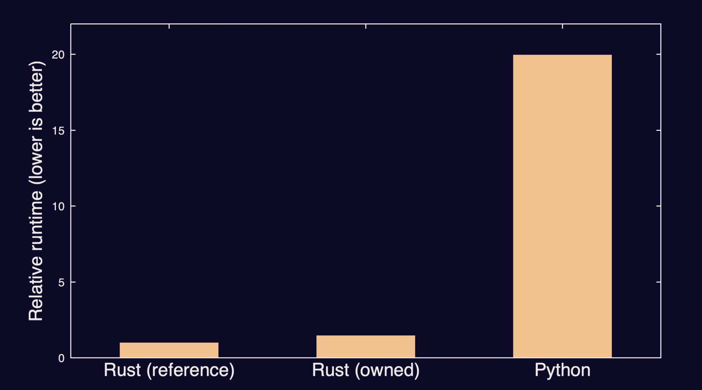
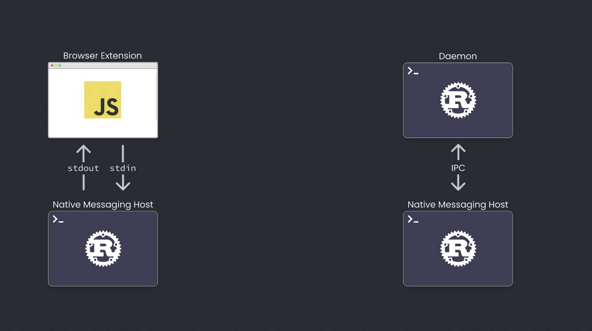
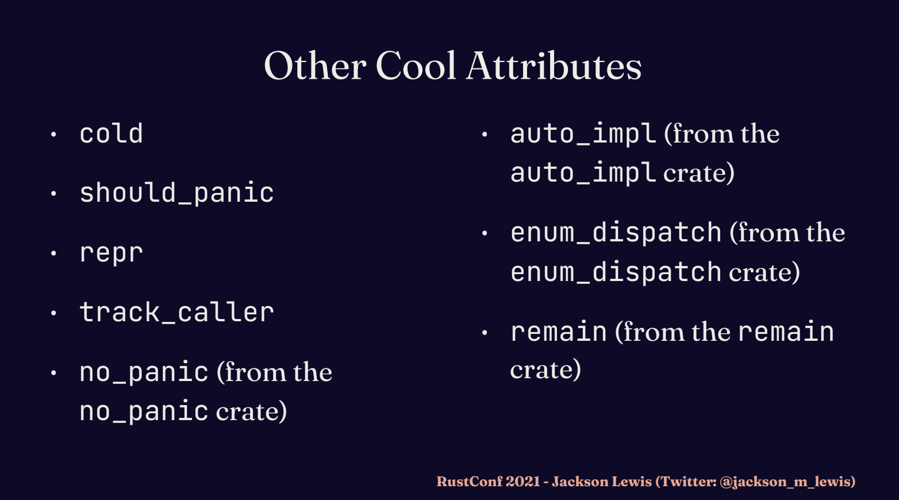

# 官方 RustConf 2021 盘点 

作者： 张汉东

---

> [大会官网](https://rustconf.com/talks) 

---

## 1.  Niko：Rust 下一步的目标是广泛使用！

- [slides：https://nikomatsakis.github.io/rustconf-2021-e44bec44/#1](https://nikomatsakis.github.io/rustconf-2021-e44bec44/#1)
- [视频：Project Update by Niko Matsakis](https://www.youtube.com/watch?v=ylOpCXI2EMM&list=PL85XCvVPmGQgACNMZlhlRZ4zlKZG_iWH5&index=1)

2021 年对 Rust 来说，是非常令人兴奋的。

2021 年 Rust 基金会成立，以及一些致力于 Rust 开发的团队成立。

Rust 甚至被考虑用于 Linux 内核。

Rust 的学习曲线正在逐步被降低。Rust 生态也越来越丰富。

Rust 2021 edition 蓄势待发！其目标是关键性的采用和可持续发展。

Niko 在该talk 中分享了 Rust 近几年的成长。

下一步 Rust 的目标：广泛使用！

## 2. Mara Bos:  以改进 Rust 标准库锁为例，探讨大型工作团队如何突出困境

- [slides：https://m-ou.se/rustconf-2021-deadlocked-slides.pdf](https://m-ou.se/rustconf-2021-deadlocked-slides.pdf)
- [视频：Deadlocked by Mara Bos](https://www.youtube.com/watch?v=DnYQKWs_7EA&list=PL85XCvVPmGQgACNMZlhlRZ4zlKZG_iWH5&index=2)

**问题：**

在很久之前，为标准库添加同步原语。其中最重要的是 Mutex。因为操作系统已经为我们实现了很多同步原语，那么标准库只需要将它们包起来即可吗？答案是否定的。因为这样做不符合 Rust 的要求，它们是为 C 设计的。

为 Rust 设计实现时，有很多微妙的事情，但其中有三个较大的问题。

 第一个问题是，如果你拥有一个对象，你可以把它移动到内存的不同位置。意味着你不能假设一个对象在其整个生命周期内都会停留在同一个内存位置。但是，操作系统的锁原语是要求该对象在同一个内存位置。比如 SRW 读写锁。你可以将其放到堆上来达到效果，但是很低效。也无法静态实现。

第二个问题是，在 Rust 中 Unsafe 和 Safe 的边界是 非常明确的。即便你的实现是错误的或者是多余的，但内存安全是底线。比如，死锁。死锁是实现错误，但它绝对是安全的。然而，操作系统实现的锁并不总是死锁，还可能是未定义行为。如果只是简单的用 Rust 包装底层原语，那么就会破坏语言的安全保证。

第三个问题是，内存/资源泄漏是安全的。比如我们创建了一个 Mutex锁，但是忘记解锁了，我可以drop它，但它还是锁定的，它是安全的。但是在操作系统的实现中，销毁mutex将引起未定义行为。

**一个解决方案：**

使用 `parking-lot` 全局数据结构来取代这些锁。这个方案在 2018年9月被提出，然后经历了大概一年的讨论，直到大家的精力耗完了。因为这个改变是非常巨大的。最终只留下300多条讨论，PR被关闭。

再之后，当有人对 Mutex 的实现提出一些改进，人们就会回答说，parking lot 会解决这个问题。

人们仍然期望 parking lot在不久后被整合进标准库。但面对之前遗留的讨论，没有人能很好地概述问题是什么，没有任何需要改变的清单，没有明确的地方可以开始这件事。

**让我们从小事做起：**

挑选出一个最微小的障碍，开始尝试解决它。

第一个障碍：稳定性保证。 

Rust 承诺了很多保证，对于整合 parking lot 来说，要保证在某些情况下不会发生恐慌。但正是这个保证，引发了很多讨论。所以，Mara 提出，将这个保证的细节删掉。得到了整个团队的同意。于是，一个干扰的因素被去掉了。

第二个障碍：不可移动。

给微软发了一个 PR，添加了一个说明，澄清如果在windows平台如果锁没有被借用，就可以移动它。仅仅几天就得到了微软的响应，于是 团队得到了一个很大的平台的支持，有了可移动的mutex。

就这样，Mara拆分出了一些很小的问题，逐个去解决它。这样一来，小问题就不会再分散对大问题的注意力了。

**小结**

Mara 组建了 新的 Lib Team，命名为 Lib API Team，致力于 API 的设计，而不会被具体实现分心。本次分享的目的主要是用具体的案例来说明，当事情遭遇困境的时候，应该从微小单一的障碍着手，想办法突破困境。

## 3. Miguel Young： 移动构造函数，Rust 中可能吗？

- [slides: https://speakerdeck.com/rustconf/2021-move-constructors-by-miguel-young-de-la-sota](https://speakerdeck.com/rustconf/2021-move-constructors-by-miguel-young-de-la-sota)
- [视频： Move Constructors: Is it Possible? by Miguel Young de la Sota](https://www.youtube.com/watch?v=UrDhMWISR3w&list=PL85XCvVPmGQgACNMZlhlRZ4zlKZG_iWH5&index=3)

> 作者说：注意，学习这一切你不需要C++知识!

> 我认为还是需要一点的 ，至少得知道什么是移动构造函数吧？
>
> 值得说明的是，以下这部分知识在 Cpp 中算高阶知识，但是在 Rust 中类似的知识，则是入门级的。
>
> C++ 中为了防止指向堆内存的成员变量被默认的拷贝构造函数浅拷贝而导致双重释放，所以需要开发者自己编写拷贝构造函数。
>
> 虽然 Rust 中没有构造函数，但C++的这个行为和 Rust 的 Copy 语义有些类似。
>
> 但是只有这种拷贝构造函数，在面对处理临时对象的时候，会有性能损失。因为在创建临时对象的时候，拷贝构造函数也会执行，这些临时对象用完就会被释放。
>
> 为了优化拷贝构造函数带来的性能问题，C++ 11 中引入了右值引用和移动构造函数。
>
> 右值的概念，相对于左值。对应于 Rust 中，左值即地址表达式，右值即值表达式。在 Rust 中，右值，即值表达式，如果没有使用let 绑定，它就是一个临时变量。C++ 也是一样，但是在 C++ 中，可以通过右值引用（`&&v`，两个引用前缀） 这个东西，将右值（临时值）的生存期延长了，相当于给右值又赋予一个变量名。
>
> cpp 中 `std::move` 可以将一切值变成右值。
>
> 有了右值引用，就可以实心移动构造函数来复用临时对象了，而不需要重写拷贝构造。移动构造函数，可以将一个对象的指针成员转移给另一个对象。只有创建对象的时候传入的是右值才会执行移动构造函数。

Rust 中处理 自引用类型 是个难题，虽然有 `Pin<T>` ，但是不如 C++ 那么自然。C++ 可以通过移动构造函数安全地处理自引用类型。

一个 "自引用（self-referential） "类型是指持有对自身的引用；异步Futures是目前Rust中最常见的自引用类型。然而，它们不能在不使引用无效的情况下被移动，所以它们被 Pin 在了堆或栈上。你不能返回它们，也不能把它们放入集合中（如果没有Boxing的话）。

该 talk 中，作者使用`Pin
`保证，将把所有的C++构造函数，而不仅仅是移动构造函数，移植到Rust中，而不影响Rust的使用后移动(move-after-use)保护（这是C++缺乏的）。在今天的稳定版Rust中完全支持通过移动返回和集合。除了零成本的C++ FFI之外，Rust的 "构造函数 "可以应用于在纯Rust中表达新的数据结构。

该 talk 作者在之前也写过详细的博客文章 ： [https://mcyoung.xyz/2021/04/26/move-ctors/](https://mcyoung.xyz/2021/04/26/move-ctors/) 。

相关的库 ： [https://github.com/mcy/moveit](https://github.com/mcy/moveit) 

关于作者：

Miguel Young 是来自 Google OpenTitan 项目的开发者。OpenTitan 项目，想通过开源框架减少芯片被破解的可能。

> OpenTitan  **将由非营利组织lowRISC监督，** 该公司正在开发基于RISC-V架构的免费微处理器。
>
> **OpenTitan项目涵盖了各种逻辑组件的开发** RoT芯片的需求，包括基于RISC-V架构的lowRISC Ibex开放式微处理器，加密协处理器，硬件随机数生成器，恒定和随机存取存储器数据和密钥存储层次结构，机制保护，I / O输入块，安全启动媒体等
>
> 可以在必要时使用OpenTitan，以确保系统的硬件和软件组件的完整性，并确保未更换关键的系统组件，并基于制造商验证和授权的代码。
>
> **基于OpenTitan的芯片可用于** 服务器主板，网卡，消费类设备，路由器，物联网设备，以验证固件（检测恶意软件对固件的修改），提供加密的唯一系统标识符（硬件防伪保护）以及保护加密密钥（如果出现以下情况，则隔离密钥）：攻击者可以获得对计算机的物理访问权限），提供与安全相关的服务，并维护无法编辑或删除的隔离审核跟踪。

本人深挖了一下 [OpenTitan](https://github.com/lowRISC/opentitan) 项目，在 GitHub 的语言成分分析中看不到 Rust 的痕迹。但是在源码中搜索 Rust，则发现很多 Rust 痕迹。

一、其中，OpenTitan 的 Software 部分支持 Rust 实现。

- 设备软件的固件镜像，支持 Rust 实现。
- Host 软件必须用 Rust 实现 （也支持 Cpp）。

二、 ROM_EXT 由 Rust 实现

OpenTitan  安全启动过程中，为了增加一定程度的灵活性，特别是为了允许制造商的特定配置和提供安全更新的设施--OpenTitan设计了扩展ROM（ROM_EXT），常驻闪存中。

ROM_EXT由一个 manifest  和 image 本身组成。当 image  生成时，manifest   是 "空白 "的。ROM_EXT签名者的责任是更新manifest  ，签名image，并将签名加入其中。

源码：https://github.com/lowRISC/opentitan/tree/master/sw/host/rom_ext_image_tools/signer ，它是一个 Host 软件。

在 Readme 里介绍了他们为什么选择 Rust : https://github.com/lowRISC/opentitan/blob/master/sw/host/rom_ext_image_tools/signer/README.md 

该项目中其他比较有用的资源：

1. RISC-V Assembly Style Guide ： https://docs.opentitan.org/doc/rm/asm_coding_style/ 

2. FPGA Reference Manual：https://docs.opentitan.org/doc/rm/ref_manual_fpga/ 

3. Rust for Embedded C Programmers https://docs.opentitan.org/doc/ug/rust_for_c/ 

   
## 4. Lily Mara: 在 Rust 中不要过度优化的重要性

Lily Mara 是 曼宁新书《Refactoring to Rust》 的作者，目前在 OneSignal(让开发人员可以轻松地向他们开发的应用程序添加个性化推送通知的工具，也使用 Rust)工作。这是一个轻talk。

- [slides: https://lilymara.xyz/rustconf-2021/public/](https://lilymara.xyz/rustconf-2021/public/)
- [视频： The Importance of Not Over-Optimizing in Rust by Lily Mara](https://www.youtube.com/watch?v=CV5CjUlcqsw&list=PL85XCvVPmGQgACNMZlhlRZ4zlKZG_iWH5&index=4)

Lily 分享了一个新手 Rust 用户 Jean 的故事：

Jean 之前是做 Python 开发开发一些聚合 API 的东西，其中要使用 Json，然后就在 json 的序列号/反序列化的过程中产生了性能瓶颈。然后他听说 Rust 性能不错，就尝试使用 Rust 来解决这个问题。

他用 Rust 实现了那部分代码，发现性能提升了20倍，感觉不错。后来他向一名更有 Rust 经验的开发者展示了这段代码，那名有经验的开发者告诉他，里面还有很多不必要的内存分配，建议他们使用 引用 来替代多余的分配，提升性能。

于是 Jean 又花了很长时间学习 引用/生命周期/泛型，经历了一些挫折之后，终于写出来使用引用的第二版。性能比上一个版本提升了 1.5 倍。

看到这个结果，Jean 比较郁闷。他们只是想写一些比 Python 程序性能更好的代码。第一版 Rust 实现的代码已经达到了这个要求，比 Python 代码快 20倍。但是他们花了九牛二虎之力写的第二个 Rust 版本，和第一个版本差距并不大。

当然这个过程 Jean 也学到了很多东西。但是为了提升这么一点性能，付出了相对比较大的精力，是否值得，这是一个需要考虑的问题。

> 这让笔者想到曾经在某公司也遇到类似的场景。
> 同事 A 某，花了三天优化了服务的性能，在技术会议上，CTO 听到他花三天时间只是为了优化那点性能之后，痛批了他一顿。 
> CTO 的看法是，他花三天优化的那点性能，再加一台服务器就够了。但是，他三天可以创造出更多的价值，远远不需要为公司去省那点成本。

Lily Mara 想在这次 talk 中表达的观点就是： Rust 学习成本确实是在那摆着的，尤其是，想把代码优化到最佳，也需要花很多精力。作为一名新手，不应该在开发的时候去想着优化的事情，不需要一步到位。先完成再完美。她希望新手们不要太担心性能的问题，可以逐步通过后续的重构来解决性能问题。可以参考她写的那本书。

## 5. Hugo Peixoto：鉴别神奇宝贝卡片

Hugo Peixoto 是来自葡萄牙的一名自由职业工程师。

分享者 Hugo 制作了一套 口袋妖怪TCG库存数字化的工具，可以通过计算机视觉来识别 口袋妖怪的卡片。他将这个过程中的经验以及计算机视觉相关领域的算法做了一个分享。这也是一个轻 talk 。

- [slides : https://hugopeixoto.net/talks/identifying-pokemon/slides.pdf](https://hugopeixoto.net/talks/identifying-pokemon/slides.pdf)
- [视频： Identifying Pokémon Cards with Computer Vision by Hugo Peixoto](https://www.youtube.com/watch?v=BLy_YF4nmqQ&list=PL85XCvVPmGQgACNMZlhlRZ4zlKZG_iWH5&index=5)

Hugo 做的这个工具整体流程如下：

先从网络摄像头的视频流中抓取一帧，然后需要从中提取卡片图像。最后通过已知卡片的数据集，寻找与卡片图像最相似的那张把它提取出来，然后把它添加到网站后台数据库中。

本次分享中主要是讲解具体的视觉识别算法，相关的代码在这里： [https://github.com/hugopeixoto/ptcg-detection](https://github.com/hugopeixoto/ptcg-detection)

## 6.  Midas Lambrichts： Fuzz 驱动开发

Midas Lambrichts 是一名软件工程师，Fuzz 爱好者。

- [slides: https://drive.google.com/file/d/1gcAVqeIxpliOV7I_AN6041fZGOFNYzUx/view](https://drive.google.com/file/d/1gcAVqeIxpliOV7I_AN6041fZGOFNYzUx/view)
- [视频： Fuzz Driven Development by Midas Lambrichts](https://www.youtube.com/watch?v=qUu1vJNg8yo&list=PL85XCvVPmGQgACNMZlhlRZ4zlKZG_iWH5&index=6)

什么是 Fuzzing?

模糊测试是一种软件测试技术，用于通过向软件提供伪随机数据作为输入来发现安全性和稳定性问题。

Fuzz 驱动开发的流程：

- 确定一个不变量 （Determine an invariant）
- 编写表达该不变量的fuzz 目标（Write fuzz target that expresses that invariant）
- 运行Fuzzing目标，直到失败 （Run Fuzzing target until failure）
- 反思（Reflect）
- 使用失败的结果来创建新的单元测试
和/或推进开发 (Use failures to create new unit tests
and/or progress development)
- 迭代（Iterate）

示例：一个解析器

- 程序不应该 panic，它应该返回 Ok 或 Err （确定一个不变量）
- 将模糊器的输入原封不动地提供给解析器（编写表达该不变量的fuzz 目标）
- 运行Fuzzing目标，直到失败 
- 简单的不变性和模糊测试目标，可能是实现中的错误
- 任何失败的输入都会成为一个单元测试，以原始输入为测试对象
- 迭代（Iterate）

接下来 Midas 编写一个 JSON Patch Squasher 工具为例，展示了如何使用这六个步骤进行 fuzz 驱动开发。

其他 fuzz 相关资源：

- [https://github.com/rust-fuzz](https://github.com/rust-fuzz)
- [fuzzing book](https://rust-fuzz.github.io/book/)

## 7. Isabella Tromba：用 Rust 编写最快的 GBDT 库

Isabella 是 [Tangram](https://www.tangram.dev/rustconf2021) 的创始人，这是一个多合一的自动化机器学习框架（完全用 Rust 编写！从核心机器学习算法到网络应用的后端和前端。），Tangram 使程序员可以轻松地训练、部署和监控机器学习模型。 

在此之前，她是 Slack 的机器学习工程师，并在麻省理工学院学习计算机科学。 该分享也是一个 轻 talk。

在本次演讲中，Isabella 将分享 优化梯度提升决策树机器学习算法的 Rust 实现的经验。 通过代码片段、堆栈跟踪和基准测试，探索如何使用 rayon、perf、cargo-asm、编译器内部函数（intrinsics）和 unsafe rust 来编写一个训练速度比用 C/C++ 编写的类似库更快的 GBDT 库。

- [slides: https://www.tangram.dev/rustconf2021](https://www.tangram.dev/rustconf2021)
- [视频： Writing the Fastest GBDT Library in Rust by Isabella Tromba](https://www.youtube.com/watch?v=D1NAREuicNs&list=PL85XCvVPmGQgACNMZlhlRZ4zlKZG_iWH5&index=7)

什么是 GBDT ?

GBDT简介GBDT，英文全称是 Gradient Boosting Decision Tree，梯度提升决策树，顾名思义，与梯度、boosting. 是一种迭代的决策树算法，由多棵决策树组成，每一颗决策树也叫做基学习器，GBDT最后的结果就是将所有基学习器的结果相加。

Rust 在 Tangram 的应用

- rayon，用来并行化计算输入训练数据的特征矩阵中每个节点的分数。
- cargo-flamegraph , 用于创建火焰图，寻找性能瓶颈。
- cargo-asm，帮助查看生成的汇编代码。从火焰图中，知道哪个函数占用了大部分的时间。然后通过查看了生成的汇编代码，看看是否有机会让它更快。
- 使用编译器的内部函数（intrinsics）来为特定的CPU进行优化。内部函数是一些特殊的函数，提示编译器生成特定的汇编代码。
- 用 unsafe 方法来消除一些不必要的跳转检查。前提是，他们知道这些地方可以安全地忽略检查，比如输入的数据永远不可能越界访问。

## 8. Brian Martin： 用 Rust 重写 Twitter 缓存服务

Brian 是 Twitter 的一名软件工程师，他专注于性能和优化项目。 他为多个 Twitter 开源项目做出了贡献，包括：Pelikan、Rezolus 和 rpc-perf。 Brian 对高性能软件、系统调优、监控、基准测试和 Rust 充满热情。 在不编写代码的时候，Brian 会在他当地的搜救部门做志愿者，并训练他的狗寻找在荒野中迷路的人。

- [slides: https://drive.google.com/file/d/1hEpsidaKOLLwpk6abIzIcMxqChuk13GD/edit](https://drive.google.com/file/d/1hEpsidaKOLLwpk6abIzIcMxqChuk13GD/edit)
- [视频： Whoops! I Rewrote It in Rust by Brian Martin](https://www.youtube.com/watch?v=m-Qg3OoPIdc&list=PL85XCvVPmGQgACNMZlhlRZ4zlKZG_iWH5&index=8)

[Pelikan](https://github.com/twitter/pelikan) 是 推特开源的 缓存框架，Brain 想用它来取代 memcached 和 redis。他说服了该项目的维护者，允许他们用 Rust 为 Pelikan 增加 TLS 支持。因为他认为用 Rust 比 C 更好。

缓存服务的性能是超级重要的。正如我之前提到的。Brain 希望单个缓存实例能够在单个核心上每秒支持大约十万个请求，并且延迟低于一毫秒。为了确保这一点，Brain 通常会应用一些具有固定请求率的合成工作负载，并将每个请求的延迟记录在柱状图中。Brain 的目标是在 P999 延迟低于某个阈值时达到最高吞吐量。P999 是所有请求延迟分布中的第99.9个百分点。

Rust的实现最终使Pelikan模块成为它们应该成为的东西，但由于C语言的限制，以前无法做到。

Brian 分享了他们用 Rust 重写 Pelikan 的来龙去脉。最后总结出使用 Rust 重写的成本和收益：

成本：

- 额外的时间会导致错过交付日期
- Duplicating work that’s been paid for （应该是开玩笑）

收益：

- 在纯 Rust 库中更容易工作
- 不再有cmake！!
- 增加了新的想法

并且通过一些性能优化，他们达到了 C 语言的性能。目前 Rust 重写工作还在继续中。

## 9. Luke Westby： 我是如何利用 Rust 逃离互联网的

Luke Westby 在 StructionSite 使用 Rust 和 Elm 构建软件。 他和他的妻子和狗住在加利福尼亚，他喜欢做编程之外的各种事情。 luke 是从 Elm 社区来到 Rust 的，在那里他是长期的核心贡献者、定期会议发言人，并且以前是 elm-conf 的助理组织者。 他非常喜欢 Rust，尤其是 Bevy 引擎。 

- [slides: https://drive.google.com/file/d/1SpMG3neb5Hhn1GUH67LhC-1b3SrnecUt/view](https://drive.google.com/file/d/1SpMG3neb5Hhn1GUH67LhC-1b3SrnecUt/view)
- [视频： How I Used Rust to Become Extremely Offline by Luke Westby](https://www.youtube.com/watch?v=b0I4vP2CP88&list=PL85XCvVPmGQgACNMZlhlRZ4zlKZG_iWH5&index=9)

Luke 一直在执行一项逃离互联网的任务。Luke 认为自己已经浪费了数不清的时间，在网上游荡，无所事事地浏览，并发表一些没有人关心的意见。

因此，他删除了他所有的账户，并屏蔽了所有让他分心的网站。他以为他终于成功了，但似乎内容总是能找到被消费的方式。他首选的搜索引擎显示了与查询主题相关的新闻、最近的帖子和视频标题的小片段。搜索 "新闻 "并被标题分散注意力的诱惑往往过于强烈，不幸的是，他的网站拦截器只对URL起作用，而不是页面的元素。

为了切断这最后的干扰源，并最终完全逃离互联网，他不得不自己动手建立了一个浏览器扩展，可以删除页面的这些区域，他还用Rust来确保他永远不会关闭它。这次分享就是为了告诉你他是怎么做的。

> 我有个疑问：他不用手机吗 。。。

Luke 做的是这样一个工具：实现了一个浏览器扩展，帮助他屏蔽页面上让他焦虑分心的信息。但是为了防止他关闭那个扩展，他通过Rust 实现了一个类似于图中架构的程序，来监控浏览器中那个扩展是否正常工作，如果他关闭了扩展，那么这个监控程序就会自动为它关闭浏览器。整个代码实现用到了多线程channel / ipc 通信等。

这个分享有点意思。

## 10. Jackson Lewis： 用五种鲜为人知的属性宏来增强你的代码

Jackson Lewis, 是 1Password 的 19 岁软件开发人员，拥有三年的专业经验。 他喜欢 Rust 并创建了宏库 [cascade](https://github.com/inquisitivepenguin/cascade)，以及多个爱好项目，包括多人游戏引擎。 

- [slides:  https://drive.google.com/file/d/1f5eeVf8yctPVIb97IUDfVnpwnsoH6Lpr/view](https://drive.google.com/file/d/1f5eeVf8yctPVIb97IUDfVnpwnsoH6Lpr/view)
- [视频： Supercharging Your Code with Five Little-Known Attributes by Jackson Lewis](https://www.youtube.com/watch?v=8d7DqeYXq7A&list=PL85XCvVPmGQgACNMZlhlRZ4zlKZG_iWH5&index=10)

> 这个分享中有句话很有意思： 你必须保护你的代码不被未来的自己发现，他们会忘记你写的所有细微的细节，并毁掉一切。
> 幸运的是，我们 Rustaceans 有工具来帮助缓解这个问题：代码注释、惯用指南和类型系统。

哪五个属性呢：

1. `#[non_exhaustive]` ，可以让枚举体支持「非穷举性」，当你不确定枚举在将来有什么变化时，可以增加这个属性。
2. `#[deprecated]`，当你想替换掉一个以后不会被使用的函数时，你可以加这个属性。
3. `#[pre]`，Pre是precondition的简称，是第三库提供的，详细请看:[https://github.com/aticu/pre](https://github.com/aticu/pre)。通过它你可以为指定的函数提供前置条件，用来判断它是否满足某种条件，而保证安全使用。通常用于 unsafe 函数。
4. `#[readonly::make]`，同样是第三方库，详细：[https://github.com/dtolnay/readonly](https://github.com/dtolnay/readonly)。它允许你为结构体中某个别字段设置只读。
5. `#[typetag::serde]`，详细:[https://github.com/dtolnay/typetag](https://github.com/dtolnay/typetag)。它允许你无痛地对trait对象进行序列化和反序列化。

其他超酷的属性宏：

## 11.  Zac Burns: 编译时社会协同( Social Coordination)

Zac Burns 是 Edge & Node 的软件工程师（他们正在招聘 Rust 开发人员！）。 他热爱 Rust 两年多，编程近 20 年。 Zac 说：「你想知道什么比学习生命期更难吗？通过二十年时间去犯可预防的错误能学习同样的课程。」

- [slides:  https://speakerdeck.com/rustconf/2021-compile-time-social-coordination-by-zac-burns](https://speakerdeck.com/rustconf/2021-compile-time-social-coordination-by-zac-burns)
- [视频： Compile-Time Social Coordination by Zac Burns](https://www.youtube.com/watch?v=4_Jg-rLDy-Y&list=PL85XCvVPmGQgACNMZlhlRZ4zlKZG_iWH5&index=11)

你能写出好代码，这很不错。但是你能让我们一起写出好代码吗？

这次分享中，Zac 带领我们来学习 Rust 是如何让我们更容易写出一致的代码，并且在文件、crate和人之间保持一致。这是一个关于我们如何停止踩踏每个人的脚趾并学会爱上借用检查器的故事。

> 一个生物学家物理学家和一个Rust 程序员正在观察一所房子。有两个人 进入房子，过了一会儿，有三个人从房子里出来。
> 
> 生物学家说，他们繁殖了。
> 
> 物理学家说，测量时有一个错误。
> 
> 而 Rust 程序员说，现在房子里有 `-1` 个人。

三个人有三套不同的关于世界如何运作的假设。

Zac 通过这个小段子，引出开发过程中，不同的人拥有不同的世界观，代码协作要保证一致性比较困难。实施良好的程序是内部高度一致的。有模式和设计选择，在整个代码的远程位置上，完成后都会遵守。

一致性不好的代码会出问题。Zac 举了游戏开发中的一些示例说明这个问题。程序越大越复杂，一致性就越难保持。

Zac 越是考虑保持一致性的问题，他就越发相信，作为一门学科，投资的最佳回报是在编译器和编译器辅助的解决方案中，与沟通或指导不同的是，编译器可以扩展到任何团队规模，在每个贡献者需要的时候为他们提供个性化的建议。

乍一看，似乎是限制，由编译器强加的限制。实际上，它赋予了我们自由，让我们能够写出更好的软件，而不被作者之间的交流和共享知识的限制所约束。

Zac 在分享中举了很多开发中的示例来阐述他的这些观点，推荐大家看看这场分享。

## 12. Esteban Kuber ： Hacking rustc 为编译器做贡献

Esteban Kuber 从2015年开始参与社区活动，从2017年开始成为编译器团队的成员，目前作为首席工程师在AWS从事rustc的工作，专注于改进其诊断信息，努力使该语言对所有人都平易近人。这也是一场轻 talk。

- [slides: https://docs.google.com/presentation/d/14gtkzvgNf9hGw2NjL2wwyDahu-sIw32gQoQ5L6byLfQ/edit#slide=id.geba40fd1a9_0_6](https://docs.google.com/presentation/d/14gtkzvgNf9hGw2NjL2wwyDahu-sIw32gQoQ5L6byLfQ/edit#slide=id.geba40fd1a9_0_6)
- [视频： Hacking `rustc`: Contributing to the Compiler by Esteban Kuber](https://www.youtube.com/watch?v=9H9SO2u6Q20&list=PL85XCvVPmGQgACNMZlhlRZ4zlKZG_iWH5&index=12)

很多人对编译器有这样的看法：它们是靠魔法和精灵尘运行的黑盒子。而且，你要参与其中，你需要同时在多个领域有不同寻常的技术能力。

有这样一种想法：只有优秀程序员才能玩转编译器。Esteban 今天在这里就是活生生的证明，这绝对是根本性的错误。

你不需要知道或理解编译器的每一个方面，就能做出有意义的贡献。你不需要知道优化通道如何工作。要修改解析器。你不需要知道这个人是如何工作的，就可以理解类型推理的运作。

而且你不需要了解类型推理是如何运作的，就可以了解生命周期分析是如何运作的。

你也不需要精通语言设计的艺术，你只需要想做这件事。

Estenban 这个分享就是告诉你，如何给 Rust 做贡献：

1. 了解 RFC/ MFC 流程
2. 寻找你能做的：增加新特性？改 Bug? 等等。
3. 了解 issues 中 不同标签的意义，有助于你寻找适合你的 issue 去解决。（具体可以看 PPT 图片，Rust 作为一个开源项目，在管理 issue 方面做的很不错，也值得学习）
4. 配置开发环境 （rust-analyzer / rustc dev guide）
5. 遇到问题可以去 Zulip 和官方团队交流

## 13. Nell Shamrell-Harrington： This Week in Rust: 400 Issues and Counting!

Nell Shamrell-Harrington 是微软开源项目办公室的首席软件工程师，也是Rust基金会的董事。她也是《This Week in Rust》的主编，以及多个Rust工作组和团队的成员。在此之前，她曾在Mozilla和Chef软件公司工作。在业余时间，她是Operation Code的董事会成员，这是一个致力于向退伍军人及其家属教授软件工程技能的非营利组织。

- [slides: https://www.slideshare.net/NellShamrell/this-week-in-rust-400-issues-and-counting](https://www.slideshare.net/NellShamrell/this-week-in-rust-400-issues-and-counting)
- [视频： This Week in Rust: 400 Issues and Counting! by Nell Shamrell-Harrington](https://www.youtube.com/watch?v=OZPXhmy-wVw&list=PL85XCvVPmGQgACNMZlhlRZ4zlKZG_iWH5&index=13)

七年来，超过400期的《Rust周刊》将Rust社区的动态带到了 Rustaceans 的收件箱中。Nell 回顾了 This Week in Rust 这么多年来的历程，以及它为 Rust 社区带来的意义：是社区更新的聚合者。

> 也许，这也是 RustMagazine 社区月刊的意义吧！

